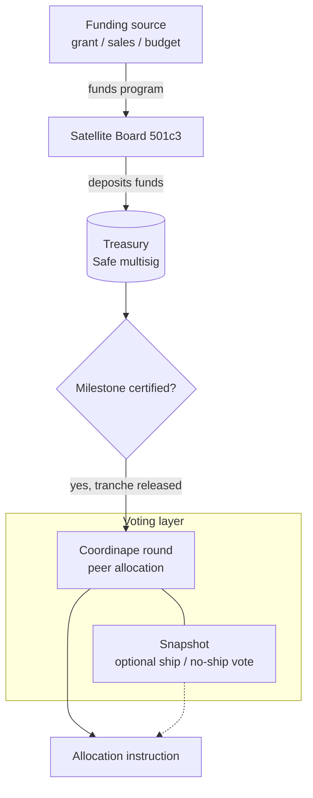
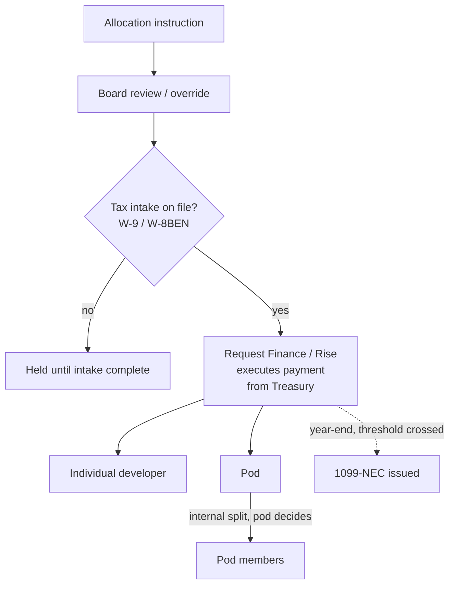

# The Commons-Hub Model

*A replicable model for organizing collaboratively-developed open source software
around nonprofit and for-profit satellites*

**Status:** Early concept draft — not reviewed by counsel. Nothing in this document
should be treated as a legal or tax conclusion.

**Being split into four documents** — see [`DOC-SPLIT-PLAN.md`](DOC-SPLIT-PLAN.md).
[`commons-hub-pattern.md`](commons-hub-pattern.md) (reference architecture) is
drafted; the manifesto, contributor guide, and legal risk register are not yet
split out. This file remains the source material for those three until they are.

**Scope:** This document describes a generalized, clonable organizational pattern —
it is written to apply to any group collaboratively developing and monetizing an
open source commons, not to any single organization in particular.

---

## Introduction: Why This, Why Now

*Framing draft — the "Trust issues" thread below trails off in the original
dictation and still needs to be finished; flagged rather than guessed at.*

### Corporations as a governance technology, not a law of nature

The corporation is not a naturally occurring phenomenon. It is one socially
produced, historically specific answer to two recurring questions: when people
organize together to produce something, who governs that production — and who
benefits economically from it? Different historical eras have answered both
questions differently: guilds, common land,
[joint-stock charters](https://en.wikipedia.org/wiki/Joint-stock_company),
the industrial corporation, the modern platform company. Each is a governance
structure for collective production and economic benefit, adopted — and later
challenged — because the previous answer stopped sufficiently serving whoever
held the power to change it. That has usually meant the elites of the era, not
a broad public: the English enclosure movements discussed below were driven by
landowners who benefited from privatizing common land, not by commoners
demanding it;
joint-stock charters emerged to mobilize capital for merchants and investors
who needed a legal vehicle for it, not from popular pressure. The pattern
worth naming plainly: governance structures tend to change when they stop
working for whoever already has enough power to rewrite them.

This initiative proposes to treat that question as still open, and to design a
next answer for it — specifically for a mode of production (collaboratively
developed open source software) that the corporate form was never built to serve
well in the first place, since corporate law defaults to concentrating both
ownership and benefit rather than distributing them.

### Why now: what AI changes, and what it doesn't

That question of who governs production and who benefits from it isn't just
philosophical — economists have a specific answer for why the corporate form won
out over more distributed alternatives in the first place, and it's worth being
precise about it, because it's exactly what's shifting now.
[Ronald Coase's 1937 answer](https://en.wikipedia.org/wiki/The_Nature_of_the_Firm)
to "why do firms exist at all, if markets are efficient?" was **transaction
costs**: coordinating complex production through a market — finding people,
negotiating, verifying quality, for every task — is expensive, and firms exist
because hierarchical management was, for most of industrial history, cheaper
than market coordination for a given kind of production. Coase won the 1991
Nobel in Economics for this.

The clearest illustration is textile production just before the modern
corporation took shape. Before Richard Arkwright's water frame (1769), English
cloth was made under the *putting-out system* — pure market coordination: a
merchant distributed raw wool or cotton to independent spinners and weavers
working in their own homes, paid piece-rate for finished cloth, no employment
relationship at all. It lost to the factory for three specific reasons, not a
vague one: **production was unobservable** (a merchant only saw finished cloth,
never the process, which produced chronic embezzlement of material and
inconsistent quality); **scheduling was unenforceable** (dispersed workers set
their own pace, often around farm work); and **the new machinery physically
required centralization** — a water wheel could power a mill, not a cottage.
Direct supervision solved the first two problems outright; centralization was
the only way to use the new capital equipment at all.

AI doesn't erode all three of those reasons equally, and the honest version of
this argument has to say so line by line rather than just asserting "AI makes
things cheap":

- **Observability** — the strongest point of the parallel. AI-assisted code
  review, automated testing, and the trust/vetting mechanisms this document
  already builds in §6 do a real version of what a factory foreman did: make
  the production process legible without requiring everyone under one roof.
- **Capital-centralization — this one inverts, rather than just weakening.**
  In 1769 the machinery forced centralization; a spinner could never own a
  water wheel. Today the equivalent capital — compute, AI models — is rentable
  by the hour through cloud APIs. A dispersed contributor can access
  industrial-grade tooling *without* being inside a hierarchical firm that
  owns the capital equipment.
- **Scheduling/coordination** — largely already solved by tooling that
  predates this document (version control, CI/CD, issue trackers), with AI
  plausibly reducing the remaining friction further.
- **What doesn't get solved, and may get harder:** the 1770 embezzlement
  problem was about *material*; the equivalent risk now is trust in
  *contribution provenance* — can this code, and whoever submitted it, be
  trusted. Cheap AI-generated contribution volume doesn't shrink that
  problem, it grows it — this is the
  [XZ Utils backdoor](https://www.akamai.com/blog/security-research/critical-linux-backdoor-xz-utils-discovered-what-to-know)
  risk from §6, restated as economic history rather than a security anecdote.
  **AI-driven abundance of code doesn't reduce the need for the trust layer in
  §6 — it increases it.**

One more honest qualifier, worth stating plainly rather than leaving implicit:
"cheap" here means cheap in dollars and labor-hours, not cheap in resource
terms. AI compute carries real energy, water, and embodied-carbon costs. An
organization whose values already lean toward social and economic justice
shouldn't present AI-driven abundance as costless — that would sit
inconsistently with the rest of this document's posture, which flags rather
than asserts wherever a claim is uncertain.

There's a second, independent reason hierarchy isn't needed here, distinct
from anything AI changes. Coase's hierarchy doesn't only solve "I can't see
what you're doing" — it solves "you don't actually want to do what I need,"
the **misalignment** between what a wage-earner wants (the largest wage for
the least effort) and what a firm wants (the largest output for the wage),
which is precisely what supervision hierarchies exist to manage. Self-selected,
mission-driven contributors who opted in because they believe in the goal
mostly don't have that gap to begin with — this isn't a cheaper way to
supervise labor, it's a context where the thing supervision exists to fix is
largely absent. This already has a name and a rigorous treatment, and it's a
tighter fit here than Coase alone:
[Yochai Benkler, "Coase's Penguin, or, Linux and The Nature of the
Firm"](https://cyber.harvard.edu/is03/Readings/Benkler_Excerpt.pdf) (Yale Law
Journal, 2002) — the title is a direct response to Coase, using Linux as the
empirical counter-case, and it argues for a third mode of production alongside
markets and firms: **commons-based peer production**, where complex goods get
built by self-organizing contributors motivated by non-monetary reasons
(mission, reputation, craft), coordinated through shared infrastructure rather
than either price signals or managerial hierarchy. This isn't speculative —
it's the mode that already produced Linux and most of the open source stack
this pattern itself depends on.

The coordination mechanism this points toward has a name too:
**[stigmergy](https://www.ncbi.nlm.nih.gov/pmc/articles/PMC10956014/)** —
agents coordinating indirectly through shared traces left in a common
environment, rather than through direct communication or central command. An
ant doesn't get orders; it reads a pheromone trail another ant left and
reinforces or ignores it, and the colony converges on good paths without any
ant ever computing one. It's a live concept in swarm robotics and multi-agent
AI system design today, not just biology — and this document already specifies
the pheromone trail: the shared Commons itself, the committer-standing record
in §6, and the tactical voting weight in §7 are the shared environment that
lets independent contributors coordinate toward a common goal without anyone
directing traffic.

Which points to why dispersion is the better answer here, not merely an
adequate one. Concentrating capability into one legal entity, one point of
control, one target, is exactly the aircraft-carrier problem: enormous value
in a single place is precisely what makes it worth attacking — legally (one
entity to sue or deplatform), politically (one target to pressure),
operationally (one point of funding or leadership failure). A dispersed,
replicable structure doesn't have that failure mode — no single instance is
load-bearing, and if one node goes down, the pattern survives elsewhere. That
is what the clonable, multi-Satellite shape in §1 is actually for: not just a
way to scale, but a resilience strategy.

### A return to the commons

Before the [enclosure movements](https://en.wikipedia.org/wiki/Enclosure)
reshaped landholding in England, common land was governed collectively by the
communities that worked it — not owned by any single lord, not managed by the
state. Enclosure privatized that land, and with it, concentrated the benefit
of centuries of collective stewardship into far fewer hands.

<figure class="float">

<figcaption>Enclosure Act for Shifnal, 1793 (Shropshire Archives 539/1/5/3).
Public domain, via Wikimedia Commons.</figcaption>
</figure>

Garrett Hardin's later ["tragedy of the
commons"](https://en.wikipedia.org/wiki/Tragedy_of_the_commons) argument
treated unowned shared resources as inherently doomed to overexploitation —
but Elinor Ostrom's empirical research (which won her the [2009 Nobel
Memorial Prize in Economic
Sciences](https://en.wikipedia.org/wiki/Nobel_Memorial_Prize_in_Economic_Sciences))
overturned that claim, documenting hundreds of real cases where communities
successfully self-governed shared resources through their own institutional
rules, without requiring either privatization or centralized state control.[^1]

This initiative is, in effect, a proposal to apply Ostrom-style commons
governance to a *digital* commons — open source software — rather than to land,
water, or fisheries: a body of collectively produced software governed by the
people who build it, with the Commons-Hub structure (§1 below) as the specific
institutional design, and the funded-program-allocation
[DAO](https://en.wikipedia.org/wiki/Decentralized_autonomous_organization)
(§3–4) as one concrete rule within it, in Ostrom's sense of a community
writing its own rules for how a shared resource's benefit gets distributed.

### Trust and bad-faith actors

Because the Commons is open source, nothing stops an organization or
individual whose goals are directly hostile to the adopting organization's
own mission from adopting the same tooling — no vetting mechanism changes
that, since the license already grants everyone access regardless of
standing in the community. What the organization can still control is
narrower: who earns committer/maintainer standing on its own infrastructure,
and who its community prioritizes when people ask for help. Both are handled
informally, by ordinary maintainer judgment, rather than by a formal vetting
system — see [§6](#6-community-trust-and-contributor-standing).

### The present moment: elite overproduction and AI-driven displacement

<figure class="float">

<figcaption>Peter Turchin, 2020. Photo: Peter Turchin, CC BY 4.0, via
Wikimedia Commons.</figcaption>
</figure>

Peter Turchin's [structural-demographic
theory](https://en.wikipedia.org/wiki/Structural-demographic_theory)
identifies "elite overproduction" as a recurring precondition for social
instability: when a society trains and credentials more aspirants for
elite-track positions than it has positions to absorb them into, intra-elite
competition intensifies, average outcomes for elite aspirants decline, and —
critically — some fraction of those aspirants become "counter-elites,"
turning their training and ambition toward organizing opposition to the
existing order rather than joining it.[^2]

The current U.S. software labor market is a live instance of this pattern: an
education system that has spent two decades producing an increasing supply of
highly credentialed software engineers, now colliding with AI-driven
contraction of entry- and mid-level engineering hiring. A growing population of
capable, credentialed, increasingly frustrated engineers — including recent
graduates with advanced degrees — is finding the traditional elite-track path
(a well-paid job at a major tech employer) narrowing or closing.

### The opportunity

That population is not just a labor pool to hire from — it is a mobilizable
base for a movement, in Turchin's counter-elite sense. This initiative's pitch
to them is not purely economic: it offers a way to do real, technically
substantial work, be paid for it through the mechanisms described in §3–4,
and do so without having to take a job at an organization whose practices
conflict with their politics. (Any organization adopting this pattern will
generally already have its own public language naming the specific employers
or practices it considers disqualifying — that language belongs in the
adopting organization's own materials, not in this generalized document.)
Positioned this way, the Commons-Hub pattern is simultaneously a funding/
staffing strategy for whichever specific organization adopts it, and a
replicable recruitment narrative for any future Satellite or Commons built on
this pattern.

[^1]: [Elinor Ostrom — Wikipedia](https://en.wikipedia.org/wiki/Elinor_Ostrom)
[^2]: [Elite overproduction — Wikipedia](https://en.wikipedia.org/wiki/Elite_overproduction);
    [Structural-Demographic Theory — Peter Turchin](https://peterturchin.com/structural-demographic-theory/)

---

## 1. Core Idea

At the center of the pattern is a **Commons**: a body of collaboratively developed
open source software (and the engineering practices, standards, and shared libraries
around it). The Commons is not itself a legal entity — it's an artifact and a body of
practice. It functions as:

- an **engineering hub** — where core contributors maintain shared infrastructure,
  standards, and foundational libraries
- a **financial source and sync** — money flows *out* of the Commons (funding
  development of the shared stack) and *into* the Commons (royalties, IP licensing
  fees, or contribution-in-kind from satellites that build on it)

Any number of legal entities can be organized *around* a single Commons. A
Commons might be a shared application framework, a set of foundational
libraries, or a full product stack — the pattern is meant to generalize: any
collaboratively-developed open source commons could sit at the center.

```
                 ┌───────────────────────┐
                 │        COMMONS         │
                 │ (shared OSS stack +    │
                 │  engineering hub)      │
                 └───────────┬────────────┘
              funds/IP in  ↑ │ ↓  funds/IP out
        ┌────────────────────┼────────────────────┐
        │                    │                    │
 ┌──────▼──────┐      ┌──────▼──────┐      ┌──────▼──────┐
 │ Satellite A  │      │ Satellite B  │      │ Satellite C  │
 │  501(c)(3)   │      │  501(c)(3)   │      │  501(c)(3)   │
 │      │       │      │      │       │      │      │       │
 │  for-profit  │      │  for-profit  │      │  for-profit  │
 │  subsidiary  │      │  subsidiary  │      │  subsidiary  │
 │  (optional)  │      │  (optional)  │      │  (optional)  │
 └──────────────┘      └──────────────┘      └──────────────┘
```

This multi-Satellite shape is a resilience property, not just a scaling one —
see the Introduction ("Why now: what AI changes, and what it doesn't") for why
dispersion is the better answer here, not merely an adequate one.

## 2. The Satellite Layer

Each **Satellite** is a [501(c)(3)](https://www.irs.gov/charities-non-profits/charitable-organizations/exemption-requirements-501c3-organizations)
organized around some program of work that draws on
the Commons. A Satellite may, as its revenue-generating programs mature, spin those
programs out into a **wholly-owned for-profit subsidiary**: the nonprofit retains
mission/governance control, while the subsidiary carries the operational/
revenue-generating work.

Multiple Satellites can exist around one Commons simultaneously — e.g., one Satellite
oriented toward labor organizing tools, another toward tenant organizing, another
toward a specific geography — all built on the same shared stack, all feeding
improvements and (where applicable) licensing revenue back to the Commons.

## 3. Governance Layer — Two Separate Mechanisms

It's important to keep these two things distinct; they are not the same mechanism and
should not be conflated:

- **Organizational governance — the Board.** Mission, priorities, protocols, and
  policy for each Satellite are set through ordinary nonprofit governance: the
  501(c)(3)'s board of directors. **There is no
  [DAO](https://en.wikipedia.org/wiki/Decentralized_autonomous_organization)
  involved in setting priorities or policy.** The board decides what to build,
  which funded programs to pursue (grants, earned-revenue-funded initiatives,
  or internally allocated budget), and what the organization's direction is,
  exactly as any nonprofit board would.

- **Funded-program-allocation DAO — scoped narrowly, one mechanism among
  possibly several.** A separate, purpose-built DAO mechanism governs exactly
  one thing: how the proceeds of an *already-secured* funded program — a
  grant, a commercial-revenue-funded initiative, or a board-allocated
  budget — are split among the individual developers (and pods) who
  contributed to earning it. Deliberately not scoped to grants alone: this
  organization does not intend to depend solely on grant funding long-term,
  and the mechanism doesn't care where the money came from. This DAO does
  not set policy, does not decide what to build, and does not govern the
  organization. Its entire remit is: given a funded program the board has
  already secured, and a defined pool of contributors who worked on it,
  determine what share of the disbursed funds each contributor or pod
  receives. Other narrowly-scoped DAO-like mechanisms may eventually exist
  for other specific purposes (to be defined later) — but priority-setting
  is never one of them.

## 4. Worked Example: Funded Program Allocation Mechanic

This is the concrete mechanic the allocation DAO implements. Note that every step here
happens *after* the board has already decided to pursue and has secured the funding —
the DAO has no role in that decision.

**Part 1 — funding award through the vote:**



**Part 2 — the vote's output through payment:**



Coordinape and Snapshot touch this pipeline only at the voting layer, and
only lightly — both use a connected crypto wallet as a *signature/identity*
mechanism, not as an on-chain computation. Snapshot votes are signed
messages tallied off-chain (gasless); Coordinape's peer-allocation round is
an ordinary web app. The genuine on-chain activity in this diagram is the
treasury and payment layer (Safe multisig → Request Finance/Rise → developer
wallet) — that was always going to be blockchain-based once the org chose to
pay contributors in crypto, independent of the voting-tool choice.

1. A Satellite's board pursues and secures a funded program — e.g., a $100,000 grant,
   an earned-revenue-funded initiative, or a board-allocated budget — on terms the
   board negotiated and remains accountable for.
2. Community members who want to contribute work toward the funded program **opt in**
   as contributors (no fixed roster; participation is self-selected by interest).
3. Each participating contributor completes standard tax intake (e.g., a
   [W-9](https://www.irs.gov/forms-pubs/about-form-w-9) for US persons,
   [W-8BEN](https://www.irs.gov/forms-pubs/about-form-w-8-ben) for foreign
   contributors) and registers a wallet address for
   receiving funds (chain TBD — Bitcoin or Ethereum are the current candidates).
   Intake must be complete *before* a contributor is eligible to receive any
   disbursement — this is a gate, not a follow-up step.
4. As the program hits its funded milestones, **active contributors vote** on how the
   released tranche is apportioned among those who did the work.
5. Votes can allocate a tranche either to an **individual contributor** or to a
   **pod** (a development sub-group working a piece of the program).
6. If a tranche is voted to a pod, the pod's own members then decide internally how to
   divide that chunk — the DAO-level vote only decides the pod's allocation, not the
   individual split within it.
7. The vote's output is an **allocation instruction**, not a payment. It feeds a
   disbursement pipeline that: confirms tax intake is on file for every recipient,
   executes payment only after that check passes, records each payment as compensation
   for services rendered on the specific funded program (not as a profit share or gift), tracks
   cumulative payments per contributor per calendar year, and issues
   [1099-NEC](https://www.irs.gov/forms-pubs/about-form-1099-nec) (or the
   applicable equivalent) at year end for contributors who cross reporting thresholds.
   The DAO machinery is meant to be built integrated with this disbursement/tax
   pipeline from the start, not layered on top of it later.

## 5. Risks & Open Questions

Ranked roughly by how likely each is to force a redesign of the mechanic above.

1. **[Legal — medium severity] DAO scope must stay strictly allocation-only.**
   Because the DAO governs only the *distribution* of already-secured funded-program
   dollars among contributors — not priorities, not policy, not whether to pursue the
   program — board fiduciary duty is much less implicated than a "DAO sets policy"
   design would be. But the board (or an authorized officer) should still retain
   audit/override authority over disbursements: the org, not the DAO, remains legally
   accountable for how those dollars are spent. Recommend the DAO's vote function as a
   binding allocation instruction that the org's disbursement process executes
   automatically, with the board retaining override/audit rights, not that the DAO's
   output be completely outside institutional control. **Worth confirming with counsel
   that this framing is sufficient**, but it is a materially smaller ask than earlier
   drafts of this document implied.

2. **[Legal/tax — high severity] Payments must be structured as compensation for
   services, not profit-sharing.** Because contributors are being paid out of
   funded-program dollars administered by a 501(c)(3), each payment has to map to
   actual services that contributor performed on that program — this is the
   [private-inurement](https://www.irs.gov/charities-non-profits/charitable-organizations/inurement-private-benefit-charitable-organizations)
   guardrail. A
   peer vote determining *shares* is fine as a mechanism for sizing a services
   payment, but the underlying legal characterization must be "contractor payment for
   services performed" — documented as such (e.g., a lightweight statement of work or
   contribution record per contributor per milestone) — not "distribution of program
   winnings" or a profit-sharing distribution. **Requires confirmation from counsel.**

3. **[Tax] Intake must gate disbursement, not follow it.** Building the DAO/wallet
   registration flow to require W-9/W-8 intake before funds are eligible to move keeps
   compliance built into the mechanism rather than bolted on after the fact — this is
   reflected as step 3 above and should stay a hard gate in implementation, not a
   best-effort follow-up.

4. **[Tax] Crypto valuation & withholding.** Paying in crypto still requires
   fair-market-value USD conversion at time of payment for 1099 reporting purposes,
   and potentially backup withholding if a contributor fails to provide a W-9. Needs
   to be built into the disbursement pipeline, not handled ad hoc at year end.

5. **[Legal/tax] Related-party transactions between Commons and Satellite.** If the
   Commons is ever formalized as its own entity, money/IP flowing between it and a
   501(c)(3) Satellite is a related-party transaction and needs arm's-length terms
   (e.g., an IP license at fair market value) to avoid private-benefit problems.
   Keeping the Commons deliberately entity-less (a shared codebase and set of
   practices, not a legal person) avoids this risk for as long as that's tenable.

6. **[Legal] DAO legal wrapper.** Because the DAO's scope is now narrow (allocation
   only, with off-chain payment execution and board override), it may not need its own
   chartered legal vehicle (e.g., a [Wyoming DAO
   LLC](https://sos.wyo.gov/Business/Docs/DAOs_FAQs.pdf)) the way a policy-setting DAO
   would — it could plausibly be implemented as an internal voting tool feeding an
   ordinary org-run disbursement process. Still **unclear/requires confirmation**
   whether any wrapper is needed, and if so, what liability exposure the voting
   mechanism itself carries.

7. **[Operational] Chain/token choice.** Bitcoin vs. Ethereum vs. something else —
   unresolved.

8. **[Operational] Milestone verification.** Who certifies that a funded milestone has
   actually been met, triggering a vote — likely a board or program-management
   function, but unresolved.

9. **[Policy] Interaction with an adopting organization's existing comp
   philosophy.** Many organizations publicly commit to transparent,
   formula-based compensation bands rather than manager/community discretion
   or negotiation. Reconciling that kind of stated philosophy with a
   peer-vote-based allocation mechanic — for anyone who is *also* a paid
   employee or contractor — needs to be resolved case by case per adopter.

10. **[Sequencing] Relationship to an interim fiscal sponsorship arrangement.**
    This document describes a *permanent* structure. It is compatible with,
    and not blocked by, an adopting organization pursuing a fiscal sponsor to
    cover a gap while unincorporated — the sponsor relationship covers the
    near term; this structure is a candidate for what the organization
    incorporates into (or graduates out of the sponsor into) later.

11. **[Legal — medium severity] Tactical governance tokens (§7) must be
    board-delegated authority, not personal property.** A nonprofit board
    can lawfully delegate day-to-day/tactical decision-making to staff, a
    management team, or — per §7 — a token-weighted committer vote. What it
    cannot do is let a founder's personal, freely-held instrument operate as
    the org's real control mechanism independent of board authorization.
    The distinguishing factor is procedural: the board must formally adopt
    the token system as its own chosen delegation mechanism (a board
    resolution is enough) and retain the power to modify or unwind it — the
    same override/audit pattern already required of the funded-program-allocation
    DAO in Risk 1, one layer up. **Requires confirmation from counsel that the
    adoption resolution is sufficient**, particularly for the 501(c)(3) side;
    the for-profit subsidiary side is ordinary corporate practice and carries
    much less of this risk.

12. **[Legal — low severity] Securities-law exposure, walked through
    against Howey rather than just asserted.** The four-part
    [*Howey*](https://en.wikipedia.org/wiki/SEC_v._W._J._Howey_Co.) test for
    an investment contract requires (1) an investment of money, (2) in a
    common enterprise, (3) a reasonable expectation of profit, (4) derived
    from the efforts of others. §7's tokens fail prong 1 (nothing is
    purchased — they're granted by a trusted peer, not bought), fail prong 3
    (no profit-participation rights, and non-transferability means no resale
    value either — no dividends, no capital appreciation, nothing to expect
    a profit from), and prong 4 actively inverts (holders keep their weight
    only by remaining active contributors themselves — the opposite of the
    passive reliance on others' efforts Howey targets). Uniswap's UNI token
    — cited in an earlier draft of this risk item as a reason "governance
    only" doesn't automatically clear the bar — isn't the right comparison
    once transferability is off the table: UNI's exposure came from trading
    on open exchanges with a real, observable market price, which is exactly
    what non-transferability removes here. The direct precedent is
    [*United Housing Foundation, Inc. v. Forman*, 421 U.S. 837
    (1975)](https://supreme.justia.com/cases/federal/us/421/837/) — the
    Supreme Court held cooperative shares were *not* securities specifically
    because they couldn't be transferred outside the cooperative, weren't
    purchased for profit, and (notably, given §7's decay/vesting design)
    carried voting rights not tied to the raw number of shares held. Several
    states codify the same pattern by statute: California's [Consumer
    Cooperative Corporation
    Law](https://leginfo.legislature.ca.gov/faces/billTextClient.xhtml?bill_id=202120220AB283)
    and [Limited Liability Worker Cooperative
    Act](https://leginfo.legislature.ca.gov/faces/billNavClient.xhtml?bill_id=201520160AB816),
    and Illinois' [Limited Worker Cooperative Association
    Act](https://law.justia.com/codes/illinois/2019/chapter-805/act-805-ilcs-317/)
    (805 ILCS 317), both exempt non-transferable, participation-based
    cooperative membership interests from securities registration. This
    doesn't eliminate the question — **still requires confirmation from
    counsel**, per this document's own discipline of never treating a legal
    read as fully settled, and current SEC posture on digital-token no-action
    guidance specifically should be verified rather than assumed from older
    letters — but it's a genuinely low-probability finding, not an open
    question of comparable weight to Risk 2.

## 6. Community Trust and Contributor Standing

Because the Commons is open source, nothing stops a bad-faith actor from
taking the code and building something the organization opposes — no vetting
mechanism, cryptographic or otherwise, changes that; the license already
grants everyone access regardless of standing in the community. (An earlier
draft of this section specified a zero-knowledge/blockchain-based trust
graph to address this. It was dropped: the mechanism couldn't actually
prevent the harm it was aimed at — open-source code isn't excludable — and
it added real engineering cost to solve a narrower problem than it looked
like it was solving.)

What an organization *can* still control is much narrower, and doesn't need
special machinery:

- **Committer/maintainer status on its own core infrastructure.** Handled
  the way most open-source projects already handle it: a new contributor
  earns commit access through sustained good contributions, vouched for by
  one or two people who already have it. Tracked however the maintainers
  already keep notes — a private list, a GitHub team, a line in a README —
  not a purpose-built trust protocol.
- **Community support prioritization.** In the org's community channels,
  **no one is ever denied help.** People the community already trusts get
  more effort, as a judgment call made in the moment by whoever's
  responding, not a lookup against a formal registry.

Both rely on ordinary human judgment and institutional memory, not on a
system engineered to resist infiltration or graph harvesting — because
there's no formal graph to infiltrate or harvest in the first place.

### A secondary benefit: the support archive itself

Every request for help, whoever it comes from, either surfaces a real gap (a
documentation hole, a bug) worth fixing regardless of the requester's
intent, or adds to a growing record of previously-solved problems. That
archive — mailing list threads, issue trackers, chat logs — is worth
deliberately preserving and indexing on its own merits: it's a natural
training/retrieval corpus for a self-serve support tool (an LLM-backed FAQ
bot, a searchable knowledge base) that reduces the org's support burden over
time. This is a good idea independent of the trust question above, not a
consolation prize for dropping the trust network.

## 7. Tactical Governance — Committer Voting Weight

This is a third, distinct mechanism, separate from both the board (§3,
strategy/fiduciary oversight) and the funded-program-allocation DAO (§3–4,
which splits the proceeds of an already-secured funded program). §7 governs
a different question entirely: **day-to-day tactical decisions** — roadmap, technical
direction, priorities — across both the nonprofit and the for-profit
subsidiary. It carries no profit-participation rights; economic
equity/compensation, if any, is a separate instrument handled through
ordinary corporate mechanisms, not this one.

### The mechanism

A founding steward starts by holding all tactical voting weight. It is
distributed to developers who earn that steward's trust, and — this is the
part that makes it scale rather than bottleneck through one person — those
developers can further distribute weight to anyone else who is a
[registered committer](#6-community-trust-and-contributor-standing) in the
ecosystem. This reuses §6's existing eligibility gate rather than inventing
a second identity system: to hold or receive tactical voting weight, you
already have to have earned committer standing.

**It cannot be bought or sold.** No consideration changes hands in either
direction — weight is granted based on trust, never purchased, and never
transferable for payment. This is a deliberate design choice, not an
afterthought: it's the single biggest factor in why this doesn't read as a
security (see Risk 12), and it mirrors the closest real legal precedent for
a non-transferable, participation-based governance interest — cooperative
membership shares (*[United Housing Foundation v.
Forman](https://supreme.justia.com/cases/federal/us/421/837/)*, 1975; see
Risk 12 for the full citation and analysis).

That restriction is enforceable only halfway by code, and the document
shouldn't imply otherwise. A smart contract (or any access-control system)
can check *who* is eligible to receive a transfer — is the recipient a
registered committer — and reject transfers to anyone who isn't. It cannot
see a side payment that happens off-chain: nothing stops someone from
routing weight to a friend in exchange for cash or a favor arranged outside
the system, and no code-level check can distinguish that from a good-faith
grant of trust. Preventing that has to be a **norms-and-consequences
problem** — a rule people are expected to follow, backstopped by discovery
and revocation (of the tokens, and likely the offending parties' committer
standing) when it's violated — not a technical guarantee the system
provides on its own.

### Two design constraints, both meant to prevent predictable failure modes

Freely transferable, permanently-held influence has a well-documented
failure mode in every DAO/governance-token system that's tried it: weight
accumulates in the hands of whoever collects the most of it, regardless of
whether they're still contributing, and a bad early trust call compounds
forever because there's no way to walk it back. Two constraints address
this directly:

- **Vesting, not a lump sum.** A developer's allocation unlocks over time
  rather than landing all at once, so a bad early judgment call doesn't
  hand someone permanent outsized influence on day one.
- **Decay on inactivity.** Voting weight tracks *current* contribution, not
  historical accumulation. A committer who goes inactive for some period
  (window TBD — e.g., no merged contribution in a trailing six months) sees
  their weight decay toward zero over a following window, rather than
  retaining full influence indefinitely. Returning and contributing again
  should restore weight — exact re-affirmation mechanics are an open design
  parameter, not resolved here.

Also worth deciding, not yet resolved: a per-person concentration cap, so
free redistribution can't be used to quietly assemble a controlling bloc
through several small transfers.

### The legal load-bearing point

For the 501(c)(3) side specifically, this system only works if it's
characterized as **the board's own delegated, revocable authority** — not
as the founder's personal property operating independently of the board.
Concretely: the board formally adopts the token-weighted tactical-governance
system as its chosen delegation mechanism (a board resolution), names an
initial administrator, and retains the power to modify or unwind it. That's
structurally identical to a board appointing and being able to remove an
executive director — just implemented as a collective mechanism instead of
a single appointed person. See Risks 11–12.

## 8. Economic Benefit — Sequencing Across Mechanisms

By this point there are three distinct mechanisms in play, and it's easy to
conflate them since they all touch "who gets what." Worth seeing side by
side once, rather than only encountering each in its own section:

| Mechanism | Scope | Duration | Economic value | Who's eligible |
|---|---|---|---|---|
| DAO (§3–4) | Per funded program | Episodic — ends when the program does | Cash, paid for services rendered | Self-selected opt-in contributors |
| Tactical tokens (§7) | Ongoing | Decays with inactivity | None — pure voice | Registered committers (§6) who've earned trust |
| ESOP | Ongoing | Vests over years | Real equity | Legally must be broad-based — ~all full-time employees |

A fourth candidate — an ESOP for the for-profit subsidiary — belongs on
this table conceptually but not yet operationally. It only becomes worth
evaluating once two things are both true, not on a calendar date:

1. **There's real enterprise value to distribute.** An ESOP requires an
   independent appraisal (no public market for the stock); with negligible
   or negative enterprise value, there's nothing meaningful to allocate —
   just administrative cost for its own sake.
2. **There's stable cash flow to fund the repurchase obligation.** Every
   vested share must eventually be bought back in cash when a participant
   leaves. A program-to-program or grant-to-grant cash position can't
   safely carry that liability; it takes predictable operating cash
   flow — in practice, real commercial revenue, not just grants.

Industry feasibility guidance (NCEO and others) puts typical setup costs at
**$100k–$250k+**, with most transactions wanting **~$1M+ in annual EBITDA
and ~20+ employees** to justify that overhead — smaller ESOPs do exist, but
this organization is well below even that floor today. One more sequencing
note for later, not now: if a founder-exit tax deferral under
[IRC §1042](https://www.financialplanningassociation.org/learning/publications/journal/AUG24-using-irc-section-1042-retirement-and-exit-planning-business-owners-guide-financial-OPEN)
is ever on the table, the subsidiary needs to already be a C-corp before
that transaction — an entity-type decision worth making with this in mind
well before it's actually needed.

**The resulting ladder:**

- **Now:** DAO for project-based cash payouts, tactical tokens for
  day-to-day voice. No ESOP — no enterprise value or stable cash flow yet
  to justify one, and no broad-based W-2 team to make "broad-based" mean
  anything.
- **Once the subsidiary has sustained commercial revenue and real
  employees** (not just grant-funded opt-in contributors): ESOP feasibility
  becomes worth a real evaluation, running alongside — not replacing —
  the DAO and tactical tokens, each still doing its own job.
- **If a founder-exit rollover is ever a goal:** C-corp status needs to
  already be in place before that transaction, which means the entity-type
  decision should account for this option early, not be revisited under
  time pressure later.

---

*Draft prepared as a collaborative starting point. Next steps: legal/tax
review of items 1–2 before any part of the funded-program allocation
mechanic is implemented; legal review of items 11–12 before any part of the
tactical governance token system (§7) is implemented.*
