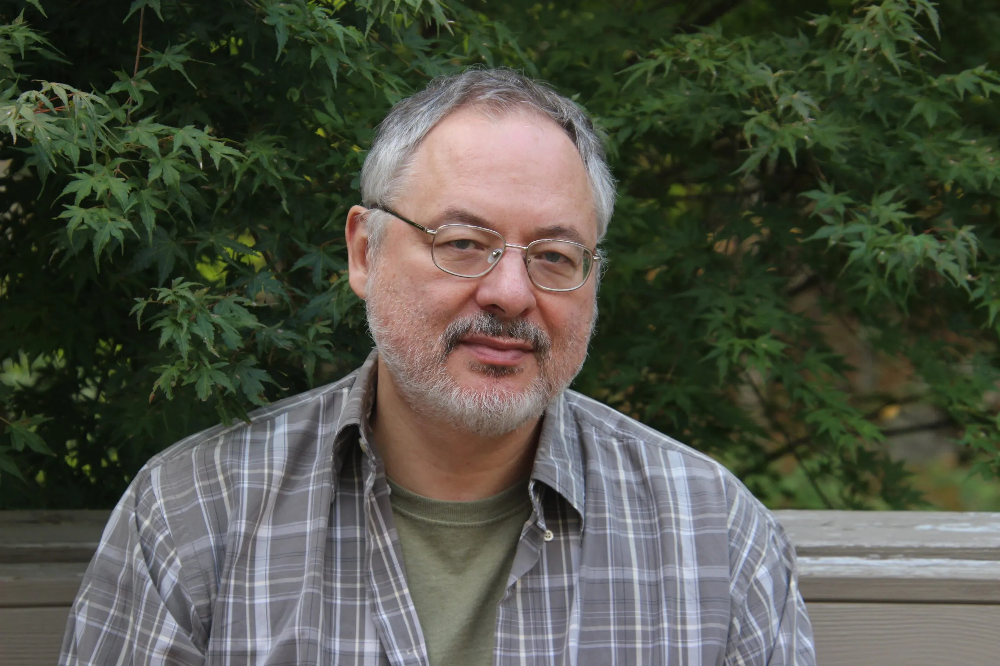

# The Commons-Hub Model

*A repeatable structure for organizing collaboratively-developed open source software
around nonprofit and for-profit satellites*

**Status:** Early concept draft — not reviewed by counsel. Nothing in this document
should be treated as a legal or tax conclusion.

**Scope:** This document describes a generalized, clonable organizational pattern —
it is written to apply to any group collaboratively developing and monetizing an
open source commons, not to any single organization in particular.

---

## Introduction: Why This, Why Now

*Framing draft — the "Trust issues" thread below trails off in the original
dictation and still needs to be finished; flagged rather than guessed at.*

### Corporations as a governance technology, not a law of nature

The corporation is not an eternal or natural fact — it is one historically specific
answer to a recurring question: when people organize together to produce something,
who governs that production, and who the resulting benefit flows to. Different eras
have answered that question differently: guilds, common land,
[joint-stock charters](https://en.wikipedia.org/wiki/Joint-stock_company),
the industrial corporation, the modern platform company. Each is a governance
structure for collective production and benefit allocation, adopted (and later
challenged) because the previous answer stopped serving enough people.

This initiative proposes to treat that question as still open, and to design a
next answer for it — specifically for a mode of production (collaboratively
developed open source software) that the corporate form was never built to serve
well in the first place, since corporate law defaults to concentrating both
ownership and benefit rather than distributing them.

### A return to the commons

Before the [enclosure movements](https://en.wikipedia.org/wiki/Enclosure)
reshaped landholding in England, common land was governed collectively by the
communities that worked it — not owned by any single lord, not managed by the
state. Enclosure privatized that land, and with it, concentrated the benefit
of centuries of collective stewardship into far fewer hands.

<figure>

<figcaption>Enclosure Act for Shifnal, 1793 (Shropshire Archives 539/1/5/3).
Public domain, via Wikimedia Commons.</figcaption>
</figure>

Garrett Hardin's later ["tragedy of the
commons"](https://en.wikipedia.org/wiki/Tragedy_of_the_commons) argument
treated unowned shared resources as inherently doomed to overexploitation —
but Elinor Ostrom's empirical research (which won her the [2009 Nobel
Memorial Prize in Economic
Sciences](https://en.wikipedia.org/wiki/Nobel_Memorial_Prize_in_Economic_Sciences))
overturned that claim, documenting hundreds of real cases where communities
successfully self-governed shared resources through their own institutional
rules, without requiring either privatization or centralized state control.[^1]

<figure>

<figcaption>Elinor Ostrom, 2010. Photo: Holger Motzkau, CC BY-SA 3.0, via
Wikimedia Commons.</figcaption>
</figure>

This initiative is, in effect, a proposal to apply Ostrom-style commons
governance to a *digital* commons — open source software — rather than to land,
water, or fisheries: a body of collectively produced software governed by the
people who build it, with the Commons-Hub structure (§1 below) as the specific
institutional design, and the grant-allocation
[DAO](https://en.wikipedia.org/wiki/Decentralized_autonomous_organization)
(§3–4) as one concrete rule within it, in Ostrom's sense of a community
writing its own rules for how a shared resource's benefit gets distributed.

### Trust and bad-faith actors

Because the Commons is open source, nothing stops an organization or
individual whose goals are directly hostile to the adopting organization's
own mission from adopting the same tooling — no vetting mechanism changes
that, since the license already grants everyone access regardless of
standing in the community. What the organization can still control is
narrower: who earns committer/maintainer standing on its own infrastructure,
and who its community prioritizes when people ask for help. Both are handled
informally, by ordinary maintainer judgment, rather than by a formal vetting
system — see [§6](#6-community-trust-and-contributor-standing).

### The present moment: elite overproduction and AI-driven displacement

<figure>

<figcaption>Peter Turchin, 2020. Photo: Peter Turchin, CC BY 4.0, via
Wikimedia Commons.</figcaption>
</figure>

Peter Turchin's [structural-demographic
theory](https://en.wikipedia.org/wiki/Structural-demographic_theory)
identifies "elite overproduction" as a recurring precondition for social
instability: when a society trains and credentials more aspirants for
elite-track positions than it has positions to absorb them into, intra-elite
competition intensifies, average outcomes for elite aspirants decline, and —
critically — some fraction of those aspirants become "counter-elites,"
turning their training and ambition toward organizing opposition to the
existing order rather than joining it.[^2]

The current U.S. software labor market is a live instance of this pattern: an
education system that has spent two decades producing an increasing supply of
highly credentialed software engineers, now colliding with AI-driven
contraction of entry- and mid-level engineering hiring. A growing population of
capable, credentialed, increasingly frustrated engineers — including recent
graduates with advanced degrees — is finding the traditional elite-track path
(a well-paid job at a major tech employer) narrowing or closing.

### The opportunity

That population is not just a labor pool to hire from — it is a mobilizable
base for a movement, in Turchin's counter-elite sense. This initiative's pitch
to them is not purely economic: it offers a way to do real, technically
substantial work, be paid for it through the mechanisms described in §3–4,
and do so without having to take a job at an organization whose practices
conflict with their politics. (Any organization adopting this pattern will
generally already have its own public language naming the specific employers
or practices it considers disqualifying — that language belongs in the
adopting organization's own materials, not in this generalized document.)
Positioned this way, the Commons-Hub pattern is simultaneously a funding/
staffing strategy for whichever specific organization adopts it, and a
replicable recruitment narrative for any future Satellite or Commons built on
this pattern.

[^1]: [Elinor Ostrom — Wikipedia](https://en.wikipedia.org/wiki/Elinor_Ostrom)
[^2]: [Elite overproduction — Wikipedia](https://en.wikipedia.org/wiki/Elite_overproduction);
    [Structural-Demographic Theory — Peter Turchin](https://peterturchin.com/structural-demographic-theory/)

---

## 1. Core Idea

At the center of the pattern is a **Commons**: a body of collaboratively developed
open source software (and the engineering practices, standards, and shared libraries
around it). The Commons is not itself a legal entity — it's an artifact and a body of
practice. It functions as:

- an **engineering hub** — where core contributors maintain shared infrastructure,
  standards, and foundational libraries
- a **financial source and sync** — money flows *out* of the Commons (funding
  development of the shared stack) and *into* the Commons (royalties, IP licensing
  fees, or contribution-in-kind from satellites that build on it)

Any number of legal entities can be organized *around* a single Commons. A
Commons might be a shared application framework, a set of foundational
libraries, or a full product stack — the pattern is meant to generalize: any
collaboratively-developed open source commons could sit at the center.

```
                 ┌───────────────────────┐
                 │        COMMONS         │
                 │ (shared OSS stack +    │
                 │  engineering hub)      │
                 └───────────┬────────────┘
              funds/IP in  ↑ │ ↓  funds/IP out
        ┌────────────────────┼────────────────────┐
        │                    │                    │
 ┌──────▼──────┐      ┌──────▼──────┐      ┌──────▼──────┐
 │ Satellite A  │      │ Satellite B  │      │ Satellite C  │
 │  501(c)(3)   │      │  501(c)(3)   │      │  501(c)(3)   │
 │      │       │      │      │       │      │      │       │
 │  for-profit  │      │  for-profit  │      │  for-profit  │
 │  subsidiary  │      │  subsidiary  │      │  subsidiary  │
 │  (optional)  │      │  (optional)  │      │  (optional)  │
 └──────────────┘      └──────────────┘      └──────────────┘
```

## 2. The Satellite Layer

Each **Satellite** is a [501(c)(3)](https://www.irs.gov/charities-non-profits/charitable-organizations/exemption-requirements-501c3-organizations)
organized around some program of work that draws on
the Commons. A Satellite may, as its revenue-generating programs mature, spin those
programs out into a **wholly-owned for-profit subsidiary**: the nonprofit retains
mission/governance control, while the subsidiary carries the operational/
revenue-generating work.

Multiple Satellites can exist around one Commons simultaneously — e.g., one Satellite
oriented toward labor organizing tools, another toward tenant organizing, another
toward a specific geography — all built on the same shared stack, all feeding
improvements and (where applicable) licensing revenue back to the Commons.

## 3. Governance Layer — Two Separate Mechanisms

It's important to keep these two things distinct; they are not the same mechanism and
should not be conflated:

- **Organizational governance — the Board.** Mission, priorities, protocols, and
  policy for each Satellite are set through ordinary nonprofit governance: the
  501(c)(3)'s board of directors. **There is no
  [DAO](https://en.wikipedia.org/wiki/Decentralized_autonomous_organization)
  involved in setting priorities or policy.** The board decides what to build,
  which grants to pursue, and what the organization's direction is, exactly
  as any nonprofit board would.

- **Grant-allocation DAO — scoped narrowly, one mechanism among possibly several.**
  A separate, purpose-built DAO mechanism governs exactly one thing: how the proceeds
  of an *already-awarded* grant are split among the individual developers (and pods)
  who contributed to earning it. This DAO does not set policy, does not decide what to
  build, and does not govern the organization. Its entire remit is: given a grant the
  board has already secured, and a defined pool of contributors who worked on it,
  determine what share of the disbursed funds each contributor or pod receives. Other
  narrowly-scoped DAO-like mechanisms may eventually exist for other specific purposes
  (to be defined later) — but priority-setting is never one of them.

## 4. Worked Example: Grant Allocation Mechanic

This is the concrete mechanic the allocation DAO implements. Note that every step here
happens *after* the board has already decided to pursue and has secured the grant —
the DAO has no role in that decision.

1. A Satellite's board pursues and secures a funded program — e.g., a $100,000 grant —
   on terms the board negotiated and remains accountable for.
2. Community members who want to contribute work toward the funded program **opt in**
   as contributors (no fixed roster; participation is self-selected by interest).
3. Each participating contributor completes standard tax intake (e.g., a
   [W-9](https://www.irs.gov/forms-pubs/about-form-w-9) for US persons,
   [W-8BEN](https://www.irs.gov/forms-pubs/about-form-w-8-ben) for foreign
   contributors) and registers a wallet address for
   receiving funds (chain TBD — Bitcoin or Ethereum are the current candidates).
   Intake must be complete *before* a contributor is eligible to receive any
   disbursement — this is a gate, not a follow-up step.
4. As the program hits its funded milestones, **active contributors vote** on how the
   released tranche is apportioned among those who did the work.
5. Votes can allocate a tranche either to an **individual contributor** or to a
   **pod** (a development sub-group working a piece of the program).
6. If a tranche is voted to a pod, the pod's own members then decide internally how to
   divide that chunk — the DAO-level vote only decides the pod's allocation, not the
   individual split within it.
7. The vote's output is an **allocation instruction**, not a payment. It feeds a
   disbursement pipeline that: confirms tax intake is on file for every recipient,
   executes payment only after that check passes, records each payment as compensation
   for services rendered on the specific grant (not as a profit share or gift), tracks
   cumulative payments per contributor per calendar year, and issues
   [1099-NEC](https://www.irs.gov/forms-pubs/about-form-1099-nec) (or the
   applicable equivalent) at year end for contributors who cross reporting thresholds.
   The DAO machinery is meant to be built integrated with this disbursement/tax
   pipeline from the start, not layered on top of it later.

## 5. Risks & Open Questions

Ranked roughly by how likely each is to force a redesign of the mechanic above.

1. **[Legal — medium severity] DAO scope must stay strictly allocation-only.**
   Because the DAO governs only the *distribution* of already-awarded grant funds
   among contributors — not priorities, not policy, not whether to pursue the grant —
   board fiduciary duty is much less implicated than a "DAO sets policy" design would
   be. But the board (or an authorized officer) should still retain audit/override
   authority over disbursements: the org, not the DAO, remains legally accountable for
   how grant funds are spent. Recommend the DAO's vote function as a binding
   allocation instruction that the org's disbursement process executes automatically,
   with the board retaining override/audit rights, not that the DAO's output be
   completely outside institutional control. **Worth confirming with counsel that this
   framing is sufficient**, but it is a materially smaller ask than earlier drafts of
   this document implied.

2. **[Legal/tax — high severity] Payments must be structured as compensation for
   services, not profit-sharing.** Because contributors are being paid out of grant
   funds administered by a 501(c)(3), each payment has to map to actual services that
   contributor performed on that grant — this is the [private-inurement](https://www.irs.gov/charities-non-profits/charitable-organizations/inurement-private-benefit-charitable-organizations)
   guardrail. A
   peer vote determining *shares* is fine as a mechanism for sizing a services
   payment, but the underlying legal characterization must be "contractor payment for
   services performed" — documented as such (e.g., a lightweight statement of work or
   contribution record per contributor per milestone) — not "distribution of grant
   winnings" or a profit-sharing distribution. **Requires confirmation from counsel.**

3. **[Tax] Intake must gate disbursement, not follow it.** Building the DAO/wallet
   registration flow to require W-9/W-8 intake before funds are eligible to move keeps
   compliance built into the mechanism rather than bolted on after the fact — this is
   reflected as step 3 above and should stay a hard gate in implementation, not a
   best-effort follow-up.

4. **[Tax] Crypto valuation & withholding.** Paying in crypto still requires
   fair-market-value USD conversion at time of payment for 1099 reporting purposes,
   and potentially backup withholding if a contributor fails to provide a W-9. Needs
   to be built into the disbursement pipeline, not handled ad hoc at year end.

5. **[Legal/tax] Related-party transactions between Commons and Satellite.** If the
   Commons is ever formalized as its own entity, money/IP flowing between it and a
   501(c)(3) Satellite is a related-party transaction and needs arm's-length terms
   (e.g., an IP license at fair market value) to avoid private-benefit problems.
   Keeping the Commons deliberately entity-less (a shared codebase and set of
   practices, not a legal person) avoids this risk for as long as that's tenable.

6. **[Legal] DAO legal wrapper.** Because the DAO's scope is now narrow (allocation
   only, with off-chain payment execution and board override), it may not need its own
   chartered legal vehicle (e.g., a [Wyoming DAO
   LLC](https://sos.wyo.gov/Business/Docs/DAOs_FAQs.pdf)) the way a policy-setting DAO
   would — it could plausibly be implemented as an internal voting tool feeding an
   ordinary org-run disbursement process. Still **unclear/requires confirmation**
   whether any wrapper is needed, and if so, what liability exposure the voting
   mechanism itself carries.

7. **[Operational] Chain/token choice.** Bitcoin vs. Ethereum vs. something else —
   unresolved.

8. **[Operational] Milestone verification.** Who certifies that a funded milestone has
   actually been met, triggering a vote — likely a board or program-management
   function, but unresolved.

9. **[Policy] Interaction with an adopting organization's existing comp
   philosophy.** Many organizations publicly commit to transparent,
   formula-based compensation bands rather than manager/community discretion
   or negotiation. Reconciling that kind of stated philosophy with a
   peer-vote-based allocation mechanic — for anyone who is *also* a paid
   employee or contractor — needs to be resolved case by case per adopter.

10. **[Sequencing] Relationship to an interim fiscal sponsorship arrangement.**
    This document describes a *permanent* structure. It is compatible with,
    and not blocked by, an adopting organization pursuing a fiscal sponsor to
    cover a gap while unincorporated — the sponsor relationship covers the
    near term; this structure is a candidate for what the organization
    incorporates into (or graduates out of the sponsor into) later.

## 6. Community Trust and Contributor Standing

Because the Commons is open source, nothing stops a bad-faith actor from
taking the code and building something the organization opposes — no vetting
mechanism, cryptographic or otherwise, changes that; the license already
grants everyone access regardless of standing in the community. (An earlier
draft of this section specified a zero-knowledge/blockchain-based trust
graph to address this. It was dropped: the mechanism couldn't actually
prevent the harm it was aimed at — open-source code isn't excludable — and
it added real engineering cost to solve a narrower problem than it looked
like it was solving.)

What an organization *can* still control is much narrower, and doesn't need
special machinery:

- **Committer/maintainer status on its own core infrastructure.** Handled
  the way most open-source projects already handle it: a new contributor
  earns commit access through sustained good contributions, vouched for by
  one or two people who already have it. Tracked however the maintainers
  already keep notes — a private list, a GitHub team, a line in a README —
  not a purpose-built trust protocol.
- **Community support prioritization.** In the org's community channels,
  **no one is ever denied help.** People the community already trusts get
  more effort, as a judgment call made in the moment by whoever's
  responding, not a lookup against a formal registry.

Both rely on ordinary human judgment and institutional memory, not on a
system engineered to resist infiltration or graph harvesting — because
there's no formal graph to infiltrate or harvest in the first place.

### A secondary benefit: the support archive itself

Every request for help, whoever it comes from, either surfaces a real gap (a
documentation hole, a bug) worth fixing regardless of the requester's
intent, or adds to a growing record of previously-solved problems. That
archive — mailing list threads, issue trackers, chat logs — is worth
deliberately preserving and indexing on its own merits: it's a natural
training/retrieval corpus for a self-serve support tool (an LLM-backed FAQ
bot, a searchable knowledge base) that reduces the org's support burden over
time. This is a good idea independent of the trust question above, not a
consolation prize for dropping the trust network.

---

*Draft prepared as a collaborative starting point. Next step: legal/tax
review of items 1–2 before any part of the grant-allocation mechanic is
implemented.*
