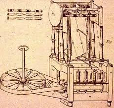
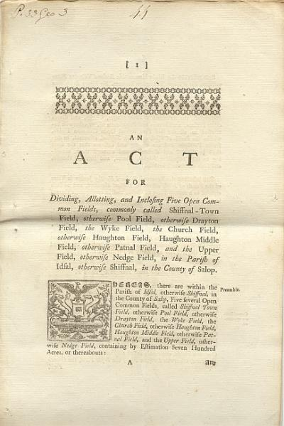

# The Commons-Hub Pattern

*Reference architecture for a replicable model organizing collaboratively-developed
open source software around nonprofit and for-profit satellites*

**Status:** Early concept draft — not reviewed by counsel. Nothing in this document
should be treated as a legal or tax conclusion.

**Scope:** This document describes the generalized, clonable organizational pattern
itself — it is written to apply to any group collaboratively developing and
monetizing an open source commons, not to any single organization in particular.

This is one of four companion documents split out of a single original draft (see
[`DOC-SPLIT-PLAN.md`](DOC-SPLIT-PLAN.md) for the rationale):

- **This document — the reference architecture.** Audience: Chris, future
  co-founders, counsel, and anyone seriously considering cloning the pattern.
- *"Why This, Why Now"* — the argument/manifesto, for prospective contributors,
  funders, and press. Leads with a short version of Appendix A's core claim and
  links back here for the full grounding. *(not yet drafted)*
- *"Contributor Guide: Trust, Standing, and Getting Paid"* — for actual
  committers/contributors. *(not yet drafted)*
- *"Legal Risk Register"* — a living tracker for counsel and the board. Carries
  every item from this pattern's earlier, single-file risk list. *(not yet drafted)*

---

## Introduction

This document presents a replicable organizational model for collaboratively
developing and monetizing an
[open source](https://en.wikipedia.org/wiki/Open-source_software) commons. Before
detailing the mechanics of the model — including how incoming funds from grants
and earned revenue get distributed among contributors through a narrowly-scoped
[DAO](https://en.wikipedia.org/wiki/Decentralized_autonomous_organization) (a
Decentralized Autonomous Organization) — we look at some of the historical and
economic factors which make the emergence of a new model inevitable. We note how
the standard corporate form arose as a specific historical answer to the
questions of (a) who governs production and (b) who benefits from it. We first
analyze these questions through the lens of neoclassical economists — in
particular how [Coase's 1937 transaction-cost
account](https://en.wikipedia.org/wiki/The_Nature_of_the_Firm) explains why
hierarchical structures usually win out. Next up is a dialectical-materialist (Marxist)
reading of the same shift, wherein we ask a question transaction-cost economics
doesn't: who holds the _power_ to set the rules of governance and distribution.

We then examine how the increasing sophistication and reach of AI make any
confident forecast of the next dominant mode of production impossible — to the
point where we have to ask whether human beings can even survive as a species to
participate in whatever mode comes next. Assuming we do, the next question is
whether the average working person ends up better off or worse — and while
today's power structures tilt the scales toward worse, we close on a hopeful
note: the same forces driving that risk also open real room for a
worker-friendly model of production to displace late-stage disaster capitalism,
not just survive alongside it.

## Corporations as a governance technology, not a law of nature

The corporation is not a naturally occurring phenomenon. It is one socially
produced, historically specific answer to two fundamental questions: when people
collaborate to produce something, who governs that production — and who
benefits economically? Different historical eras have answered both
questions differently: [guilds](https://en.wikipedia.org/wiki/Guild),
[common land](https://en.wikipedia.org/wiki/Common_land),
[joint-stock charters](https://en.wikipedia.org/wiki/Joint-stock_company),
the industrial corporation, the modern platform company. Each is a governance
structure for collective production and economic benefit, adopted — and later
challenged — because the previous answer stopped sufficiently serving whoever
held the power to change it. That has usually meant the elites of the era, not
a broad public: the wave of English enclosure that began around the mid-1700s
was driven by landowners who benefited from privatizing common land, not by
commoners demanding it; joint-stock charters emerged to mobilize capital
for merchants and investors who needed a legal vehicle for it, not from popular
pressure. Governance structures tend to change when they stop working for
whoever has enough power to rewrite them.

This document treats our two fundamental questions as still open, and
attempts to answer them for a specific mode of production: collaboratively
developed [open source software](https://en.wikipedia.org/wiki/Open-source_software)
(OSS). It's the _open_ in OSS — open in who may profit from it, open in who
may contribute to it, open in who steers its direction — that makes it a
round peg for corporate law's square hole: the corporate form defaults to
a single, exclusive top-down structure built for
concentrating both ownership and benefit, not the diffuse, non-exclusive shape
open production actually takes.

These questions of who governs production and who benefits from it aren't just
philosophical — economists have a specific answer for why the corporate form
won out over more distributed alternatives. [Ronald Coase's 1937
answer](https://en.wikipedia.org/wiki/The_Nature_of_the_Firm), which won him
the 1991 Nobel in Economics, was transaction costs: for most of industrial
history, hierarchical management was cheaper than coordinating _distributed_
production through the market. That cost calculus is exactly what AI is now
shifting.
[Appendix A.1](#a1-why-firms-exist-coase-the-putting-out-system-and-what-ai-changes)
walks through the textile-industry case that makes the original argument
concrete, and what AI changes about it — and what it doesn't.

## 1. The Commons Layer and Its Satellites

At the center of our proposed pattern is a **Commons**: a body of 
collaboratively developed
open source software (and the engineering practices, standards, and shared libraries
around it). A Commons might be a shared application framework, a set of 
foundational libraries, or a full product stack. The Commons is not itself a 
legal/financial entity; it is an **engineering hub**. It has no bank
account and moves no money itself. When money does need to move -- from 
donors or to contributors that enhance the commons --  we rely 
on the DAO mechanic shown below.

Each **Satellite** is a [501(c)(3)](https://www.irs.gov/charities-non-profits/charitable-organizations/exemption-requirements-501c3-organizations)
organized around some program of work that draws on
the Commons. A Satellite may, as its revenue-generating programs mature, spin those
programs out into a **wholly-owned for-profit subsidiary**: the nonprofit retains
mission/governance control, while the subsidiary carries the operational/
revenue-generating work.

This is the same basic legal shape used by the
[Mozilla Foundation](https://en.wikipedia.org/wiki/Mozilla_Foundation), whose
wholly-owned for-profit subsidiary,
[Mozilla Corporation](https://en.wikipedia.org/wiki/Mozilla_Corporation), has
funded Firefox's development since 2005 — a two-decade precedent for exactly
this structure.

The 501(c)(3)'s **Board** of directors set the mission, priorities,  and policy 
for each Satellite through ordinary nonprofit governance. 
There is no [DAO](https://en.wikipedia.org/wiki/Decentralized_autonomous_organization)
involved in setting priorities or policy. The board decides what to build,
which funded programs to pursue (grants, earned-revenue-funded initiatives,
or internally allocated budget), and what the organization's direction is,
exactly as any nonprofit board would.

## 2. Governance Layer — Two Separate Mechanisms

It's important to keep these two things distinct; they are not the same mechanism and
should not be conflated:

- **Funded-program-allocation DAO — scoped narrowly, one mechanism among
  possibly several.** A separate, purpose-built DAO mechanism governs exactly
  one thing: how the proceeds of an *already-secured* funded program — a
  grant, a commercial-revenue-funded initiative, or a board-allocated
  budget — are split among the individual developers (and pods) who
  contributed to earning it. Deliberately not scoped to grants alone: this
  organization does not intend to depend solely on grant funding long-term,
  and the mechanism doesn't care where the money came from. This DAO does
  not set policy, does not decide what to build, and does not govern the
  organization. Its entire remit is: given a funded program the board has
  identified, and a defined pool of contributors to that program,
  determine what share of the disbursed funds each contributor or pod
  receives. 

## 3. Worked Example: Funded Program Allocation Mechanic

At a high level: once a Satellite's board secures a funded program — a grant, an
earned-revenue-funded initiative, or a board-allocated budget — contributors who opt
in to work on it vote, via Coordinape/Snapshot, on how the released funds are split
among individuals and pods. That vote produces an allocation instruction, not a
payment: the board reviews it, a tax-intake gate (W-9/W-8BEN) must be cleared before
any recipient is paid, and payments are tracked and reported (1099-NEC) as
compensation for services rendered on that specific program.

The full step-by-step mechanic — both pipeline diagrams, the opt-in and tax-intake
gating detail, and the individual-vs-pod allocation rules — has moved to the
[Contributor Guide](contributor-guide.md), written for the audience that actually
needs this level of operational detail. Outstanding legal/tax questions about the
mechanic (DAO scope vs. fiduciary duty, compensation-vs-profit-sharing
characterization, intake-as-gate, crypto valuation and withholding) are tracked
separately in the [Legal Risk Register](legal-risk-register.md).

## 4. Economic Benefit — Sequencing Across Mechanisms

By this point there are three distinct mechanisms in play, and it's easy to
conflate them since they all touch "who gets what." Worth seeing side by
side once, rather than only encountering each in its own document:

| Mechanism | Scope | Duration | Economic value | Who's eligible |
|---|---|---|---|---|
| DAO (§2–3 above) | Per funded program | Episodic — ends when the program does | Cash, paid for services rendered | Self-selected opt-in contributors |
| Tactical tokens (see the *Contributor Guide*) | Ongoing | Decays with inactivity | None — pure voice | Registered committers who've earned trust |
| ESOP | Ongoing | Vests over years | Real equity | Legally must be broad-based — ~all full-time employees |

A fourth candidate — an ESOP for the for-profit subsidiary — belongs on
this table conceptually but not yet operationally. It only becomes worth
evaluating once two things are both true, not on a calendar date:

1. **There's real enterprise value to distribute.** An ESOP requires an
   independent appraisal (no public market for the stock); with negligible
   or negative enterprise value, there's nothing meaningful to allocate —
   just administrative cost for its own sake.
2. **There's stable cash flow to fund the repurchase obligation.** Every
   vested share must eventually be bought back in cash when a participant
   leaves. A program-to-program or grant-to-grant cash position can't
   safely carry that liability; it takes predictable operating cash
   flow — in practice, real commercial revenue, not just grants.

Industry feasibility guidance (NCEO and others) puts typical setup costs at
**$100k–$250k+**, with most transactions wanting **~$1M+ in annual EBITDA
and ~20+ employees** to justify that overhead — smaller ESOPs do exist, but
this organization is well below even that floor today. One more sequencing
note for later, not now: if a founder-exit tax deferral under
[IRC §1042](https://www.financialplanningassociation.org/learning/publications/journal/AUG24-using-irc-section-1042-retirement-and-exit-planning-business-owners-guide-financial-OPEN)
is ever on the table, the subsidiary needs to already be a C-corp before
that transaction — an entity-type decision worth making with this in mind
well before it's actually needed.

**The resulting ladder:**

- **Now:** DAO for project-based cash payouts, tactical tokens for
  day-to-day voice. No ESOP — no enterprise value or stable cash flow yet
  to justify one, and no broad-based W-2 team to make "broad-based" mean
  anything.
- **Once the subsidiary has sustained commercial revenue and real
  employees** (not just grant-funded opt-in contributors): ESOP feasibility
  becomes worth a real evaluation, running alongside — not replacing —
  the DAO and tactical tokens, each still doing its own job.
- **If a founder-exit rollover is ever a goal:** C-corp status needs to
  already be in place before that transaction, which means the entity-type
  decision should account for this option early, not be revisited under
  time pressure later.

---

## 5. The Stakes, and Why This Pattern Has an Edge

AI, paired with breakneck progress in robotics, automation, and the Web's role in
democratizing knowledge, points toward a level of material abundance humanity has
not seen before. But the same technology concentrates the means to capture that
abundance in fewer hands: mass job loss, deeper concentration of wealth and power,
and constant surveillance are not even the worst of the possible consequences — at
the far end sits the possibility of an existential threat to the species that
pushed AI technology to its current point.
[Appendix A.8](#a8-ai-abundance-and-the-case-for-urgency) lays out the full
argument.

Assume, for the sake of argument, that we clear that bar. The next question is
whether the average working person ends up better off or worse under whatever
comes next — and today's power structures, left to their own devices, tilt that
outcome toward worse: the same concentration of compute, capital, and political
leverage that creates the existential tail risk also determines who captures the
day-to-day gains long before any of that plays out.

None of that is inevitable, though — and this is where we close on a hopeful
note. Two structural properties of this pattern work directly against that
default trajectory.

### Why this pattern has a cost advantage a for-profit competitor can't match

Nonprofit and grassroots organizations without much money are a real market with a
real, recurring need — CRM/outreach tooling, in Doikayt's own case — that most
for-profit software companies leave alone. Not because the need is illusory, but
because these customers can't pay enough to justify ordinary customer-acquisition
cost. That's usually treated as this pattern's central constraint. It's also,
quietly, a structural advantage.

What a for-profit startup normally has to spend real money to acquire — actual
users, in volume, willing to run early builds, report what's broken, and ask for
the next feature — this pattern gets for free, in abundance, as a side effect of
serving a market a for-profit competitor is ignoring. And the problems don't stay
confined to that market: once a Satellite has solved a given problem for a
cash-poor organization, it's common to find that better-funded organizations have
a structurally similar version of the same problem. Because the resulting software
is free, open, and low-cost to adopt, a Satellite can move into that adjacent,
better-funded market at a cost structure a for-profit incumbent can't match — it
isn't competing on price with something built to extract margin from that market.

### The labor-market half of the advantage: elite overproduction and AI-driven
displacement

Peter Turchin's [structural-demographic
theory](https://en.wikipedia.org/wiki/Structural-demographic_theory)
identifies "elite overproduction" as a recurring precondition for social
instability: when a society trains and credentials more aspirants for
elite-track positions than it has positions to absorb them into, intra-elite
competition intensifies, average outcomes for elite aspirants decline, and —
critically — some fraction of those aspirants become "counter-elites,"
turning their training and ambition toward organizing opposition to the
existing order rather than joining it.[^2]

The current U.S. software labor market is a live instance of this pattern: an
education system that has spent two decades producing an increasing supply of
highly credentialed software engineers, now colliding with AI-driven
contraction of entry- and mid-level engineering hiring. A growing population of
capable, credentialed, increasingly frustrated engineers — including recent
graduates with advanced degrees — is finding the traditional elite-track path
(a well-paid job at a major tech employer) narrowing or closing.

That population is not just a labor pool to hire from — it is a mobilizable
base for a movement, in Turchin's counter-elite sense. Paired with the
cost-advantage dynamic above, this pattern has two complementary resources most
startups have to pay real money for: engaged users and committed labor.

### Resilience: why dispersion is a strength, not just a scaling property

This multi-Satellite shape is a resilience property, not just a scaling one.
Concentrating value and capability into a single legal entity is exactly what
makes it worth attacking — legally, politically, operationally. A dispersed,
replicable structure has no equivalent point of failure: no single Satellite is
load-bearing for the pattern as a whole. See Appendix A.6, ["Why dispersion, not
just adequate but
better"](#a6-why-dispersion-not-just-adequate-but-better-the-aircraft-carrier-problem),
for the full argument.

Cost structure and resilience aren't abstractions here — they're the concrete
reasons a worker-friendly model of production doesn't have to stay a hopeful
aspiration. This is exactly the model built to give a better answer to the
question this document opened with.

## Appendix A: Historical and Economic Grounding

*This appendix is contained here deliberately, per the doc-split plan: it holds
the historical/economic argument for why this pattern exists and why now, in one
place, so "Why This, Why Now" and the other companion documents can link back to
it rather than repeating it inline.*

### A.1 Why firms exist: Coase, the putting-out system, and what AI changes

Building on the Introduction's transaction-cost account: the clearest
illustration is textile production just before the modern
corporation took shape. Before Richard Arkwright's water frame (1769), English
cloth was made under the *putting-out system* — pure market coordination: a
merchant distributed raw wool or cotton to independent spinners and weavers
working in their own homes, paid piece-rate for finished cloth, no employment
relationship at all. It lost to the factory for three specific reasons:
**production was unobservable** (a merchant only saw finished cloth,
never the process, which produced chronic embezzlement of material and
inconsistent quality); **scheduling was unenforceable** (dispersed workers set
their own pace, often around farm work); and **the new machinery physically
required centralization** — a water wheel could power a mill, not a cottage.
Direct supervision solved the first two problems outright; centralization was
the only way to use the new capital equipment at all.

<figure class="float">

<figcaption>A hand spinning wheel (left) beside Arkwright's water frame (right) —
the putting-out system's tool next to the machine that replaced it. Source:
Wikipedia — exact page and license requires confirmation before publication.</figcaption>
</figure>

> The corporate form didn't cause the factory system — the machinery did, and
> the corporation is the ownership structure that machinery required.

AI doesn't erode all three of the 1769 reasons equally, and the honest version
of this argument has to say so line by line rather than just asserting "AI
makes things cheap":

- **Observability** — the strongest point of the parallel. AI-assisted code
  review, automated testing, and the trust/vetting mechanisms described in the
  [Contributor Guide](contributor-guide.md) do a real version of what a factory
  foreman did: make the production process legible without requiring everyone
  under one roof.
- **Capital-centralization — this one inverts, rather than just weakening.**
  In 1769 the machinery forced centralization; a spinner could never own a
  water wheel. Today the equivalent capital — compute, AI models — is rentable
  by the hour through cloud APIs. A dispersed contributor can access
  industrial-grade tooling *without* being inside a hierarchical firm that
  owns the capital equipment.
- **Scheduling/coordination** — largely already solved by tooling that
  predates this document (version control, CI/CD, issue trackers), with AI
  plausibly reducing the remaining friction further.
- **What doesn't get solved, and may get harder:** the 1770 embezzlement
  problem was about *material*; the equivalent risk now is trust in
  *contribution provenance* — can this code, and whoever submitted it, be
  trusted. Cheap AI-generated contribution volume doesn't shrink that
  problem, it grows it — this is the
  [XZ Utils backdoor](https://www.akamai.com/blog/security-research/critical-linux-backdoor-xz-utils-discovered-what-to-know)
  risk, restated as economic history rather than a security anecdote.
  **AI-driven abundance of code doesn't reduce the need for the trust layer
  described in the Contributor Guide — it increases it.**

One more honest qualifier, worth stating plainly rather than leaving implicit:
"cheap" here means cheap in dollars and labor-hours, not cheap in resource
terms. AI compute carries real energy, water, and embodied-carbon costs. An
organization whose values already lean toward social and economic justice
shouldn't present AI-driven abundance as costless — that would sit
inconsistently with the rest of this document's posture, which flags rather
than asserts wherever a claim is uncertain.

### A.2 What Coase's account leaves out: power, and Marx's answer to it

Coase's framework answers "why hierarchy, given the technology and the cost of
coordination" — but it takes the surrounding distribution of power over
infrastructure as a fixed backdrop, not something to be explained. It doesn't
ask who got to own the water wheel, who got to write the terms spinners worked
under once centralized, or why "efficiency" so often turns out to have been
decided in advance by whoever already held the leverage to decide it. The issue
of who holds power in a relationship, and how they choose to exercise it, is
not a footnote to human production relationships — it is close to the most
fundamental fact about them. An explanation of why firms exist that doesn't
ask that question has a real blind spot, not just an incomplete one.

This document already makes a version of that argument once, without naming it
as such: the Introduction's account of enclosure is exactly this critique in
miniature. The shift from common land to private landholding wasn't a response
to commoners demanding more efficient land use — it was landowners with the
power to rewrite the rules doing so, in their own interest, and calling the
result an improvement. Coase's transaction-cost story and the "efficiency"
framing around it can be true as far as it goes and still be the story told
afterward by whoever won.

Marx's own answer to the same question isn't merely "the powerful decide" as a
general cynicism — he has a specific mechanism, and it's a genuinely useful lens
for the current moment, not just a historical curiosity. His "Fragment on
Machines," in the [*Grundrisse*](https://www.marxists.org/archive/marx/works/1857/grundrisse/ch13.htm)
notebooks (1857–58), predicted a point at which automated, machine-embodied
social knowledge — what he called the **general intellect** — becomes the
primary productive force directly, at which point value grounded in direct,
individually-measured labor time starts to break down as the actual basis of
production. Software built substantially by AI, trained on the accumulated,
freely-given knowledge-work of millions of people, and then made freely
reproducible at near-zero marginal cost, is about as literal an instance of
"general intellect becoming a direct productive force" as has existed since
Marx wrote the phrase. This is also the passage the later Italian *operaisti* —
[Antonio Negri](https://en.wikipedia.org/wiki/Antonio_Negri),
[Carlo Vercellone](https://en.wikipedia.org/wiki/Carlo_Vercellone), and
[Maurizio Lazzarato](https://en.wikipedia.org/wiki/Maurizio_Lazzarato) — built
[cognitive capitalism](https://en.wikipedia.org/wiki/Cognitive_capitalism) and
[immaterial labor](https://en.wikipedia.org/wiki/Immaterial_labour) theory on:
once value comes from socially-distributed, networked cognitive labor rather
than labor time inside one factory under one owner's direct supervision,
private appropriation of that value becomes increasingly awkward to justify, or
even to mechanically sustain.

Read this way, Coase and Marx aren't answering different questions so much as
describing the same mechanism from two different standpoints: Coase describes
it from inside the system, as a transaction-cost optimization; Marx describes
it from the standpoint of the system's eventual supersession, as a contradiction
between how value is actually produced (socially, collaboratively) and how it's
still legally appropriated (privately, by an owner). Both are looking at the
same shift in where productive capability actually lives.

### A.3 Determinism vs. contingency: what this document is and isn't claiming

It would be convenient — and dishonest — to claim that any of this makes the
outcome determined. A strict materialist reading would want to say this is a
determined transition: the contradiction sharpens, the old relations become an
unsustainable fetter, transformation follows more or less on schedule. The
actual historical record doesn't support that confidence: capitalism has
repeatedly absorbed exactly this kind of threat rather than being superseded by
it — open protocols get captured into platforms, networked production gets
re-enclosed via IP law and API paywalls, and there's nothing automatic about
commons-based production winning this round either.

The honest version isn't "history is doing this for us." It's: the technical
conditions are more favorable to this kind of project than they've been before,
and someone still has to build the institutions that actually hold the line, on
purpose, against re-enclosure. Which, not coincidentally, is what the
[Contributor Guide](contributor-guide.md)'s trust layer and non-transferable
tactical-governance tokens are actually for — they're the deliberate, contingent
political work standing in for the "inevitable" the dialectic doesn't actually
guarantee. Nothing in this pattern wins by waiting.

### A.4 Commons-based peer production: Benkler's answer

There's a second, independent reason hierarchy isn't needed here, distinct
from anything AI changes. Coase's hierarchy doesn't only solve "I can't see
what you're doing" — it solves "you don't actually want to do what I need,"
the **misalignment** between what a wage-earner wants (the largest wage for
the least effort) and what a firm wants (the largest output for the wage),
which is precisely what supervision hierarchies exist to manage. Self-selected,
mission-driven contributors who opted in because they believe in the goal
mostly don't have that gap to begin with — this isn't a cheaper way to
supervise labor, it's a context where the thing supervision exists to fix is
largely absent. This already has a name and a rigorous treatment, and it's a
tighter fit here than Coase alone:
[Yochai Benkler, "Coase's Penguin, or, Linux and The Nature of the
Firm"](https://cyber.harvard.edu/is03/Readings/Benkler_Excerpt.pdf) (Yale Law
Journal, 2002) — the title is a direct response to Coase, using Linux as the
empirical counter-case, and it argues for a third mode of production alongside
markets and firms: **commons-based peer production**, where complex goods get
built by self-organizing contributors motivated by non-monetary reasons
(mission, reputation, craft), coordinated through shared infrastructure rather
than either price signals or managerial hierarchy. This isn't speculative —
it's the mode that already produced Linux and most of the open source stack
this pattern itself depends on.

### A.5 Stigmergy: coordination without a center

The coordination mechanism this points toward has a name too:
**[stigmergy](https://www.ncbi.nlm.nih.gov/pmc/articles/PMC10956014/)** —
agents coordinating indirectly through shared traces left in a common
environment, rather than through direct communication or central command. An
ant doesn't get orders; it reads a pheromone trail another ant left and
reinforces or ignores it, and the colony converges on good paths without any
ant ever computing one. It's a live concept in swarm robotics and multi-agent
AI system design today, not just biology — and this pattern already specifies
the pheromone trail: the shared Commons itself, and the committer-standing
record and tactical voting weight described in the
[Contributor Guide](contributor-guide.md), are the shared environment that
lets independent contributors coordinate toward a common goal without anyone
directing traffic.

### A.6 Why dispersion, not just adequate but better: the aircraft-carrier problem

Which points to why dispersion is the better answer here, not merely an
adequate one. Concentrating capability into one legal entity, one point of
control, one target, is exactly the aircraft-carrier problem: enormous value
in a single place is precisely what makes it worth attacking — legally (one
entity to sue or deplatform), politically (one target to pressure),
operationally (one point of funding or leadership failure). A dispersed,
replicable structure doesn't have that failure mode — no single instance is
load-bearing, and if one node goes down, the pattern survives elsewhere. That
is what the clonable, multi-Satellite shape in
[§1](#1-the-commons-layer-and-its-satellites) is actually for: not just a way to scale, but a
resilience strategy.

### A.7 A return to the commons: enclosure and Ostrom

Before the [enclosure movements](https://en.wikipedia.org/wiki/Enclosure)
reshaped landholding in England, common land was governed collectively by the
communities that worked it — not owned by any single lord, not managed by the
state. Enclosure privatized that land, and with it, concentrated the benefit
of centuries of collective stewardship into far fewer hands.

<figure class="float">

<figcaption>Enclosure Act for Shifnal, 1793 (Shropshire Archives 539/1/5/3).
Public domain, via Wikimedia Commons.</figcaption>
</figure>

Garrett Hardin's later ["tragedy of the
commons"](https://en.wikipedia.org/wiki/Tragedy_of_the_commons) argument
treated unowned shared resources as inherently doomed to overexploitation —
but Elinor Ostrom's empirical research (which won her the [2009 Nobel
Memorial Prize in Economic
Sciences](https://en.wikipedia.org/wiki/Nobel_Memorial_Prize_in_Economic_Sciences))
overturned that claim, documenting hundreds of real cases where communities
successfully self-governed shared resources through their own institutional
rules, without requiring either privatization or centralized state control.[^1]

This initiative is, in effect, a proposal to apply Ostrom-style commons
governance to a *digital* commons — open source software — rather than to land,
water, or fisheries: a body of collectively produced software governed by the
people who build it, with the Commons-Hub structure
([§1](#1-the-commons-layer-and-its-satellites)) as the specific institutional design, and the
funded-program-allocation
[DAO](https://en.wikipedia.org/wiki/Decentralized_autonomous_organization)
([§2–3](#2-governance-layer--two-separate-mechanisms)) as one concrete rule
within it, in Ostrom's sense of a community writing its own rules for how a
shared resource's benefit gets distributed.

[^1]: [Elinor Ostrom — Wikipedia](https://en.wikipedia.org/wiki/Elinor_Ostrom)
[^2]: [Elite overproduction — Wikipedia](https://en.wikipedia.org/wiki/Elite_overproduction);
    [Structural-Demographic Theory — Peter Turchin](https://peterturchin.com/structural-demographic-theory/)

### A.8 AI, abundance, and the case for urgency

AI's honest case for abundance rests on more than the technology itself. Paired with
breakneck progress in robotics and automation, and the Web's role in democratizing
knowledge — anyone now has 24/7 access to an expert
tutor, and the pool of people who can pick
up the skills to become a contributor to a project like this one is larger than it has
ever been — it points toward a level of material abundance humanity has not seen
before.

The same technology concentrates the means to capture that abundance in fewer hands.
Mass displacement of labor, wealth and power pooling further with whoever already
owns the compute and the models, and surveillance capacity to match are not
speculative — they are the direction current incentives already point. At the far end
of that same curve sits a risk with no historical precedent to weigh it against: that
sufficiently advanced AI, up to and including an AI singularity, poses an existential
threat to the species that built it. *(Requires confirmation: this section should cite
specific sources for the existential-risk claim rather than assert it — e.g. the CAIS
statement on AI risk or Bostrom/Christiano — before this document is finalized.)*

This document takes no position on which outcome is more likely — no one credible can,
yet. What it argues is narrower, and harder to dispute: because the downside is this
severe, it is more urgent now, not less, to have alternatives to the traditional
corporation and the capitalist mode of production it was built to serve — built and
tested before the outcome is decided, not improvised after. That is the stake this
whole document is written against.
