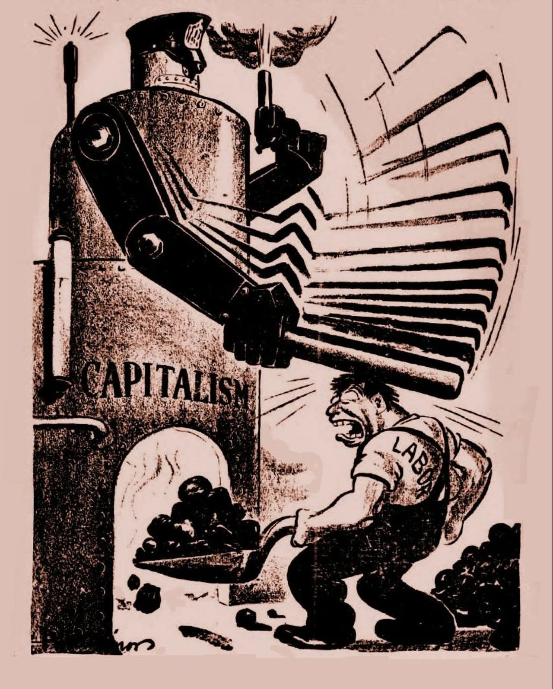
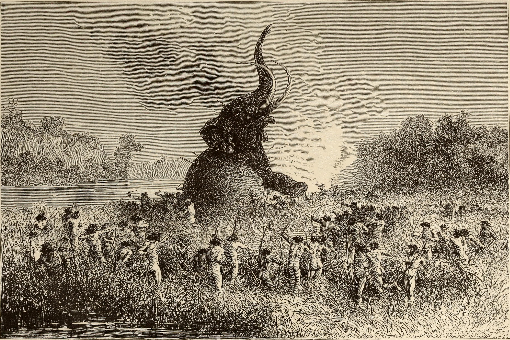
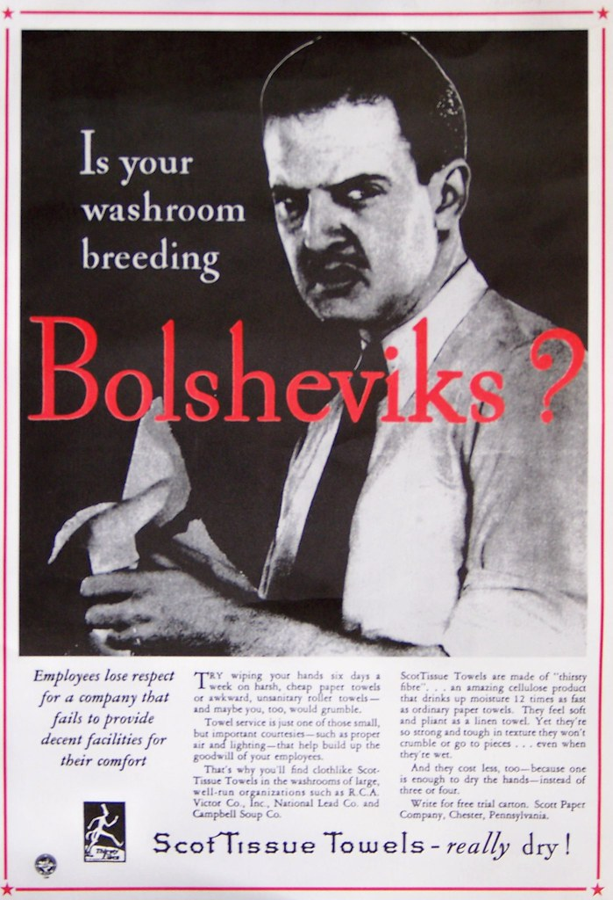
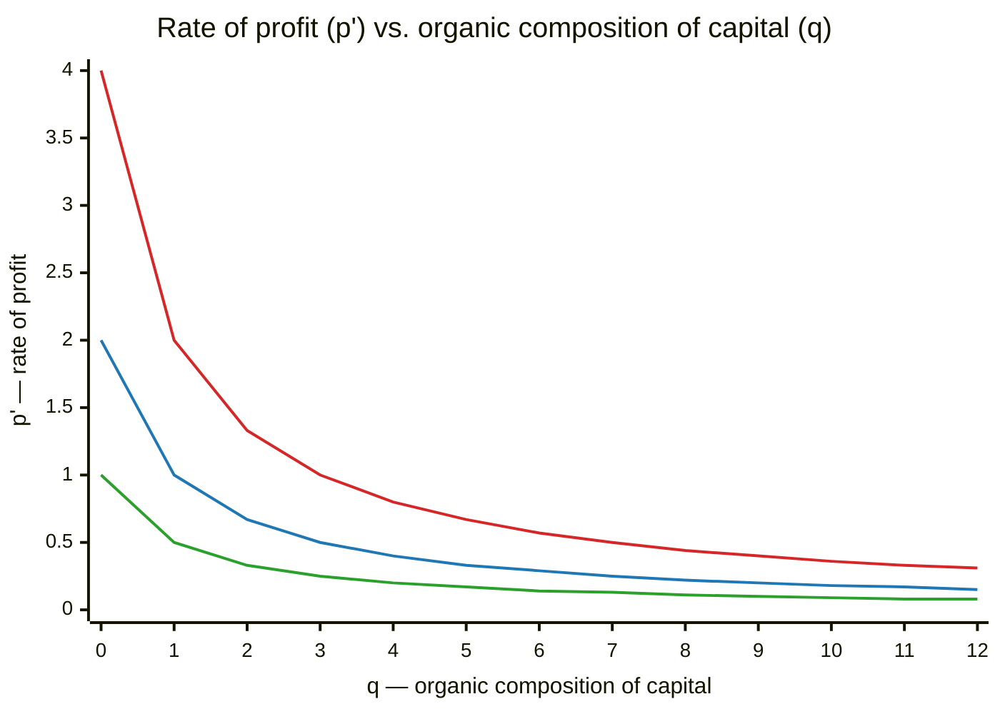

# The Commons-Hub Pattern

*A replicable model for organizing collaboratively-developed
open source software around nonprofit and for-profit satellites*

**Status:** Early concept draft — not reviewed by counsel. 

---

## Table of Contents

- [Overview](#overview)
- [Corporations as a governance technology, not a law of nature](#corporations-as-a-governance-technology-not-a-law-of-nature)
  - [Factors favoring the emergence of the corporate model -- neoclassical View](#factors-favoring-the-emergence-of-the-corporate-model----neoclassical-view)
  - [Drivers of the dissolution of the corporate model -- Marxist view](#drivers-of-the-dissolution-of-the-corporate-model----marxist-view)
- [1. The Commons Layer and Its Satellites](#1-the-commons-layer-and-its-satellites)
  - [Bulwarks against enclosure of our digital commons](#bulwarks-against-enclosure-of-our-digital-commons)
  - [The Tragedy of the Commons, Proven Wrong](#the-tragedy-of-the-commons-proven-wrong)
- [2. Governance Layer — Three Mechanisms](#2-governance-layer--three-mechanisms)
  - [Board](#board)
  - [DAO](#dao)
  - [Token-Based Delegated Authority](#token-based-delegated-authority)
- [3. Economic Benefit — Sequencing Across Mechanisms](#3-economic-benefit--sequencing-across-mechanisms)
  - [C-corp or S-corp?](#c-corp-or-s-corp)
- [4. The Stakes, and why our model has an edge](#4-the-stakes-and-why-our-model-has-an-edge)
  - [The labor-market half of the advantage: elite overproduction and AI-driven displacement](#the-labor-market-half-of-the-advantage-elite-overproduction-and-ai-driven-displacement)
  - [Cost advantages that a for-profit competitor can't match](#cost-advantages-that-a-for-profit-competitor-cant-match)
  - [Resilience through dispersion](#resilience-through-dispersion)
- [Appendix A: Historical and Economic Grounding](#appendix-a-historical-and-economic-grounding)
  - [A.1 Why firms exist: Coase, the putting-out system, and what's changing now](#a1-why-firms-exist-coase-the-putting-out-system-and-whats-changing-now)
  - [A.2 Marxist Economics 101](#a2-marxist-economics-101)
    - [Use-value](#use-value)
    - [Value and socially necessary labor time](#value-and-socially-necessary-labor-time)
    - [From flint tools to factories](#from-flint-tools-to-factories)
    - [Exchange-value and mechanization](#exchange-value-and-mechanization)
    - [Surplus value](#surplus-value)
    - [Class struggle and contradictions](#class-struggle-and-contradictions)
    - [The tendency of the rate of profit to fall](#the-tendency-of-the-rate-of-profit-to-fall)
      - [In accounting terms](#in-accounting-terms)
      - [Quantifying the dissolution driver](#quantifying-the-dissolution-driver)
  - [A.3 Founder labor and the entrepreneurial reward](#a3-founder-labor-and-the-entrepreneurial-reward)
  - [A.4 Commons-based peer production: Benkler's answer](#a4-commons-based-peer-production-benklers-answer)
  - [A.6 Why dispersion, not just adequate but better: the aircraft-carrier problem](#a6-why-dispersion-not-just-adequate-but-better-the-aircraft-carrier-problem)
  - [A.7 A return to the commons: enclosure](#a7-a-return-to-the-commons-enclosure)

---

## Overview

This document presents a replicable organizational model for collaboratively
developing and monetizing an
[open source](https://en.wikipedia.org/wiki/Open-source_software) commons. Before
detailing the mechanics of the model — including how incoming funds from grants
and earned revenue get distributed among contributors through a narrowly-scoped
[DAO](https://en.wikipedia.org/wiki/Decentralized_autonomous_organization) (a
Decentralized Autonomous Organization) — we look at some of the historical and
economic factors which make the emergence of a new model inevitable. We note how
the standard corporate form arose as a specific historical answer to the
questions of (a) who governs production?   and (b) who benefits from that production? We first
analyze these questions through the lens of neoclassical economists — in
particular how [Coase's 1937 transaction-cost
account](https://en.wikipedia.org/wiki/The_Nature_of_the_Firm) explains why
hierarchical structures usually win out. Next up is a dialectical-materialist (Marxist)
reading of the same shift, wherein we ask a question transaction-cost economics
doesn't: who holds the _power_ to organize production and claim its
surplus — and what happens to that arrangement once automation makes
human labor itself increasingly unnecessary.

We later examine how the increasing sophistication and reach of AI make any
confident forecast of the next dominant mode of production impossible — to the
point where we have to ask whether human beings can even survive as a species under
whatever model comes next. Assuming we do, the next question is
whether the average working person ends up better off or worse — and while
today's power structures tilt the scales toward worse, we argue 
that the same forces driving that outcome also open opportunities for 
alternative worker-friendly legal/financial/ownership structures to displace
the top-down corporate form that underpins late-stage disaster capitalism.

In terms of our two opening questions our model's answers are:

- Who governs: the contributors to the commons themselves -- through
[token-based delegated authority](#token-based-delegated-authority)
that vests with earned trust and decays on inactivity (rather than
accumulating into permanent control.)   

- Who benefits, and by what means: the people who did the work on a given funded
program, by their own [equally-weighted vote through a
DAO](#dao). 

## Corporations as a governance technology, not a law of nature

The corporation is not a naturally occurring phenomenon. It is a socially
produced, historically specific answer to **two fundamental questions**: when people
collaborate to produce something, who governs that production (and by what means) — and who
benefits economically (and by what means)? Different historical eras have answered both
questions differently: [guilds](https://en.wikipedia.org/wiki/Guild),
[common land](https://en.wikipedia.org/wiki/Common_land),
[joint-stock charters](https://en.wikipedia.org/wiki/Joint-stock_company),
the industrial corporation, the modern [platform
company](https://en.wikipedia.org/wiki/Platform_economy). Each is a governance
structure for collective production and economic benefit, adopted — and later
challenged — because the previous model no longer served elites
with the power to change it. 

Enclosure Act for Shifnal, 1793 (Shropshire Archives 539/1/5/3). Public domain, via Wikimedia Commons.
The wave of English enclosure that began around the mid-1700s[^1]
was driven by landowners who benefited from privatizing common land, not by
commoners demanding it; joint-stock charters emerged to mobilize capital
for merchants and investors who needed a legal vehicle for it, not from popular
pressure. Governance structures tend to change when they stop working for
whoever has enough power to rewrite them.

This document treats our two fundamental questions as still open, and
attempts to answer them for a specific mode of production: collaboratively
developed [open source software](https://en.wikipedia.org/wiki/Open-source_software)
(OSS). It's the _open_ in OSS — open in who may profit from it, open in who
may contribute to it, open in who steers its direction — that makes it a
round peg for corporate law's square hole. The corporate form defaults to
a single, exclusive top-down structure built for
concentrating both decision-making authority and economic benefit, 
not the diffuse, non-exclusive shape
open production actually takes.

### Factors favoring the emergence of the corporate model -- neoclassical View

In his 1937 paper [*The Nature of the
Firm*](https://en.wikipedia.org/wiki/The_Nature_of_the_Firm), Ronald Coase —
who later won the 1991 Nobel in Economics substantially on its strength —
asked why production gets organized inside firms at all, rather than
coordinated entirely through market transactions between independent
parties. His answer was transaction costs: for most of industrial history,
hierarchical management was cheaper than coordinating distributed production
through the market. That cost calculus is exactly what AI and other rapidly evolving digital 
technologies  are now shifting — [Appendix
A.1](#a1-why-firms-exist-coase-the-putting-out-system-and-whats-changing-now)
walks through the textile-industry case where it first played out.

### Drivers of the dissolution of the corporate model -- Marxist view

Coase's analysis makes the advantages of centralization clear, but begs the
question of _who_ got to own the means of production around which the
corporate firm is centralized — and _how_ they got to own it in the first
place.[^2] That question is exactly what [Marxist economic
theory](#a2-marxist-economics-101)
takes up, centering it on **class struggle**: a structural conflict
between whoever owns "the factory," and those who labor inside of it.
This manifests in terms of conflict over 
how the production process is organized (think wildcat strikes over shop floor conditions), and the
division of the value that process generates.

Capitalist modes of production, according to Marx, play out in a system whose internal
_contradictions_ lead to the inexorable collapse of capitalism itself --   among
these contradictions: quarterly focus on profits' demand for infinite growth
versus the fundamental resource limits of the planet,
the fact that continually _squeezing_ working people's wages leaves them with increasingly _shrinking_
disposable income to purchase the goods a capitalist economy produces. But the internal
contradiction most relevant to this section is the process by which the surplus value
extracted from workers is invested into ever more sophisticated machines which
perform work with ever-increasing efficiency, and ever-diminishing requirements for human labor.

You load sixteen tons, what do you get? Another day older and deeper in
debt. Public domain.

Marx's "Fragment on Machines," in the Grundrisse notebooks (1857–58),[^3] anticipated exactly this: a point at
which automated, machine-embodied social knowledge, "the general intellect" (Marx's term — but
with a striking resonance with today's concept of [AGI](https://en.wikipedia.org/wiki/Artificial_general_intelligence)),
becomes the primary productive force directly, breaking down labor-time as the basis of value.
Once that labor-time basis breaks down, working people notice — both that they no longer
have work, and that the resulting abundance is being captured by a class that visibly
isn't the one still producing it. How a society -- especially one as heavily armed and 
socially fragmented as what we have now in the US --  handles the inevitable disillusionment 
depends to a large degree on whether alternative, fairer models of production can be 
established.

## 1. The Commons Layer and Its Satellites

At the center of our proposed model is a **Commons**: a body of 
collaboratively developed
open source software (and the engineering practices, standards, and shared libraries
around it). A Commons might be a shared application framework, a set of 
foundational libraries, or a full product stack. The Commons is not itself a 
legal/financial entity; it is an **engineering hub**. It has no bank
account and moves no money itself. When money does need to move -- from 
donors or to contributors that enhance the commons --  we rely 
on the DAO mechanic shown below.

<figure>

<figcaption>Donors fund Satellites and customers fund subsidiaries; both pay
compensation expense into a Compensation Distribution DAO. Workers vote on
allocation, the DAO issues an allocation instruction to the Board for
review/override, the Board pays Workers, and Workers contribute code back to
the Commons.</figcaption>
</figure>

Each **Satellite** is a [501(c)(3)](https://www.irs.gov/charities-non-profits/charitable-organizations/exemption-requirements-501c3-organizations)
organized around some program of work that extends or improves 
the Commons. A Satellite may, as its revenue-generating programs mature, spin those
programs out into a **wholly-owned for-profit subsidiary**: the nonprofit retains
mission/governance control, while the subsidiary carries the operational/
revenue-generating work.
This is the same basic legal shape used by the
[Mozilla Foundation](https://en.wikipedia.org/wiki/Mozilla_Foundation), whose
wholly-owned for-profit subsidiary,
[Mozilla Corporation](https://en.wikipedia.org/wiki/Mozilla_Corporation), has
funded Firefox's development since 2005 — a two-decade precedent for exactly
this structure.

### Bulwarks against enclosure of our digital commons

There is an active movement today to re-enclose the digital commons — 
the central component of our model. Companies 
seeking such privatization often justify its merits by pointing to
Garrett Hardin's 1968 essay, ["The Tragedy of the
Commons"](https://en.wikipedia.org/wiki/Tragedy_of_the_commons), which argued
that unowned shared resources are inherently doomed to overexploitation and
mismanagement. Simple in its appeal, this idea has become a go-to rationalization
for private ownership of public goods. Market leading software vendors 
(MongoDB, Elastic, HashiCorp et.al.) have all recently 
decide to relicense away from open source after cloud providers resold
their software without contributing back — HashiCorp's leadership rationalized this move
in almost exactly Hardin's terms: "there's a tragedy of the commons
here."[^4] 

So of what value could our model be, if successful established 
software firms are moving 
in the exact opposite direction?  Note that MongoDB, Elastic, HashiCorp, and Redis 
are for-profit companies answerable
to shareholders — once maintaining their code as open source stopped maximizing shareholder
return, enclosure won out. Our model is engineered to withstand 
that pressure: governance of the Commons is the remit of a 501(c)(3) Satellite, not a
for-profit company, so mission/governance control
([§1](#1-the-commons-layer-and-its-satellites)) stays legally locked to the
public benefit the Satellite was chartered for, never to shareholder
return. That's the actual precondition for this whole proposal: an
organization motivated by mission as opposed to profit has no
motivation or justification to enclose in the same way HashiCorp did. [^5]

### The Tragedy of the Commons, Proven Wrong

We should also note that  Elinor Ostrom's empirical research 
(which won her the [2009 Nobel
Memorial Prize in Economic
Sciences](https://en.wikipedia.org/wiki/Nobel_Memorial_Prize_in_Economic_Sciences))
definitively overturned Hardin's claim. She documented hundreds of real cases where
communities successfully self-governed shared resources through their own
institutional rules, without requiring either privatization or centralized
state control.[^6]    Our proposal can be viewed as applying
Ostrom-style commons governance to a *digital* commons — open source software — 
rather than to land, water, or fisheries.

## 2. Governance Layer — Three Mechanisms

### Board

The 501(c)(3)'s **Board** of directors set the mission, priorities,  and policy 
for each Satellite through ordinary nonprofit governance. 
There is no [DAO](https://en.wikipedia.org/wiki/Decentralized_autonomous_organization)
involved in setting priorities or policy. The board decides what to build,
how to fund those  programs, and what the organization's direction is -- 
exactly as any nonprofit board would.

### DAO

The **DAO** mechanism governs exactly
one thing: how the proceeds of a funded program — a
grant, a commercial-revenue-funded initiative, or a board-allocated
budget — are split among the individual developers (and pods) who
contribute to the realization of that program. 
The DAO does not set policy, does not decide what to build, and does not govern the
organization. Its entire remit is: given a funded program 
and a defined pool of contributors to that program,
determine -- by equally weighted voting -- what share of the 
disbursed funds each contributor or pod receives. The board has the ultimate
authority to approve (the typical case) or reject that proposal.

The vote itself runs on off-chain tooling
([Coordinape](https://coordinape.com)/[Snapshot](https://snapshot.org)); the
[blockchain](https://en.wikipedia.org/wiki/Blockchain)-based leg is
the treasury and payout — funds move from a
[multisig](https://en.wikipedia.org/wiki/Multisignature) treasury to each
contributor's crypto wallet
[on-chain](https://en.wikipedia.org/wiki/Blockchain) (chain TBD). See the
[Contributor Guide](contributor-guide.md) for the full pipeline.

### Token-Based Delegated Authority

Along with the Board and the DAO, a third mechanism governs _day-to-day_
operations — product roadmap construction, build-vs.-buy decisions, staffing
assignments, and similar matters: **token-based delegated authority**.

This authority applies across the nonprofit and its for-profit subsidiary
alike. It is, in effect, a share of decision-making authority that scales
with how much a contributor is trusted, and it is distinct from both  the Board and the 
DAO. The former governs mission, long term priorities, and policy. The latter exists to 
distribute the proceeds of a funded program. 
*Token-based delegated authority* is tactical in scope and carries
no profit-participation rights. 

The _founding steward_ holds all authority initially and grants 'slices' of it to developers
as they deliver results and build trust. Those developers can, in turn, 
delegate that authority to others _they_ trust. 
That delegation is only valid to someone already recognized as a trusted
committer — i.e., someone who's already earned commit rights in
the project, independent of this token system. Reusing
that existing standing as the eligibility check means there's no separate
identity-verification process to design for this mechanism. (See the
[Contributor Guide](contributor-guide.md) for the on-boarding mechanic —
wallet registration and tax documents intake.)

In practice this authority is held as a
[blockchain](https://en.wikipedia.org/wiki/Blockchain)-based token (or
equivalent [smart
contract](https://en.wikipedia.org/wiki/Smart_contract) access-control
mechanism) rather than a database record, so eligibility and
non-transferability can be checked programmatically. It cannot be bought or
sold — it is granted on trust, never transferable for payment — which is
also the central reason this mechanism doesn't read as a security under the
[Howey test](https://en.wikipedia.org/wiki/SEC_v._W._J._Howey_Co.): nothing
is purchased, and there are no profit-participation or resale rights. Two
constraints keep it from calcifying into permanent control: an individual's
share vests over time rather than landing as a lump sum, and it decays on
inactivity rather than accumulating indefinitely.

The full mechanic — committer eligibility, vesting and decay parameters,
concentration caps, and the full securities-law analysis — is being written
up in the [Contributor Guide](contributor-guide.md) and [Legal Risk
Register](legal-risk-register.md), respectively.

*(Proceeds distribution via the funded-program-allocation DAO — the mechanic
formerly summarized in this section — will get its own detailed treatment in a
later document; a pointer back to it belongs here once that's written.)*

## 3. Economic Benefit — Sequencing Across Mechanisms

In an ideal world, commitment to mission would be sufficient motivation for a 
founding steward to adopt our  proposed model. But self-interest and the  desire for
material comfort shapes nearly every decision people make.
The U.S. tax code actually already provides a ready-made mechanism
for leveraging that self-interest: an  [Employee Stock
Ownership Plan](https://en.wikipedia.org/wiki/Employee_stock_ownership_plan) (ESOP.) 

An ESOP is a trust that holds company stock on behalf of a firm's
employees, vesting it to them over years of service. Congress built it
as a tax-favored path to convert employees into genuine owners rather
than just wage earners. That serves two things we want here: first, it
lets a founder take a real, liquid exit, converting the enterprise
value they built into cash; second, it routes all *future* appreciation
to the employees who keep building the company, rather than to
whoever inherits or buys the founder's stake. Self-interest (coupled with mission committment) 
fuels an organization's founding; broad-based ownership captures everything built afterward. (For the fuller argument — including where
our view of founder labor diverges from Marx, and the Schumpeter
framing behind it — see [Appendix
A.3](#a3-founder-labor-and-the-entrepreneurial-reward).)

ESOP feasibility isn't automatic — it only becomes worth evaluating once
two things are both true, not on a calendar date:

1. **There's real enterprise value to distribute.** An ESOP requires an
   independent appraisal (no public market for the stock); with negligible
   or negative enterprise value, there's nothing meaningful to allocate —
   just administrative cost for its own sake.
2. **There's stable cash flow to fund the repurchase obligation.** Every
   vested share must eventually be bought back in cash when a participant
   leaves. A program-to-program or grant-to-grant cash position can't
   safely carry that liability; it takes predictable operating cash
   flow as opposed to sporadically obtained grants.

Industry feasibility guidance (NCEO and others) puts typical setup costs at
**$100k–$250k+**, with most transactions wanting **~$1M+ in annual EBITDA
and ~20+ employees** to justify that overhead — smaller ESOPs do exist, but
this organization is well below even that floor today. One more sequencing
note for later, not now: if a founder-exit tax deferral under
[IRC §1042](https://www.financialplanningassociation.org/learning/publications/journal/AUG24-using-irc-section-1042-retirement-and-exit-planning-business-owners-guide-financial-OPEN)
is ever on the table, the subsidiary needs to already be a C-corp before
that transaction — an entity-type decision worth making with this in mind
well before it's actually needed.

#### C-corp or S-corp?

The two elections differ in exactly the way that matters for retained
earnings, and downstream, for ESOP tax treatment:

- **C-corp:** the corporation itself pays tax on its income (a flat
  21% federal rate, as of this wrting). Retained earnings — profit kept in the company
  rather than distributed — have been taxed once; if ever paid out as
  a dividend, shareholders pay tax on it again. The relevant ESOP
  benefit here is narrower but real: a founder selling stock to the
  ESOP can defer capital-gains tax under
  [IRC §1042](https://www.financialplanningassociation.org/learning/publications/journal/AUG24-using-irc-section-1042-retirement-and-exit-planning-business-owners-guide-financial-OPEN)
  by rolling the proceeds into other US securities — but only if the
  company is a C-corp at the moment of sale.
- **S-corp:** a pass-through entity — no federal tax at the entity
  level. All income is taxed to shareholders in the year it's earned,
  whether distributed or not, so retained earnings here are money
  that's already been fully taxed once and won't be taxed again on
  distribution. Because an ESOP trust is itself tax-exempt, whatever
  share of the company an ESOP owns generates income that currently
  isn't taxed to anyone — a 100%-ESOP-owned S-corp can end up owing no
  federal income tax at all. It just doesn't get §1042: that deferral
  is C-corp only.

The two aren't just different flavors of the same thing — they're
mutually exclusive elections that reward different goals (a founder's
exit versus the ongoing company's retained earnings), and which one
fits depends on facts specific to this organization's cap table,
timeline, and the founders' own tax situation. **This is a decision
for counsel and a CPA familiar with ESOP transactions, not something
this document resolves** — the discussion above is background for that
conversation, not a substitute for it.

By this point there are three distinct mechanisms in play, and it's easy to
conflate them since they all touch "who gets what." Worth seeing side by
side once, rather than only encountering each in its own document:

| Mechanism | Scope | Duration | Economic value | Who's eligible |
|---|---|---|---|---|
| DAO (§2 above) | Per funded program | Episodic — ends when the program does | Cash, paid for services rendered | Self-selected opt-in contributors |
| Token-based delegated authority (see the *Contributor Guide*) | Ongoing | Decays with inactivity | None — pure voice | Registered committers who've earned trust |
| ESOP | Ongoing | Vests over years | Real equity | Legally must be broad-based — ~all full-time employees |

**The resulting ladder:**

- **Now:** DAO for project-based cash payouts, token-based delegated
  authority for day-to-day voice. No ESOP — no enterprise value or stable
  cash flow yet to justify one, and no broad-based W-2 team to make
  "broad-based" mean anything.
- **Once the subsidiary has sustained commercial revenue and real
  employees** : ESOP feasibility
  becomes worth a real evaluation, running alongside — not replacing — the
  DAO and token-based delegated authority, each still doing its own job.
- **If a founder-exit rollover is ever a goal:** C-corp status needs to
  already be in place before that transaction, which means the entity-type
  decision should account for this option early, not be revisited under
  time pressure later.

---

## 4. The Stakes, and why our model has an edge

The past year (2026, as of this writing) has seen rapid, measurable progress
toward AI writing the software that builds AI itself.[^7]   This
mirrors recent progress toward 
["lights-out manufacturing"](https://en.wikipedia.org/wiki/Lights_out_(manufacturing)) 
-- robots building new robots with minimal human involvment -- in the 
physical world. While these  technologies promise never-before-seen levels of material
abundance, they can also be deployed to direct that
abundance exclusively to those whose hands hold the controls. Mass job loss,
heightened inequality, and constant surveillance are not even the worst of the
possible consequences — at the far end sits the possibility of an existential
threat to the species that pushed AI technology to its current point. 

Assuming we clear the extinction bar, the next question is
whether the average working person ends up better off or worse under whatever
comes next. Today's power structures, left to their own devices, tilt that
outcome toward _way_ worse. The same concentration of capital, 
computational resources,  and political influence that enables 
AI research to proceed unregulated also determines who captures the 
day-to-day gains from that same technology.

None of that is inevitable though — and this is where we close on a hopeful
note. First we look at two structural properties of our model 
that provide operational business advantages. Then finally, we address the 
likely consequence of any specific 501c3 realizing a mission 
that is overly threatening to entrenched captial:  targeting and surpression.
We discuss the resliance properties of our model that guard against this.

### The labor-market half of the advantage: elite overproduction and AI-driven displacement

Peter Turchin's [structural-demographic
theory](https://en.wikipedia.org/wiki/Structural-demographic_theory)
identifies "elite overproduction" as a recurring precondition for social
instability: when a society trains and credentials more aspirants for
elite-track positions than it has positions to absorb them into, intra-elite
competition intensifies and average outcomes for elite aspirants decline.
Some fraction of those aspirants then tend to become "counter-elites,"
turning their training and ambition toward organizing opposition to the
existing order rather than joining it.[^8]

This is playing out in the current U.S. software labor market: an
education system that has spent two decades producing what is now an over-supply of
highly credentialed software engineers (Learn to code!) is now colliding with the AI-driven
contraction of entry- and mid-level engineering hiring. A growing population of
capable, credentialed, and increasingly frustrated engineers 
is finding the traditional elite-track path
(a well-paid job at a major tech employer) narrowing or closing.
This population of potential colleagues constitutes 
a committed mobilizable base, naturally aligned with the mission of any non-profit 
that challenges the system that is leaving them behind.

### Cost advantages that a for-profit competitor can't match

Identifying the unmet needs of customers with money, and acquiring those customers
(just getting them to _sign up and try_) is a key challenge for-profits face. 
Small nonprofits and shoestring-budget grassroots organizations pose a different problem 
entirely: their needs are real, often recurring,
and easy to identify — but most for-profit software companies 
leave them alone since they can't pay enough to justify the ordinary 
customer-acquisition cost. This works to our advantage.

While for-profit start-ups normally have to devote significant sales and
marketing budget to acquire their users, a collective that 
adopts our model has a much easier job, precisely because their
targeted user base will be underserved. Once a given problem has
been solved for an initial cash-poor and underserved market, 
it's common to find that better-funded organizations
have structurally similar versions of the same problem. Because the software that solves 
those problems is now proven, free and open, a collective can move into that adjacent,
better-funded market at a cost structure a for-profit incumbent can't match.

In summary, the operational advantages that accrue from these two structural properaties are:
  - lower cost of customer acquisition 
  - lower product marketing spend to figure out what to build
  - lower cost of recruiting and easier staff retention due to alignment around principles

### Resilience through dispersion

Engineers building cloud infrastructure learned this lesson long ago: you don't put a service in one data center, because
one region's outage takes the whole thing down — you replicate across independent regions and providers so no single
failure is fatal. The same logic applies to organizations, and it's the same reason a single aircraft carrier, however
powerful, is one well-placed strike away from losing everything it carries: concentrating value and capability into one
legal entity is exactly what makes it worth attacking — legally, politically, operationally. A dispersed, replicable
structure has no equivalent point of failure: if a lawsuit, a funding collapse, or a government action takes out one
Satellite, the shared Commons and every other Satellite running it keep operating. See Appendix A.6, "Why dispersion, not
just adequate but better", for the full argument.

This isn't hypothetical. In August 2026, the US government designated the Italian hosting collective Autistici/Inventati
a ["Specially Designated Global Terrorist"](https://decode39.com/16319/autistici-inventati-case-sets-a-new-counterterrorism-precedent-irdi-says/)
entity over how its infrastructure was allegedly used by others — and within
days its primary domain and mail server, both concentrated in one operator, went dark for its entire user base.[^9] Its
underlying software was already open source; what wasn't dispersed was the service itself. A multi-Satellite structure
running the same shared code across independently governed, independently banked entities means one Satellite's takedown
doesn't take the whole network's users down with it.

But dispersion of legal entities alone isn't sufficient. If every Satellite banks with the same institutions or registers
domains through the same registry, a single coordinated action, or a wave of banks and hosts preemptively cutting ties
to limit their own exposure, can still hit several at once — real resilience means deliberately varying banks,
registrars, and jurisdictions across Satellites, not just incorporating separately. The DAO's multisig crypto-treasury
leg (§2) offers a partial hedge against that specific bank-level risk — it can't be frozen the way an account can — but
none of this protects whichever Satellite is actually targeted from the consequences of that; dispersion preserves the
pattern and its other Satellites, not any single one of them.

## Appendix A: Historical and Economic Grounding

### A.1 Why firms exist: Coase, the putting-out system, and what's changing now

Building on the Introduction's transaction-cost account: the clearest
illustration is textile production just before the modern
corporation took shape. Before Richard Arkwright's water frame (1769), English
cloth was made under the *putting-out system* — pure market coordination: a
merchant distributed raw wool or cotton to independent spinners and weavers
working in their own homes, paid piece-rate for finished cloth, with no employment
relationship at all. It lost to the factory for three specific reasons:

- **Production was unobservable.** A merchant only saw finished cloth, never
  the process, which produced chronic embezzlement of material and
  inconsistent quality.
- **Scheduling was unenforceable.** Dispersed workers set their own pace,
  often around farm work.
- **The new machinery physically required centralization.** A water wheel
  could power a mill, not a cottage.

Direct supervision solved the first two problems outright; centralization was
the only way to use the new capital equipment at all.

<figure class="float">

<figcaption>Spinning wheel alongside Arkwright's water frame / Source:
Wikipedia</figcaption>
</figure>

Today, AI and the broader digital-infrastructure stack subvert several of
these same advantages at once — and the honest version of this argument has
to show the mapping directly rather than just assert "technology makes
things cheap":

- **Observability and scheduling — the direct flip of the first two 1769
  reasons.** AI-assisted code review, automated testing, and the
  trust/vetting mechanisms described in the [Contributor
  Guide](contributor-guide.md), paired with tooling that predates this
  document (version control, CI/CD, issue trackers), reduce the cost of
  decomposing work, assigning it, monitoring it, integrating outputs, and
  resolving exceptions — a real version of what a factory foreman and a
  fixed schedule did, without requiring everyone under one roof.
- **Capital requirements — the direct flip of the third 1769 reason.** In
  1769 the machinery forced centralization; a spinner could never own a
  water wheel. Today the equivalent capital — compute, AI models, and the
  cloud infrastructure underneath them — is rentable by the hour. A
  dispersed contributor can access industrial-grade tooling *without* being
  inside a hierarchical firm that owns the equipment.
- **Knowledge and information concentration — a fourth advantage the 1769
  case didn't need to name, because it barely existed yet.** Corporations
  have historically concentrated expertise, institutional knowledge, and
  decision-making. AI increasingly makes that expertise portable and
  accessible to distributed producers, eroding an advantage the
  textile-era analysis never had to account for.
- **Trust, quality control, and reputation — the major countervailing
  force, and where the parallel breaks down.** The 1770 embezzlement
  problem was about *material*; the equivalent risk now is trust in
  *contribution provenance* — can this code, and whoever submitted it, be
  trusted. Cheap AI-generated contribution volume doesn't shrink that
  problem, it grows it — this is the [XZ Utils
  backdoor](https://www.akamai.com/blog/security-research/critical-linux-backdoor-xz-utils-discovered-what-to-know)
  risk, restated as economic history rather than a security anecdote.
  Distributed production doesn't eliminate the need for organization; it
  changes what organization has to do — and **technology-driven abundance
  of code doesn't reduce the need for the trust layer described in the
  Contributor Guide, it increases it.**

### A.2 Marxist Economics 101

This narrowly focused primer on Marx's economic theory is targeted to
readers who are 'Marx-curious' but have never studied his work  -- in particular 
his concept of  the **labor theory of value**. The sketch below will, hopefully,
provide sufficient background for readers to understand his "Fragment on Machines" notes.[^3]

#### Use-value

All human beings -- from stone age hunter-gatherers to present day 
warehouse workers -- have an intrinsic understanding of what is useful and what isn't. 
To the former, meat and berries had immediate utility — eat them, and nothing else was required. 
On the other hand, something like a raw chunk
of flint, collected from a streambed, had a different, lesser
utility than it would have once it was worked: as raw material, it was
useful only in the sense that it was good for *becoming something
else* — it couldn't yet cut anything the way a knapped
blade could. That gap between raw material and finished tool was something
the hunter could already see, before ever knapping the stone.
This intrinsic utility of a thing -- a ready to eat berry, or a workable piece of rock -- 
is what Marx calls **use-value**,
and it is inherent in any 'useful thing' -- 
independent of anyone exchanging that thing for some other thing.

#### Value and socially necessary labor time

"A Pre-Historic Mammoth Hunt" (1876). Public domain, via Wikimedia
Commons.

What Marx termed **value** only enters into the picture 
once two hypothteical hunter-gatherer bands meet and barter. Let's say one has access to a
riverbed full of fint, but is short on meat, while the other has
half a mastadon, but is short on tools.
They  start trading: flint tools for meat.
To settle a transaction, both sides need to take into account factors other than
"how maggot-free is this meat" versus "how sharp is
this tool" — these two things are not at all directly comparable. What both sides do
have some rough sense of is how much  time and effort each good took to 
obtain in its finished form: days spent traveling to the 
riverbed, then collecting  and knapping blades, versus 
days spent tracking and butchering game.

That comparison — effort against effort, not usefulness against
usefulness — is the essence of the notion of **value** in Marx's labor theory. *Value* is
best measured as the **socially necessary labor time** a thing takes to
produce for trade — not any one producer's own time, but roughly what
it typically takes producers in general to make the same thing.
To make this concrete: if a slow or unskilled knapper takes all day to
turn out one blade, while a knapper of average skill and
industriousness manages the same blade in an hour, the slow knapper's
blade isn't worth more for the extra hours spent. *Value* inheres in the
*average* time  -- across the whole clan — that it takes to produce
something, not whatever time any individual happens to put in. Any extra
hours are simply wasted and no extra *value* created.

#### From flint tools to factories

Fast-forward to the present, and the same *use-value logic* applies to
modern production inputs. Arable land, a shoe factory, an idle data
center all have real *use-value* on their own, worked or not — a field
_could_ grow crops, a factory _could_ produce shoes, a data center _could_
process information — but only once someone puts in the labor to make
that happen. None of that is *value* yet, though, in Marx's technical
sense — that takes labor aimed specifically at producing something for
exchange, not just any labor for any purpose. A farmer growing food
only for their own family, say, puts in plenty of real labor — but
none of it counts as *value*, because none of it is aimed at a
market. 

Note that this labor need not be manual. Think of the modern engineer
who spends months designing a superior tractor blade: they never
personally forge a single one, but their effort still creates *value*
— and that effort starts even before they begin working on the design. 
It starts even before the spark of initial
insight that a better blade might even be possible. Without years of
prior training, practice, and study, the engineer would never have 
the mental tools that allow that insight to take shape.
Both types of effort count toward *value* creation —
the hours spent studying to be at  the level where insight is possible 
are just as relevant as the hours spent at the drafting table working toward 
the finished design. The total effort hours across both categories are 
thinly amortized across every blade produced as a result of those
efforts.

This is different, though, from what happens inside the machine itself
once it's built. A machine has *value* too — the labor that went
into manufacturing it — but the machine doesn't create new *value*
just by operating; that only happens through the labor of whoever's
running it. What the machine itself does is simpler: it transfers the
*value* it already has into whatever it helps produce, a little at a
time, as it gradually wears out. This is precisely what accountants
now call **depreciation**. Marx calls it
**constant capital** ([`c`](#the-tendency-of-the-rate-of-profit-to-fall)) — *value* passed
along, not *value* created, unlike the engineer's living labor, which
actually adds something new.

That machine's own value has a layered history too: it was itself
built using other machines and tools, whose value depreciated into it
the same way it now depreciates into what it produces. Marx has a name
for this — **dead labor**, congealed from earlier rounds of
production, as opposed to **living labor** — the engineer's, actually
being performed right now. Trace that back far enough and it looks
like a dependency graph fanning out at every step:
this machine's value depends on the machines that built it, which
depend on the machines that built *them*, recursively, until you
finally bottom out at nothing but raw materials and someone's bare
hands.

#### Exchange-value and mechanization

Only after that living labor actually produces something for the
market can we interpret value quantitatively, as **exchange-value**. This 
is Marx's term for how much of one commodity trades for another. *Exchange-value*
is set (roughly) by the ratio of *socially necessary labor* necessary
to produce each item to be exchanged.
A capitalist who introduces a newer, more efficient machine ahead of competitors
captures the gap between the reduced labor time now embodied in each unit
they produce and the social average -- as extra profit. This continues until
competitors adopt similar machinery and the social average itself
falls (the same
mechanization race that drives up the *organic composition of
capital*: [`q`](#the-tendency-of-the-rate-of-profit-to-fall)).

#### Surplus value

There's a more basic source of profit, too — one that doesn't depend on
any competitive edge at all. A worker is paid a wage — this is *variable
capital*, [`v`](#the-tendency-of-the-rate-of-profit-to-fall) — that covers
roughly what it costs to maintain their lifestyle from one day to
the next — everything from food to rent, to entertainment, to
whatever portion of that day's 
pay they put away for a rainy day. Marx calls the
portion of the working day that earns back that wage **necessary labor
time**. Whatever labor is input beyond that point — the **surplus labor time** — still
produces *value*, but that *value* isn't paid for; the employer keeps it as
**surplus value**, the source of profit. Much of that profit doesn't just
sit still, either — competitive pressure pushes employers to reinvest
that surplus into better machinery, chasing exactly the kind of edge
described in the previous  [section](#exchange-value-and-mechanization).

#### Class struggle and contradictions

<table align="right" width="200">
<tr><td></td></tr>
<tr><td>Scot Tissue Towels advertisement, "Is your washroom breeding
Bolsheviks?" (1930s). Public domain.</td></tr>
</table>

Whoever owns the machinery that *surplus value* gets invested in also holds most
of the power to decide how the production process is organized and how
its output gets divided — and whoever operates that machinery has an
obvious stake in both questions too. That opposition of interest is
structural and not something that one good-faith negotiation
resolves for good. This is because the underlying division of power and divergence of 
interests that produce this conflict lingers.

Marx term for this conflict  is **class struggle**, and it's one instance
of a broader pattern he calls *contradictions* — real, structural tensions
between two parts of an economic system that pull against each other and
sharpen over time until something gives. The one that matters most here:
production keeps getting broken down into narrower, more specialized
steps, and the skill and judgment once needed to perform each step
keeps getting captured and re-embodied in the machinery itself, rather
than staying in the worker's hands. The more of that accumulated
knowledge ends up objectified in machines rather than workers, the
harder it is to say the resulting output is solely the product of
whoever owns the machine. It's tensions like this one — playing out
inside a society's actual material conditions, rather than as shifts
in ideas or values — that Marx's method, *dialectical materialism*
(his materialist inversion of
[Hegel's](https://en.wikipedia.org/wiki/Georg_Wilhelm_Friedrich_Hegel)
idealist dialectic), treats as history's actual engine of change.

This isn't only a nineteenth-century abstraction. In the [2023
SAG-AFTRA
strike](https://www.nbcnews.com/tech/tech-news/hollywood-actor-sag-aftra-ai-artificial-intelligence-strike-rcna94191),
studios proposed scanning background performers for a single day's
pay, then using generative AI to synthesize new performances from that
scan indefinitely, with no further compensation owed — union
president Fran Drescher called it "an existential threat to creative
professions." It's a present-day instance of the same pattern: a
worker's skill and likeness is captured once, re-embodied in a reusable
AI-driven asset, and then split off from any future ability of the worker 
to claim any portion of the *value* that asset goes on to produce.

#### The tendency of the rate of profit to fall

Marx's own mathematical notation shows exactly why the mechanization
race we discussed [above](#exchange-value-and-mechanization) doesn't
just squeeze workers harder — it can push the capitalist's own
*rate of profit* toward zero. 

We split the capital a firm lays out into two categories:

- **Constant capital** ($c$) — machinery, materials, everything that
  transfers its existing *value* into output without adding to it.
- **Variable capital** ($v$) — wages, the only capital that creates
  *value* beyond its own cost, since a worker paid $v$ produces more
  than $v$ over the working day.

Total capital advanced is $C = c + v$. The extra output that variable
capital produces — [*surplus value*](#surplus-value)  — is $s$: the source of profit.

Two ratios follow from that split:

- The **rate of exploitation**, $s' = s/v$, measures *surplus value*
  against wages: how much unpaid labor relative to paid.
- The **organic composition of capital**, $q = c/v$, measures
  machinery against wages: how automated a given operation is.

Every time a capitalist introduces a new machine ahead of competitors,
as described above, they raise their own $q$; once rivals follow suit
to keep up, $q$ rises for the whole industry.

Capitalists don't compete on $s'$, though — they compete on **rate of
profit**, *surplus value* measured against the entire capital outlay:

$$p' = \frac{s}{c+v}$$

Divide through by $v$:

$$p' = \frac{s/v}{c/v + 1} = \frac{s'}{q+1}$$

Picture $p'$ plotted against $q$, and this is the asymptote you get:

Each curve in the above graph is a reflection of  how hard labor is being squeezed
(that is: how high $s'$ climbs.) But regardless of which curve we analyze, 
we see that mechanization still drags the
*rate of profit* down toward the same floor. As $q \to \infty$,
$p' \to 0$, machinery transfers *value*; it doesn't create it — only
$v$, *living labor*, does.
So the more of production that shifts from $v$ to $c$, the more the
denominator
outruns anything the numerator can do about it. Push automation far
enough and the rate of profit trends toward zero even as exploitation intensifies
— Marx's own name for this is the **tendency of the rate of profit to
fall**.

This terminology can trip people up: "rate of profit"
sounds like it should track how well capitalists are doing overall, so
one might easily make the mistake that a falling rate means bad 
news for them. It isn't necessarily — a
falling rate and a thriving capitalist class are fully
compatible, just not inevitable. That's because two different things
are being tracked. $p'$ is a *ratio*, profit against total capital
invested, and a falling ratio can easily coexist with a growing
*mass* of profit — if the capital base underneath it (the
denominator) grows even faster than the profit itself. That mass is
just $s$ itself, the absolute dollar amount
([operating profit in GAAP terms](#in-accounting-terms)), not divided
by anything. That capital base is owned, overwhelmingly, by the same
capitalist class collecting the profit. So a falling rate can still
mean the owners come out ahead twice over: capturing both a growing *mass* of profit
*and* ending up with an even  bigger pile of capital (assets) on their own books.

Separately, abundance is a *use-value* related concept. It tracks with 
how much society can actually produce — and automation genuinely 
increases that quantity, whatever is happening to any value-based ratio. What doesn't follow
automatically is _who_ captures these gains: the growing
profit, the growing capital base, or the growing material abundance
itself: that's a question of _who owns_ the machines, not a mathematical one.

Note that Marx treated the *tendency of the rate of profit to fall* as
just that — a _tendency_, not an iron law — and named several
countervailing forces — pressures pushing the other way. Chief among
them: cheapening the elements of *constant capital* itself. As the
industries that produce machinery and raw materials grow more
productive, each unit of `c` embodies less value than before — the
physical mass of machinery increases, but its price doesn't rise in
lockstep, so `q = c/v` climbs more slowly than automation alone would
predict. Add to that foreign trade (cheaper imported inputs, or
higher-margin export markets) and a rising $s'$ that offsets $q$ for a
while, and any of these can slow or reverse the fall in practice.

##### In accounting terms

If you think in balance-sheet terms, here's how these map onto modern
accounting and finance vocabulary — exact for some terms, looser for
others:

| Marx's term | Symbol | Closest modern analog |
|---|---|---|
| Constant capital | `c` | Fixed assets (PP&E) + materials/inventory |
| Variable capital | `v` | Direct labor cost / payroll |
| Surplus value | `s` | Operating profit |
| Total capital advanced | `C = c+v` | Invested capital / capital employed |
| Rate of exploitation | `s' = s/v` | No standard name — closest to a labor-cost markup |
| Organic composition of capital | `q = c/v` | Capital intensity ratio |
| Rate of profit | `p' = s/(c+v)` | ROIC / ROCE (return on invested/employed capital) |

`p'` and ROIC are the tightest match — both ask the same question,
profit per dollar of *total* capital committed, rather than margin on
revenue alone.[^10] `q` and capital intensity are close too; it's a real
ratio tracked in corporate finance, just not always called that. `s'`
has no standard named counterpart — the nearest real-world equivalent
is informal, something like a labor-cost markup.

The tendency of the rate of profit to fall shows up in modern investing too: heavily capital-intensive 
industries — those with lots of fixed assets on the books per
dollar of revenue — are well known to post structurally lower ROIC
than asset-light businesses, part of why investors like Warren Buffett
have long preferred the latter. 

##### Quantifying the drivers of dissolutionment and dissolution

Getting back to our graph in the subsection above, note that its asymptote 
is exactly where Marx's later writing on automation
picks up: at the limit where $q \to \infty$, *living labor* ($v$)
becomes vanishingly small relative to capital, and automated,
machine-embodied knowledge — what Marx calls **general intellect** —
becomes the primary productive force directly. At that point
diminishing socially necessary labor-time doesn't just make the rate of 
profit trend toward zero; it stops being
the basis of *value* at all, since *value* in this whole framework has
depended on $v$ from the start.

None of the above reaches workers as a number, though. What actually lands
on them is the effect of Marx's own countervailing forces working in reverse:
tighter quotas and heavier monitoring as employers push $s'$ up to
offset a rising $q$; stagnant or falling wages as employers cut $v$
directly; specific jobs disappearing as machinery takes over the work
that used to require them; and, periodically, a recession or a round
of layoffs once capital can't find anywhere left to profitably go. It
never reads as "the rate of profit is falling" — it reads as output
climbing while a worker's own claim on it shrinks, which is exactly
the disillusionment the ["Drivers" argument
above](#drivers-of-the-dissolution-of-the-corporate-model----marxist-view)
describes: working people noticing both that they no longer have
work, and that the resulting abundance is being captured by a class
that visibly isn't the one still producing it.

### A.3 Founder labor and the entrepreneurial reward

We lean on Marxist economics throughout this document as an analytical
tool, since it is genuinely useful for describing who captures value
and why. But we part ways with Marx on one point that matters here: the
value of the labor performed by what we'll call the *visionary
capitalist* — the founder doing the unglamorous work of capital
allocation: tweaking spreadsheets, team building, running to meetings, etc.

Marx doesn't deny this is labor — in *Capital*
Vol. 3 he separates the "wages of superintendence" (pay for the *work*
of coordinating production, which a hired manager could earn too) from
"profit of enterprise" (the *owner's* claim on the residual surplus,
which he treats as unearned). It's that second piece — reward flowing
from ownership rather than from the work of founding — that we think
deserves a more generous accounting than Marx gives it, at least in the
specific case of someone actually doing the work of building something
new.

Joseph Schumpeter offers a cleaner theoretical home for this. He drew
his own line between the entrepreneur's profit — a temporary reward for
introducing a genuine innovation, a "new combination" — and the
rentier's return on capital merely owned; the entrepreneurial reward,
in his account, gets competed away once the innovation is copied.[^11]
That's closer to what we mean: the reward attaches to the act of
founding, not to a permanent ownership stake insulated from it.

Where we land: if founder self-interest results in dynastic wealth and
the kind of calcified structural inequality that outlives whatever
labor was performed to earn it, we're against that. But if the same
self-interest is what gets someone to do the actual work of founding —
and the value it creates eventually flows to broad public benefit — we
have no objection to self-interest being part of a founder's
motivation. That's not a contradiction of the mission; it's the
mechanism that gets the mission built in the first place. [Section
3](#3-economic-benefit--sequencing-across-mechanisms) covers the
mechanism — an ESOP — through which we act on that.

### A.6 Why dispersion, not just adequate but better: the aircraft-carrier problem

Which points to why dispersion is the better answer here, not merely an
adequate one. Concentrating capability into one legal entity, one point of
control, one target, is exactly the aircraft-carrier problem: enormous value
in a single place is precisely what makes it worth attacking — legally (one
entity to sue or deplatform), politically (one target to pressure),
operationally (one point of funding or leadership failure). A dispersed,
replicable structure doesn't have that failure mode — no single instance is
load-bearing, and if one node goes down, the pattern survives elsewhere. That
is what the clonable, multi-Satellite shape in
[§1](#1-the-commons-layer-and-its-satellites) is actually for: not just a way to scale, but a
resilience strategy.

[^1]: [Inclosure Acts — Wikipedia](https://en.wikipedia.org/wiki/Inclosure_Acts).
    Parliamentary enclosure became the norm from the 1750s on; by 1750, nearly
    half of all land in England was already enclosed, with roughly 5,200
    enclosure Acts passed between 1604 and 1914, covering about a fifth of
    England's total land area (~6.8 million acres).
[^2]: [Public Goods — YouTube](https://www.youtube.com/watch?v=F4SmgrAmdUQ&t=296s).
    Uses Banksy's graffiti as an example of enclosure — a public good turned
    into a private commodity — and covers Elinor Ostrom's research
    overturning Garrett Hardin's "tragedy of the commons," which this
    document covers directly in [§1](#the-tragedy-of-the-commons-proven-wrong).
[^3]: Karl Marx, "Fragment on Machines," in the [*Grundrisse*
    notebooks](https://www.marxists.org/archive/marx/works/1857/grundrisse/ch14.htm)
    (1857–58) — the notebook section containing the **general intellect**
    passage this document draws on.
[^4]: [As HashiCorp adopts the BSL, an era of open-source software might be
    ending](https://www.runtime.news/as-hashicorp-adopts-the-bsl-an-era-of-open-source-software-might-be-ending/);
    [Moving Away From Open Source: Trends in Source-Available Licensing —
    Goodwin](https://www.goodwinlaw.com/en/insights/publications/2024/09/insights-practices-moving-away-from-open-source-trends-in-licensing).
[^5]: The "nuclear option" against enclosure is a strong copyleft license
    such as the [GPL](https://en.wikipedia.org/wiki/GNU_General_Public_License),
    which requires anyone who distributes a modified version to release
    their changes under the same terms. Note this only locks out
    *third-party* enclosure by default — it doesn't stop the original
    rightsholder from relicensing later, which is exactly how MongoDB
    relicensed away from AGPL: a Contributor License Agreement let them
    do it unilaterally. A GPL project with no CLA and copyright dispersed
    across many independent contributors (the Linux kernel is the
    standard example) is the closest thing to a permanent lock, but it
    would also block a Satellite's own for-profit subsidiary from adding
    proprietary features on top of the Commons. The more workable choice
    for this pattern is a permissive license such as
    [MIT](https://en.wikipedia.org/wiki/MIT_License) or
    [BSD](https://en.wikipedia.org/wiki/BSD_licenses): it lets a
    subsidiary build a thin proprietary layer — hosting, integrations,
    support, a polished commercial product — on top of the shared,
    freely-forkable core. That's the light barrier to entry a subsidiary
    needs to fund itself, without ever restricting the Commons itself.
[^6]: [Elinor Ostrom — Wikipedia](https://en.wikipedia.org/wiki/Elinor_Ostrom)
[^7]: [arxiv.org/abs/2607.07663](https://arxiv.org/abs/2607.07663)
[^8]: [Elite overproduction — Wikipedia](https://en.wikipedia.org/wiki/Elite_overproduction);
    [Structural-Demographic Theory — Peter Turchin](https://peterturchin.com/structural-demographic-theory/)
[^9]: [Designation of Autistici/Inventati as a Specially Designated
    Global Terrorist — U.S. Department of
    State](https://www.state.gov/releases/office-of-the-spokesperson/2026/08/designation-of-autistici-inventati-as-a-specially-designated-global-terrorist)
    (August 26, 2026); [Autistici/Inventati press release — infrastructure
    impact timeline](https://www.inventati.org/campaign/press) (domain
    unreachable August 28, 2026).
[^10]: Real companies tie executive compensation directly to
    ROIC/ROCE performance targets, per their own SEC filings — e.g.
    [Phillips 66's 2021 proxy
    statement](https://www.sec.gov/Archives/edgar/data/1534701/000114036121010999/nc10021503x3_def14a.htm)
    (50% of performance-share payout tied to after-tax ROCE) and
    [Schlumberger/SLB's 2025 proxy
    statement](https://www.sec.gov/Archives/edgar/data/87347/000130817925000029/slb_courtesy-pdf.pdf)
    (three-year average ROCE benchmarked against competitors). On the
    analyst side, comparing ROIC against WACC (cost of capital) is a
    standard valuation framework taught in the [CFA
    curriculum](https://www.cfainstitute.org/insights/professional-learning/refresher-readings/2026/equity-valuation-applications-and-processes).
[^11]: Joseph Schumpeter, *The Theory of Economic Development* (1911;
    trans. 1934), on entrepreneurial profit vs. interest on capital; and
    *Capitalism, Socialism and Democracy* (1942) on "creative
    destruction."

