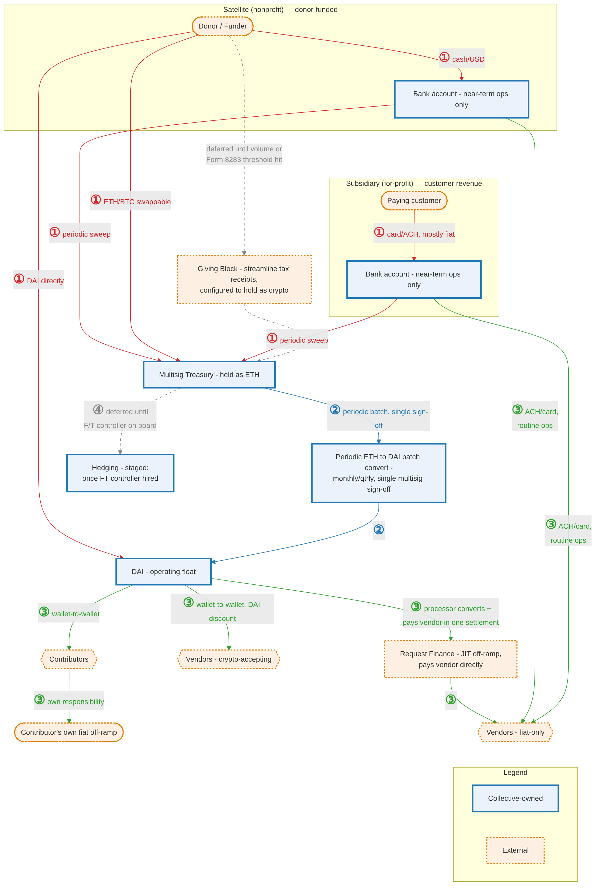
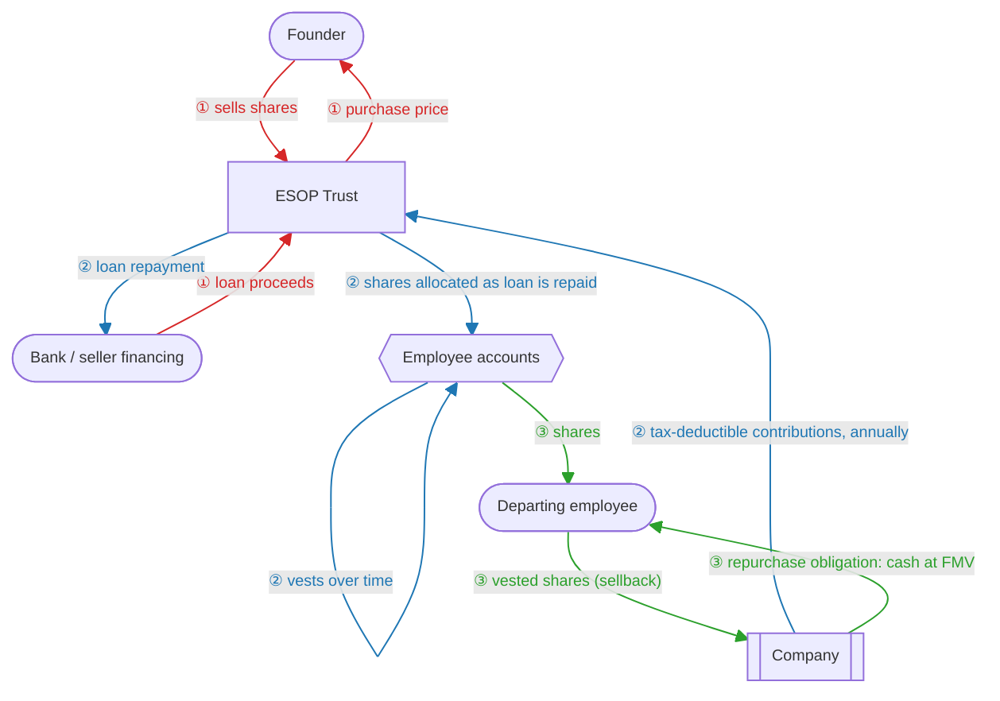
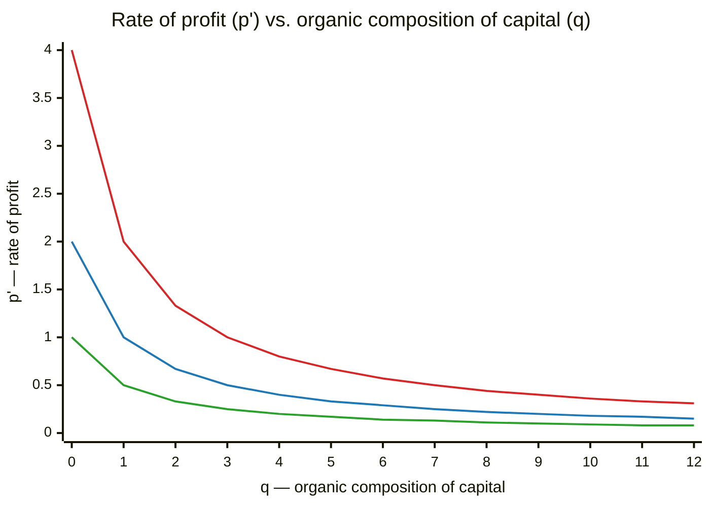
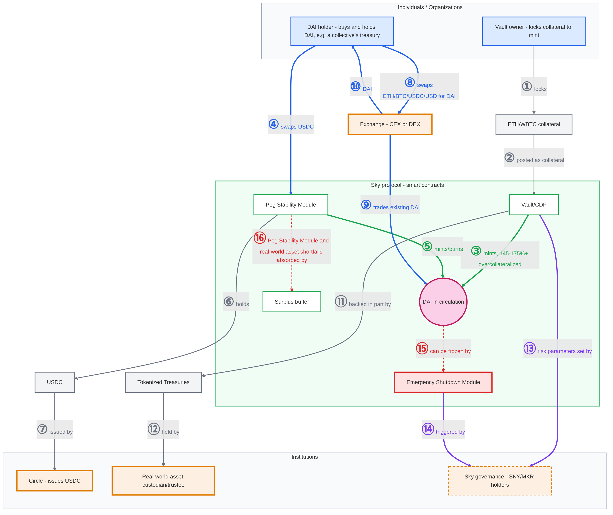

# The Commons-Hub Pattern

<table align="right" width="160">
<tr><td></td></tr>
<tr><td>Brought to you by Doikayt Mobilization Labs</td></tr>
</table>

*A replicable model for organizing collaboratively-developed
open source software (OSS) around nonprofit and for-profit satellites*

**Status:**

Early concept draft.

- Not reviewed by counsel
  - nothing in this document is legal, tax, or financial advice;
  - consult qualified counsel and a CPA before acting on anything discussed herein.
- Not offered as guidance to any sanctioned or designated party.
  - this analysis is intended solely for educational and organizational-design purposes.
  - readers are responsible for complying with their jurisdiction's applicable laws, including sanctions regimes.
- Not written by a trained economist — this is a summary of the
  author's own research and reflection on equitable approaches to
  structuring, operating, and generating wealth from an OSS-focused enterprise.
- Not battle tested — the patterns, strategies and technical solutions we
  propose below are based on the emerging roadmap we
  are putting together for _our_ collective, and are offered in the spirit of
  spurring discussion and soliciting feedback from the OSS community.
- Not yet suitable for dark mode viewing on GitHub. The diagrams are images with white
  backgrounds, so on the dark theme they show up as bright panels: legible, but jarring.
  - to switch to a light theme, open
    [GitHub's appearance settings](https://github.com/settings/appearance) and choose a
    light theme under "Theme mode".
 

---

## Table of contents

- [Overview](#overview)
- [Corporations as a governance technology, not a law of nature](#corporations-as-a-governance-technology-not-a-law-of-nature)
  - [Factors favoring the emergence of the corporate model -- neoclassical view](#factors-favoring-the-emergence-of-the-corporate-model----neoclassical-view)
  - [Drivers of the dissolution of the corporate model -- Marxist view](#drivers-of-the-dissolution-of-the-corporate-model----marxist-view)
- [1. The Commons layer and its Satellites](#1-the-commons-layer-and-its-satellites)
  - [Bulwarks against enclosure of our digital commons](#bulwarks-against-enclosure-of-our-digital-commons)
  - [The Tragedy of the Commons, proven wrong](#the-tragedy-of-the-commons-proven-wrong)
- [2. Governance layer — three mechanisms](#2-governance-layer--three-mechanisms)
  - [Board](#board)
  - [DAO](#dao)
  - [Token-based delegated authority](#token-based-delegated-authority)
- [3. Resilience: surviving attack by design](#3-resilience-surviving-attack-by-design)
  - [Resilience through dispersion](#resilience-through-dispersion)
  - [Case study: the takedown of Autistici/Inventati](#case-study-the-takedown-of-autisticiinventati)
  - [Technical mitigations](#technical-mitigations)
    - [Technical infrastructure: DNS](#technical-infrastructure-dns)
    - [Technical infrastructure: key and credential custodianship](#technical-infrastructure-key-and-credential-custodianship)
    - [Trusted signer election](#trusted-signer-election)
      - [Trusted signer roster design and jurisdictional dispersal](#trusted-signer-roster-design-and-jurisdictional-dispersal)
  - [Financial mitigations](#financial-mitigations)
    - [Fund flows](#fund-flows)
- [4. Distribution of economic benefits — from founder incentives to broad-based ownership](#4-distribution-of-economic-benefits--from-founder-incentives-to-broad-based-ownership)
  - [ESOPs in a nutshell](#esops-in-a-nutshell)
  - [When ESOPs make sense](#when-esops-make-sense)
  - [C-corp or S-corp?](#c-corp-or-s-corp)
- [5. The stakes, and why our model has an edge](#5-the-stakes-and-why-our-model-has-an-edge)
  - [The labor-market half of the advantage: elite overproduction and AI-driven displacement](#the-labor-market-half-of-the-advantage-elite-overproduction-and-ai-driven-displacement)
  - [Cost advantages that a for-profit competitor can't match](#cost-advantages-that-a-for-profit-competitor-cant-match)
- [Appendix A: historical and economic grounding](#appendix-a-historical-and-economic-grounding)
  - [A.1 Why firms exist: Coase, the putting-out system, and what's changing now](#a1-why-firms-exist-coase-the-putting-out-system-and-whats-changing-now)
    - [The tooling wave](#the-tooling-wave)
    - [The AI wave](#the-ai-wave)
  - [A.2 Marxist economics 101](#a2-marxist-economics-101)
    - [Use-value](#use-value)
    - [Value and socially necessary labor time](#value-and-socially-necessary-labor-time)
    - [From flint tools to factories](#from-flint-tools-to-factories)
    - [Exchange-value and mechanization](#exchange-value-and-mechanization)
    - [Surplus value](#surplus-value)
    - [Class struggle and contradictions](#class-struggle-and-contradictions)
    - [The tendency of the rate of profit to fall](#the-tendency-of-the-rate-of-profit-to-fall)
      - [In accounting terms](#in-accounting-terms)
      - [Quantifying the drivers of disillusionment and dissolution](#quantifying-the-drivers-of-disillusionment-and-dissolution)
  - [A.3 Founder labor and fair reward](#a3-founder-labor-and-fair-reward)
  - [A.4 DAI backgrounder](#a4-dai-backgrounder)
  - [A.5 Income vs. retained earnings: a quick refresher](#a5-income-vs-retained-earnings-a-quick-refresher)
- [Footnotes](#footnotes)

---

## Overview

This document presents a replicable organizational model for equitable,
collaborative development and monetization of an
[open source](https://en.wikipedia.org/wiki/Open-source_software) commons. Before
detailing the mechanics of the model — including how incoming funds from grants
and earned revenue get distributed among contributors through a narrowly-scoped
[DAO](https://en.wikipedia.org/wiki/Decentralized_autonomous_organization) (a
Decentralized Autonomous Organization) — we look at some of the historical and
economic factors which make the emergence of a new model inevitable. We note how
the standard corporate form arose as a specific historical answer to the
economic questions of (a) who governs production, and (b) who benefits from that production? We first
analyze these questions through the lens of neoclassical economists — in
particular how [Coase's 1937 transaction-cost
account](https://en.wikipedia.org/wiki/The_Nature_of_the_Firm) explains why
hierarchical structures usually win out. Next up is a dialectical-materialist (Marxist)
reading of the same shift, wherein we ask a question transaction-cost economics
doesn't: who holds the _power_ to organize production and claim its
surplus — and what happens to that arrangement once automation makes
human labor itself increasingly unnecessary.

We later examine how AI's increasing sophistication and reach are shaping the next
dominant mode of production, to the point where we have to ask whether human beings can
even survive as a species in the coming years
([Section 5](#5-the-stakes-and-why-our-model-has-an-edge)). Assuming we do, the next
question is whether the average working person ends up better off or worse — and today's
power structures stack the deck in favor of _way_ worse. Our [resilience
section](#3-resilience-surviving-attack-by-design) walks through a concrete recent example
of entrenched power playing a stacked hand: the August 2026 takedown of the Italian
hosting collective
[Autistici/Inventati](https://decode39.com/16319/autistici-inventati-case-sets-a-new-counterterrorism-precedent-irdi-says/)
(A/I). It then details technical and financial measures that a collective can take to
survive in the face of such takedown attempts.

We close on [a hopeful note](#5-the-stakes-and-why-our-model-has-an-edge) -- examining 
how advantages built into our proposed model open opportunities for alternative
worker-friendly legal/financial/ownership structures to displace the top-down corporate
form that underpins late-stage disaster capitalism.

In terms of our two opening questions our model's answers are:

- Who governs: the contributors to the commons themselves -- through
[token-based delegated authority](#token-based-delegated-authority)
that vests with earned trust and decays on inactivity (rather than
accumulating into permanent control).

- Who benefits: the people who did the work on a given funded
program, by their own [equally-weighted vote through a
DAO](#dao). 

## Corporations as a governance technology, not a law of nature

The corporation is not a naturally occurring phenomenon. It is a socially
produced, historically specific answer to **two fundamental questions**: when people
collaborate to produce something, who governs that production (and by what means) — and who
benefits economically (and by what means)? Different historical eras have answered both
questions differently: [guilds](https://en.wikipedia.org/wiki/Guild),
[common land](https://en.wikipedia.org/wiki/Common_land),
[joint-stock charters](https://en.wikipedia.org/wiki/Joint-stock_company),
the industrial corporation, the modern [platform
company](https://en.wikipedia.org/wiki/Platform_economy). Each is a governance
structure for collective production and economic benefit -- adopted because the previous
model no longer served rival elite factions with the power to change it.
<table align="right" width="150">
<tr><td></td></tr>
<tr><td>Enclosure Act for Shifnal, 1793 (Shropshire Archives 539/1/5/3). Public domain, via Wikimedia Commons.</td></tr>
</table>

The wave of English enclosure that began around the mid-1700s[^1]
was driven by landowners who benefited from privatizing common land, not by
commoners demanding it. Joint-stock charters emerged to mobilize capital
for merchants and investors who needed a legal vehicle for it, not from popular
pressure. Later, factory owners displaced the guilds and the putting-out system (see
[Appendix A.1](#a1-why-firms-exist-coase-the-putting-out-system-and-whats-changing-now)).
The modern platform company has not yet met its challenger, though
[AI-driven production](#the-ai-wave) looks like a likely candidate.

The remainder of our discussion treats our two fundamental questions as still open, and
attempts to answer them for a specific mode of production: collaboratively
developed [open source software](https://en.wikipedia.org/wiki/Open-source_software)
(OSS). It's the _open_ in OSS — open in who may profit from it, open in who
may contribute to it, open in who steers its direction — that makes it a
round peg for corporate law's square hole. The corporate form defaults to
a single, exclusive top-down structure built for
concentrating both decision-making authority and economic benefit, 
not the diffuse, non-exclusive shape
open source development actually takes.

### Factors favoring the emergence of the corporate model -- neoclassical view

In his 1937 paper [*The Nature of the
Firm*](https://en.wikipedia.org/wiki/The_Nature_of_the_Firm), Ronald Coase —
who later won the 1991 Nobel in Economics substantially on its strength —
asked why production gets organized inside firms at all, rather than
coordinated entirely through market transactions between independent
parties. His answer was transaction costs: for most of industrial history,
hierarchical management was cheaper than coordinating distributed production
through the market. That cost calculus is exactly what AI and other rapidly evolving digital 
technologies  are now shifting — [Appendix
A.1](#a1-why-firms-exist-coase-the-putting-out-system-and-whats-changing-now)
walks through the textile-industry case where it first played out.

### Drivers of the dissolution of the corporate model -- Marxist view

Coase's analysis makes the advantages of centralization clear, but begs the
question of _who_ got to own the means of production around which the
corporate firm is centralized — and _how_ they got to own it in the first
place.[^2] That question is exactly what [Marxist economic
theory](#a2-marxist-economics-101)
takes up, centering it on **class struggle**: a structural conflict
between whoever owns "the factory," and those who labor inside of it.
This manifests in terms of conflict over 
how the production process is organized (think wildcat strikes over shop floor conditions), and the
division of the value that process generates.

Capitalist modes of production, according to Marx, play out in a system whose internal
_contradictions_ lead to the inexorable collapse of capitalism itself --   among
these contradictions: quarterly focus on profits' demand for infinite growth
versus the fundamental resource limits of the planet,
the fact that continually _squeezing_ working people's wages leaves them with increasingly _shrinking_
disposable income to purchase the goods a capitalist economy produces. But the internal
contradiction most relevant to this section is the process by which the surplus value
extracted from workers is invested into ever more sophisticated machines which
perform work with ever-increasing efficiency, and ever-diminishing requirements for human labor.

<table align="right" width="200">
<tr><td></td></tr>
<tr><td>You load sixteen tons, what do you get? Another day older and deeper in
debt. Public domain.</td></tr>
</table>

Marx's "Fragment on Machines," in the Grundrisse notebooks (1857–58),[^3] anticipated exactly this: a point at
which automated, machine-embodied social knowledge, "the general intellect" (Marx's term — but
with a striking resonance with today's concept of [AGI](https://en.wikipedia.org/wiki/Artificial_general_intelligence)),
becomes the primary productive force directly, breaking down labor-time as the basis of value.
Once that labor-time basis breaks down, working people notice — both that they no longer
have work, and that the resulting abundance is being captured by a class that visibly
isn't the one still producing it. How a society -- especially one as heavily armed and 
socially fragmented as what we have now in the US --  handles the inevitable disillusionment 
depends to a large degree on whether alternative, fairer models of production can be 
established.

## 1. The Commons layer and its Satellites

At the center of our proposed model is a **Commons**: a body of 
collaboratively developed
open source software (and the engineering practices, standards, and shared libraries
around it). A Commons might be a shared application framework, a set of 
foundational libraries, or a full product stack. The Commons is not itself a 
legal/financial entity; it is an **engineering hub**. It has no bank
account and moves no money itself. When money does need to move -- from 
donors or to contributors that enhance the commons --  we rely 
on the DAO mechanic shown below.

<figure>

<figcaption>Donors fund Satellites and customers fund subsidiaries; both pay
compensation expense into a Compensation Distribution DAO. Workers vote on
allocation, the DAO issues an allocation instruction to the Board for
review/override, the Board pays Workers, and Workers contribute code back to
the Commons.</figcaption>
</figure>

Each **Satellite** is a [501(c)(3)](https://www.irs.gov/charities-non-profits/charitable-organizations/exemption-requirements-501c3-organizations)
organized around some program of work that extends or improves 
the Commons. A Satellite may, as its revenue-generating programs mature, spin those
programs out into a **wholly-owned for-profit subsidiary**: the nonprofit retains
mission/governance control, while the subsidiary carries the operational/
revenue-generating work.
This is the same basic legal shape used by the
[Mozilla Foundation](https://en.wikipedia.org/wiki/Mozilla_Foundation), whose
wholly-owned for-profit subsidiary,
[Mozilla Corporation](https://en.wikipedia.org/wiki/Mozilla_Corporation), has
funded Firefox's development since 2005 — a two-decade precedent for exactly
this structure.

### Bulwarks against enclosure of our digital commons

There is an active movement today to re-enclose the digital commons — 
the central component of our model. Companies 
seeking such privatization often justify its merits by pointing to
Garrett Hardin's 1968 essay, ["The Tragedy of the
Commons"](https://en.wikipedia.org/wiki/Tragedy_of_the_commons), which argued
that unowned shared resources are inherently doomed to overexploitation and
mismanagement. Simple in its appeal, this idea has become a go-to rationalization
for private ownership of public goods. Market leading software vendors 
(MongoDB, Elastic, HashiCorp et al.) have all recently 
decided to relicense away from open source after cloud providers resold
their software without contributing back — HashiCorp's leadership rationalized this move
in almost exactly Hardin's terms: "there's a tragedy of the commons
here."[^4] 

So of what value could our model be, if successful, established 
software firms are moving 
in the exact opposite direction?  Note that MongoDB, Elastic, HashiCorp, and Redis 
are for-profit companies answerable
to shareholders — once maintaining their code as open source stopped maximizing shareholder
return, enclosure won out. Our model is engineered to withstand 
that pressure: governance of the Commons is the remit of a 501(c)(3) Satellite, not a
for-profit company, so mission/governance control
([§1](#1-the-commons-layer-and-its-satellites)) stays legally locked to the
public benefit the Satellite was chartered for, never to shareholder
return. That's the actual precondition for this whole proposal: an
organization motivated by mission as opposed to profit has no
motivation or justification to enclose in the same way HashiCorp did. [^5]

### The Tragedy of the Commons, proven wrong

We should also note that  Elinor Ostrom's empirical research 
(which won her the [2009 Nobel
Memorial Prize in Economic
Sciences](https://en.wikipedia.org/wiki/Nobel_Memorial_Prize_in_Economic_Sciences))
definitively overturned Hardin's claim. She documented hundreds of real cases where
communities successfully self-governed shared resources through their own
institutional rules, without requiring either privatization or centralized
state control.[^6]    Our proposal can be viewed as applying
Ostrom-style commons governance to a *digital* commons — open source software — 
rather than to land, water, or fisheries.

## 2. Governance layer — three mechanisms

### Board

The 501(c)(3)'s **Board** of directors sets the mission, priorities, and policy 
for each Satellite through ordinary nonprofit governance. 
There is no [DAO](https://en.wikipedia.org/wiki/Decentralized_autonomous_organization)
involved in setting priorities or policy. The board decides which programs the
organization funds, how to fund them, and what its long-term direction is -- exactly as
any nonprofit board would. It does not run the product roadmap: what to build day to day
belongs to [token-based delegated authority](#token-based-delegated-authority).

### DAO

The **DAO** mechanism governs 
one thing: how the proceeds of a funded program — a
grant, a commercial-revenue-funded initiative, or a board-allocated
budget — are split among the individual developers (and pods) who
contribute to the realization of that program. 
The DAO does not set policy, does not decide what to build, and does not govern the
organization. Its entire remit is: given a funded program 
and a defined pool of contributors to that program,
determine -- by equally weighted voting -- what share of the 
disbursed funds each contributor or pod receives. The board has the ultimate
authority to approve (the typical case) or reject that proposal.

The vote itself runs on [off-chain](https://csrc.nist.gov/glossary/term/off_chain) tooling
([Coordinape](https://coordinape.com)/[Snapshot](https://snapshot.org)); the
[blockchain](https://en.wikipedia.org/wiki/Blockchain)-based leg is
the treasury and payout — funds move from a
[multisig](https://en.wikipedia.org/wiki/Multisignature) treasury to each
contributor's crypto wallet
[on-chain](https://en.wikipedia.org/wiki/Blockchain) (chain TBD). See the
[Contributor Guide](contributor-guide.md) for the full pipeline.

### Token-based delegated authority

Along with the Board and the DAO, a third mechanism governs _day-to-day_
operations — product roadmap construction, build-vs.-buy decisions, staffing
assignments, and similar matters: **token-based delegated authority**.

This authority applies across the nonprofit and its for-profit subsidiary
alike. It is, in effect, a share of decision-making authority that scales
with how much a contributor is trusted, and it is distinct from both  the Board and the 
DAO. The former governs mission, long term priorities, and policy. The latter exists to 
distribute the proceeds of a funded program. 
*Token-based delegated authority* is tactical in scope and carries
no profit-participation rights. 

The _founding steward_ holds all authority initially and grants 'slices' of it to developers
as they deliver results and build trust. Those developers can, in turn, 
delegate that authority to others _they_ trust. 
That delegation is only valid to someone already recognized as a trusted
committer — i.e., someone who's already earned commit rights in
the project, independent of this token system. Reusing
that existing standing as the eligibility check means there's no separate
identity-verification process to design for this mechanism. (See the
[Contributor Guide](contributor-guide.md) for the on-boarding mechanic —
wallet registration and tax documents intake.)

In practice this authority is held as a
[blockchain](https://en.wikipedia.org/wiki/Blockchain)-based token (or
equivalent [smart contract](https://en.wikipedia.org/wiki/Smart_contract) access-control
mechanism) rather than a database record, so eligibility and
non-transferability can be checked programmatically. It cannot be bought or
sold — it is granted on trust, never transferable for payment — which is
also the central reason this mechanism doesn't read as a security under the
[Howey test](https://en.wikipedia.org/wiki/SEC_v._W._J._Howey_Co.): nothing
is purchased, and there are no profit-participation or resale rights. Two
constraints keep it from calcifying into permanent control: an individual's
share vests over time rather than landing as a lump sum, and it decays on
inactivity rather than accumulating indefinitely.

The full mechanic — committer eligibility, vesting and decay parameters,
concentration caps, and the full securities-law analysis — is being written
up in the [Contributor Guide](contributor-guide.md) and [Legal Risk
Register](legal-risk-register.md), respectively.

*(Proceeds distribution via the funded-program-allocation DAO — the mechanic
formerly summarized in this section — will get its own detailed treatment in a
later document; a pointer back to it belongs here once that's written.)*

## 3. Resilience: surviving attack by design

We now move from governance issues, to the question of what a collective
can proactively do to survive a takedown attempt by a corporate or state actor. Any
collective whose mission genuinely threatens entrenched power should _expect_ to be
targeted. So in the ensuing sections we will:  explain
[resilience through dispersion](#resilience-through-dispersion), the principle that
spreading out any organization's people, assets, and infrastructure improves its odds of
survival; walk through a real takedown that a distributed structure might have survived;
and present _technical_ and _financial_ mitigations that turn the principle into practice.

### Resilience through dispersion

Concentrating capability in one place is inherently risky,
whereas dispersed placement of resources increases resilience in the face of attack.
Recent experience on multiple battlefields have driven this 
home to the US military establishment, whose leadership now recognizes that "forces that are 
concentrated and static are easy for enemy forces to detect and destroy."[^7] 
Cloud infrastructure engineers have long been operationalizing this lesson --
replicating services across regions instead of 
concentrating them in a single data center, where one outage can take out _everything_.

We propose applying this same logic to software collectives —
especially those with status-quo-challenging missions, which are
increasingly at risk of repression by state actors and deplatforming[^8] by
large corporations unwilling to tolerate wrongthink [^9].
In light of such threats, the distributed structure proposed in
[§1](#1-the-commons-layer-and-its-satellites) serves as a preemptive counter-measure.   The referenced diagram posits the satellites
surrounding a digital commons as 501(c)(3) entities, but note that
a trusted individual could provide that same
coordinated, resilient backup in the face of a take-down action (as mentioned
in [this section](#trusted-signer-election).)

### Case study: the takedown of Autistici/Inventati 

The recent (August 2026) US government designation of Italian
hosting collective Autistici/Inventati (A/I) as a ["Specially Designated Global 
Terrorist"](https://decode39.com/16319/autistici-inventati-case-sets-a-new-counterterrorism-precedent-irdi-says/) 
(SDGT) serves as a useful case study on how a satellite structured collective might have
avoided a shut-down. We propose mitigations on two  infrastructural axes:
_technical_, and _financial_ -- but first a recap.

The US State department issued the designation on August 26.[^10] 
Forty-eight hours later, the Public Interest Registry — the nonprofit 
that runs the entire `.org` namespace — disabled `autistici.org`[^11],
taking out roughly 16,000 email accounts, 5,500 mailing lists, ~10,000
blogs, and 1,500 websites in one stroke.[^12]
On the financial side, PayPal took out the payment rails first [^11], and 
Banca Etica followed by freezing the account itself as it was 
unwilling to risk its own [correspondent-banking](https://en.wikipedia.org/wiki/Correspondent_account)
relationships over one customer.[^11]

Jurisdiction factored in as much as a technology in this take down.
First, on the technology side: [DNS](https://en.wikipedia.org/wiki/Domain_Name_System)
is hierarchical and centralized by design — a single registry is the
authoritative source for every name under its
[top-level domain](https://en.wikipedia.org/wiki/Top-level_domain) (TLD), 
and every [resolver](https://en.wikipedia.org/wiki/Domain_Name_System#DNS_resolvers)
worldwide trusts that record without question. That's precisely what
makes a takedown effective with no technical attack at all: disable
the registry entry, and the domain stops resolving globally and
instantly, regardless of the underlying servers' ability to keep running. 

On the jurisdiction side: the [Public Interest Registry](https://pir.org) which runs the
`.org` domain is a Virginia-based 501(c)(3) — a US legal entity.
[Verisign](https://www.verisign.com), which runs `.com`, is a Delaware corporation
headquartered in California. Once the SDGT
designation was issued, both registries were subject to the  same US
legal exposure that froze PayPal and Banca Etica's accounts. A US
entity can't keep providing services (registration included), to a
designated (targeted) party. That's what actually took `autistici.org` down —
the registry's own legal obligation to stop serving it, layered on top
of DNS's own centralized architecture giving that decision instant,
global effect. A registry chartered outside the US isn't bound by that
same compulsion, but the centralization problem remains — which is
exactly what the onion-mirror mitigation (below) is built to route
around.

### Technical mitigations

Mitigations fall on the two axes named  at the start of the [previous section](#above-ref) --
_technical_ and _financial_. We start with
the technical axis: domains, keys and credentials, and the trusted signers who hold them.

#### Technical infrastructure: [DNS](https://en.wikipedia.org/wiki/Domain_Name_System)

Domain choice is the first line of defense: The popular choices, `.com` and `.org`, are, 
as mentioned above, both administered by U.S.-based registries, which the Autistici/Inventati case just
showed are willing to cave under U.S. pressure. Pinning web branding to a
domain outside U.S. jurisdiction avoids that exposure from the start.
Iceland's `.is` registry is operated by the non-profit
[ISNIC](https://www.isnic.is/en/), which has a track record of
resisting the kind of takedown requests that killed `autistici.org`.
While ISNIC runs the `.is`  [top-level domain](https://en.wikipedia.org/wiki/Top-level_domain)
(TLD), in order to actually _register_ a domain under `.is` (e.g., company_xyz.is)
you need to go through a _separate_ registrar. Registering the domain
through [1984 Hosting](https://1984.hosting/), an Icelandic registrar
with a stated commitment to anonymity and free expression, adds a
second layer of protection — this one over who controls the
registration itself, rather than which jurisdiction the registry sits
in.  Registering with 1984 helps avoid a real risk some privacy-focused registrars carry, since this registrar
keeps _you_ as the actual legal registrant with
[WHOIS](https://en.wikipedia.org/wiki/WHOIS) privacy, rather than
registering your domain under its own name and merely licensing you back
usage rights. This license-back model, used by some
anonymity-focused registrars, leaves you with no standing to transfer
or reclaim the domain yourself if that registrar itself caves. 1984 also
runs its own DNS hosting, and its
[nameservers](https://en.wikipedia.org/wiki/Name_server) are already
pre-registered with ISNIC, sidestepping the separate registration
step ISNIC otherwise requires.

A further layer of protection is achievable (at the expense of more network configuration overhead) 
by maintaining a live [onion](https://en.wikipedia.org/wiki/.onion) mirror on
[Tor](https://en.wikipedia.org/wiki/Tor_(network))[^13][^14].
Unlike a `.is` (dot _is_) domain, a `.onion` (dot _onion_) address needs
no DNS at all: it's self-certifying, derived directly from the
service's own [keypair](https://spec.torproject.org/rend-spec/encoding-onion-addresses.html)[^15],
and resolved through Tor's own distributed
hidden-service directory. There is no registry, registrar, or nameserver in
the chain for a state actor to pressure.  Note that the
`.is`/ISNIC strategy relies on a pressure-resistant DNS dependency, but still has a dependency; the
onion mirror is a _zero_-DNS-dependency channel. It is in a different
category from a registrar-based approach entirely, no matter how
takedown-resistant the registrar.

The Tor (onion router) network architecture: each relay hop peels
away one layer of encryption.

Collectives pursing this approach should make verification and publication of their .onion
presence a routine practice, rather than scrambling to prepare in the face 
of a take-down action. Set an `Onion-Location` HTTP header[^16] on the
[clearnet](https://en.wikipedia.org/wiki/Clearnet_(networking)) site
pointing at the `.onion` URL, so [Tor
Browsers](https://en.wikipedia.org/wiki/Tor_(network)) can detect it
automatically
and offer visitors a one-click switch with no separate announcement
needed. Publish the bare `.onion` address too -- in the site footer and
official bios, for anyone on a different Tor client. Automate periodic
checks with [Playwright](https://playwright.dev/docs/network):
fetch the clearnet site to confirm the `Onion-Location` header is
still present, then point a second context's `proxy` at the local Tor
daemon's SOCKS5 endpoint (`127.0.0.1:9050` by default) and load the
`.onion` URL directly, with hostname resolution happening proxy-side.
A caveat: any use of Tor, even for research, may itself draw extra
scrutiny from state actors.[^17]

#### Technical infrastructure: key and credential custodianship

This section covers the custody of the keys and credentials a collective needs to function.
They fall into two categories:

- operational: CI secrets, npm publish tokens, and any other secrets required to build and
  publish a collective's software
- financial: a multisig cosigner's wallet key, recovery codes, and credentials for bank
  account logins, and the like

The recommended vehicle for storing this type of sensitive information
is a [Bitwarden](https://bitwarden.com) vault. Bitwarden is open
source and (as of this writing) free for up to two custodians, letting them access the
full array of secrets through one shared set of credentials and
(ideally) 2FA. Note that the guidance below assumes a JavaScript/Node.js stack (our domain of expertise)  — 
hence the focus on npm publish tokens. A different language stack would swap in its own
package registry (PyPI, RubyGems, and the like.)

*CI secrets.* [Codeberg](https://codeberg.org) is the assumed git
host here, not GitHub — GitHub is a wholly-owned Microsoft subsidiary,
a US company carrying the same exposure to deplatforming already
discussed for PayPal and the domain registries above.
Codeberg, built on the open-source Forgejo, is EU-hosted and run by a
nonprofit, for the same jurisdictional reasons as the `.is` domain.
Its [Forgejo Actions](https://docs.codeberg.org/ci/actions/) supports
the same repository- and organization-level secrets [GitHub
Actions](https://docs.github.com/en/actions) does[^18]. CI secrets are
still scoped to whichever account holds them, though, regardless of
host. Once an account is suspended, its associated secrets — and every workflow that
depends on them — are frozen. Mitigate this risk with a satellite
that keeps a (regularly pulled/synced) personal mirror of the repository, with its own
independently configured secrets stored in a Bitwarden vault. This
ensures that the release pipeline can publish, even if the primary
org's account is locked.

*npm publish tokens.* This one raises tricky questions:
npm has been owned by GitHub, and therefore by Microsoft,
since 2020, which means it carries the identical deplatforming
exposure the Codeberg move above was meant to get away from — but
unlike git hosting, there's no jurisdiction-neutral registry the
public actually can install packages from by default. A self-hosted, npm-compatible
registry such as [Verdaccio](https://github.com/verdaccio/verdaccio)
(MIT-licensed) lets the collective keep publishing internally if its
npmjs.com account is suspended, but it doesn't solve public
installability — anyone running `npm install` still resolves to
npmjs.com unless they've reconfigured their own registry. Short of
that unresolved gap: publish rights are tied to an npm user or org
account, so a suspended account can't publish a new version even
though everything already published stays live. Prefer npm's
[granular access
tokens](https://docs.npmjs.com/creating-and-viewing-access-tokens/) —
scoped to specific packages, with a defined expiry, rather than a
classic token with blanket publish rights[^19] — and
keep a second maintainer's account (2FA-enabled, with its own recovery
methods on file) as a fallback publish channel.

*Financial Keys and Credentials.* A multisig treasury (§2) needs
several signers to agree before funds move, so no single signer can
drain it — but each signer still personally holds one full private
key, and protecting that key is entirely their own responsibility.
Whoever holds a cosigner key needs to guard it without becoming a
point of failure themselves. A [hardware wallet](https://en.wikipedia.org/wiki/Hardware_wallet), not
a software or exchange-hosted one, is the baseline — it keeps the
private key off any internet-connected device entirely. The [seed
phrase](https://en.wikipedia.org/wiki/Seed_phrase) behind it needs its own backup, split or duplicated across more than one physical
location, so losing any single copy — to a fire, a theft, or misplacement -- 
doesn't result in lock-out. None of this should be set up under
pressure: a signer should periodically confirm their ability to produce
a valid signature with their key (the same way the
[onion mirror](#onion-mirror) and [alternate domain](#technical-infrastructure-dns)
above get periodically checked), rather than finding out only when a critical
transaction gets blocked. Where
signers are located matters as much as how they guard the key —
and we next discuss how jurisdictional spread should shape the trusted signer roster.

#### Trusted signer election

This section picks up on the idea introduced
near the [start of this section](#resilience-through-dispersion): individuals, not just
501(c)(3)'s, can serve the satellite-like role of **trusted signer** -- our shorthand for any
person or entity tasked with
  - adding their vote to authorize a significant treasury transaction (in the course of normal operations) 
  - coordinating the restoration of a collective's  ability  to reboot operations (in the face of a take-down
event.)

Two structural properties  ideally hold for the trusted signer roster, 
regardless of whether any given signer is an individual or a corporation:

- transactions are gated by a [quorum](https://en.wikipedia.org/wiki/Threshold_cryptosystem)
  of M-of-N signers, rather than one maximally-trusted individual -- 
  so a sanctioning adversary has to compel or compromise several people at once, not just one;
- maximal jurisdictional dispersion among designated signers, sized so
  that the signers outside any single jurisdiction can, by themselves,
  still reach the M threshold -- meaning the total loss of every signer
  in one jurisdiction (arrest, detention, a single legal action)
  doesn't drop the group below quorum.

The tradeoff between designating a corporation versus an individual as a
trusted signer is that the individual has no corporate liability shield to stand behind,
with resultant real personal exposure to any individual in that role.
The corporation not only has the advantage of its legal shield, it also doesn't die -- that is:
it has built-in succession (a board, staff, standard procedures) that outlives any one person's
involvement. The main disadvantage of the corporation is its higher profile. Its status as a
legal entity -- with a physical address recorded in public records, and a registered agent to
serve -- makes it an easy target for direct legal process: a subpoena, a seizure warrant, or
a blocking order.

##### Trusted signer roster design and jurisdictional dispersal

Trust is obviously a critical factor in nominating an individual as a
trusted signer, and the obvious pool to draw from is the already-vetted 
roster of code committers who have earned some degree of 
token-based delegated authority, as described in 
[§2](#2-governance-layer--three-mechanisms).  It is instructive to think 
through an _absolute worst case_ scenario to see what is being asked of 
a jurisdictionally dispersed team -- perhaps one involving
an NDAA detention order that ends up with all of 
US-based committers in an isolated work camp. In such a regrettable case,
what is materially lost is the ability of the US-based 501c3 to 
continue development or monetization of the commons. However, the surviving
dispersed signers can still re-establish new fiat currency  accounts in 
their jurisdiction(s) around the still-accessible treasury, 
and then continue on to rebooting the collective around the still-intact commons.

Dispersing the signers serves two competing goals. The first is coercion resistance: no
one jurisdiction holds enough signers to reach the M threshold, so no government can force
a transaction by itself. The second is availability: losing one jurisdiction, through a
detention, a seizure, or a single legal action, still leaves at least M signers able to
sign. Whether both can be met depends on how many jurisdictions the roster spans, and the
simplest case shows the tension at its sharpest: two jurisdictions, the U.S. and one
other. Keeping the U.S. signers below M means the U.S. cannot force a transaction
(coercion resistance), but then the other jurisdiction must hold at least M for the
treasury to survive the loss of the U.S. team (availability), and now that jurisdiction
can sign alone, which sacrifices coercion resistance.

So a two-jurisdiction roster has to give up one goal somewhere. Because the team and the
501(c)(3) are U.S.-based, the natural choice is to protect against U.S. government
initiated take-downs and accept the second jurisdiction's exposure. In a 3-of-5 roster
that means two signers in the U.S. and three in the other jurisdiction. The cost is that
the second jurisdiction's government, or a U.S. request to it, becomes the pressure
point, and losing that jurisdiction's signers freezes the treasury. The extreme version,
M-1 signers in the U.S. and a single signer abroad, is weaker still: losing that one
signer freezes the treasury too.

A third jurisdiction removes the trade-off. Spread the same five signers as: two in the
U.S., two in a second jurisdiction, and one in a third -- then no jurisdiction holds a quorum,
and losing any one jurisdiction still leaves three. The general rule is that no
jurisdiction holds more than the smaller of M-1 and N-M signers, which forces at least
three jurisdictions for a 3-of-5 roster. The rule assumes the jurisdictions act
independently. If two of them coordinate, through treaty or sanctions alignment, their
signers count together. Even then, a remote signer is harder to pressure, although
not completely immune.

Looking at how the roster might evolve: a small, early-stage collective could start off
with just one founder, and at this point multi-sig signing makes no sense. Even as the
team grows, geographic dispersion of trust and committers should not be sought for its own
sake. It is better to think of the network evolving in stages: as the collective grows it
would go from no multi-sig to a _2-of-3_ or _3-of-5_ all-domestic signer set. Then as
trusted committers from other jurisdictions join, the collective could move some of the
responsibility from domestic signers to designees in other jurisdictions. Each move
should be judged against the two goals above. A single signer abroad adds little:
coercion resistance only begins once the U.S. holds fewer than M signers, so early moves
abroad are steps toward that target, not immediate wins.

### Financial mitigations

Both payment rails and bank accounts become vulnerable the moment a US dollar-denominated
transaction moves through those rails, or results in a deposit into those accounts.
Dollars must be settled inside the U.S. banking system — which
[OFAC](https://ofac.treasury.gov/) (the Treasury Department's Office of Foreign Assets
Control) polices through sanctions issued under the
[IEEPA](https://en.wikipedia.org/wiki/International_Emergency_Economic_Powers_Act).
Every U.S. bank must comply with OFAC's blocking orders (primary sanctions),[^18] but such
an order reaches only the designated party's property and interests in property.

[Secondary sanctions](https://en.wikipedia.org/wiki/Secondary_sanctions) reach further, to
the foreign bank itself and with it every customer the bank serves. Since 2019, Treasury
can bar a foreign bank from holding correspondent accounts at U.S. banks if the bank
knowingly conducts or facilitates significant transactions for a blocked party.[^20] The
threat is credible because dollar-denominated payments, even between two non-U.S. parties,
ordinarily clear through the U.S. correspondent-banking system,[^21] so an excluded bank
loses dollar access for all customers, not just the flagged one. Banca Etica cited this
kind of exposure on September 1, when it suspended A/I's account for fear of U.S.
secondary sanctions.[^11]

To mitigate the risk of a collective suffering A/I's fate, our model calls for holding
long-term assets in crypto currencies that are hard to seize. Our top candidates are
[ETH](https://en.wikipedia.org/wiki/Ether_(cryptocurrency)) and
[DAI](https://en.wikipedia.org/wiki/Dai_(cryptocurrency)). DAI is less well known, so a
short definition and a comparison with ETH follow. The [appendix](#a4-dai-backgrounder) has
the full treatment.

> **DAI** is a U.S.-dollar-pegged cryptocurrency designed to hold near $1 without being a
> bank deposit. Like ETH, it has no per-address freeze function,[^22] so no issuer can lock
> a customer out by targeting their address (the limits are in
> [Appendix A.4](#a4-dai-backgrounder)).
>
> The two differ in price stability and in paperwork. ETH floats freely, and fell roughly
> 94% in the 2018 crash and 81% in 2022;[^23] DAI's worst dips have been far smaller and
> shorter.[^24] [Hedging](https://www.kraken.com/learn/trading/hedging-strategies) against
> ETH's swings is possible, but pays off only once the organization can justify hiring a
> treasurer. DAI is also received and spent at about the same value, so converting it to
> fiat produces essentially no gain or loss to record, and payout takes a single
> transaction. ETH takes two: a disposal to track for gains or losses, then the payment.

There are thus two ways to hold a collective's treasury, listed in increasing order of simplicity:

- ETH for long-term holdings, with a DAI account covering short-term operating
  expenses (the two-tier model)
- A straight DAI account, with no ETH intermediate step at all

The diagram below depicts the first of these, the two-tier model. Its ETH reserve carries none of
DAI's own risks: no protocol-triggered Emergency Shutdown (see [Appendix
A.4](#a4-dai-backgrounder)), and no dependence on DAI's collateral, part of which is USDC that
Circle can freeze. The DAI float handles spending, so a vendor who won't accept DAI gets paid from
a stable balance instead of triggering an ETH sale, and another capital-gains event, on every
invoice.

The all-DAI treasury option (not shown in the diagram) drops the ETH reserve, the periodic
batch convert, and the second balance to manage. The price is concentration: exposure to
ETH's volatility is avoided, but every dollar shares the fate of DAI's collateral and
governance. Which tradeoff fits depends on a collective's administrative capacity, so the
simplest rule is to hold DAI only, accepting that risk, until the 501(c)(3) Satellite (or
its subsidiary) can hire a treasurer, and then let that person decide.

#### Fund flows

Click the diagram for full size. Editable source:
[`diagrams/fund-flows.mmd`](diagrams/fund-flows.mmd).

This diagram covers financial custody and execution only — how funds move,
what's crypto versus fiat, and what's internal versus what's external. It intentionally
leaves out the DAO's allocation vote and the Board's review/override
authority, both already covered in [§2](#2-governance-layer--three-mechanisms);
the multisig treasury shown here is the layer that executes whatever
that governance process decides.

*Reading the diagram.* Arrows: $\color{red}{\text{red}}$ = money in
($\color{red}{\text{①}}$) · $\color{blue}{\text{blue}}$ = converting ETH to DAI
($\color{blue}{\text{②}}$) · $\color{green}{\text{green}}$ = money out
($\color{green}{\text{③}}$) · $\color{gray}{\text{gray dashed}}$ = deferred or pass-through
($\color{gray}{\text{④}}$ and the dotted lines).
$\color{blue}{\text{Blue}}$ boxes are assets or accounts held by the Satellite or its
subsidiary, and $\color{blue}{\text{blue}}$ double-barred boxes are processes they run.
Dashed $\color{orange}{\text{orange}}$ boxes are external parties, outside both entities.

*Money in* ($\color{red}{\text{①}}$). Donor gifts reach the Satellite and customer revenue reaches
the subsidiary. A donor can send cash to the Satellite's bank account, DAI directly to the
operating float, ETH straight to the treasury, or BTC, which is swapped to ETH on arrival.
Customers pay the subsidiary by card or ACH, mostly in fiat. Whatever lands in a bank account is
swept periodically into the multisig treasury and held as ETH. That is the reason both bank
accounts are labeled "near-term ops only": bank accounts are the one part of this structure a U.S.
freeze can reach, so we keep as little in them as possible. The Satellite and its subsidiary are
separate legal entities, which is why each keeps its own bank account. Everything downstream of
the sweep, from the treasury to the DAI float, belongs to the Satellite, so the subsidiary's sweep
is a distribution from a wholly-owned subsidiary to its parent.

*Converting* ($\color{blue}{\text{②}}$). Once a month or quarter, a batch converts part of the ETH
treasury into DAI on a single multisig sign-off, refilling the operating float. This is the
two-tier model in practice. The ETH holds long-term value where no bank can freeze it, and the DAI
is the stable working balance the collective actually spends. One periodic batch, in place of many
small swaps, also keeps signer effort and capital-gains events low.

*Money out* ($\color{green}{\text{③}}$). Everything paid out comes from the DAI float.
Contributors are paid wallet to wallet, and converting to fiat is their own responsibility.
Vendors that accept DAI are paid the same way, potentially at a discount. Vendors that don't
accept DAI are paid through a just-in-time off-ramp ([Request
Finance](https://www.request.finance/)), a processor that converts the DAI and pays the vendor
directly in one settlement, so no fiat sits in the collective's accounts along the way. Routine
operating costs still go out by ACH or card from the two near-term bank accounts.

*Held back for now* ($\color{gray}{\text{④}}$ and the dotted lines). Hedging the ETH treasury
waits until a treasurer is on board, for the overhead reasons given earlier. The donation
processor ([Giving Block](https://thegivingblock.com/)), which streamlines tax receipts for crypto
donations, waits until donation volume or the [Form
8283](https://www.irs.gov/forms-pubs/about-form-8283) reporting threshold makes it worthwhile.

*What this buys.* A bank freeze can reach only the two small operating accounts. The bulk of the
funds sit in ETH and DAI, which have no per-address freeze function, subject to the DAI limits
described in [Appendix A.4](#a4-dai-backgrounder).

None of this would have stopped the sanctioning of A/I in the first place. What it would
have done is keep the Commons and every other Satellite running while the targeted
Satellite dealt with the consequences. That is the whole point of dispersion: a collective
can't escape being in the cross-hairs of a hostile state or corporation, but it can decide
in advance, through structure, whether such targeting ends its work or only slows it down.

Resilience protects the collective from pressure applied from outside. The next question
is what keeps its founders and contributors committed from the inside: who benefits from
the work, and how.

## 4. Distribution of economic benefits — from founder incentives to broad-based ownership

In an ideal world, commitment to mission would be sufficient motivation for a 
founding steward to adopt our  proposed model. But self-interest and the  desire for
material comfort shapes nearly every decision people make.
The U.S. tax code actually already provides a ready-made mechanism
for leveraging that self-interest: an [Employee Stock
Ownership Plan](https://en.wikipedia.org/wiki/Employee_stock_ownership_plan)
(ESOP) — available to the for-profit subsidiary specifically (501(c)(3)'s can't sponsor one.)
ESOPs provide a tax-advantaged mechanism to distribute ownership — the
founder gets a real, liquid exit, employees get real equity, and
the tax code subsidizes both sides of that trade.

#### ESOPs in a nutshell

An ESOP is a trust that holds company stock on behalf of a firm's
employees, vesting it to them over years of service. Congress built it
as a tax-favored path to convert employees into genuine owners rather
than just wage earners. How broadly that ownership has to be shared
isn't left to a founder's discretion, though — federal law specifies 
the rules.[^25] Concretely, the trust itself is the stock purchaser: it
buys back the founder's shares directly — typically financed by a loan
that the company then repays over time via tax-deductible
contributions to the trust. This provides founders a liquid exit path that
converts the enterprise value they built into cash. For
employees, it doubles as motivation and retention: all *future*
appreciation accrues to those who stay on to keep building the
company -- rather than to an uninvolved third party who inherits or
buys the founder's stake. (Note: although this document often 
leans on Marxist economic analysis, our perspective on what constitutes _justly rewarded_
founder labor on exit is more aligned with Schumpeter as discussed
in [Appendix A.3](#a3-founder-labor-and-fair-reward).)

The buyout (①), the ongoing vesting cycle (②), and an employee's eventual
exit (③) are three separate flows of cash and shares — the last of these is what
creates the [repurchase obligation](#repurchase-obligation) discussed
below. Here's how they connect:

Allocation moves shares out of the trust's loan-collateral account and into
an employee's individual account as the acquisition debt gets repaid.
This is mechanically tied to the loan repayment schedule, not to tenure. 
Whether or not an employee can keep those allocated shares on exit is separately determined 
by a service-based vesting schedule.[^26]

#### When ESOPs make sense

Setting up an ESOP only makes sense if: 

1. **There's real enterprise value to distribute.** An ESOP requires an
   independent appraisal (no public market for the stock); with negligible
   or negative enterprise value, there's nothing meaningful to allocate —
   just administrative cost for its own sake.
2. **There's stable cash flow to fund the <u>repurchase obligation</u>.** Every
   vested share must eventually be bought back in cash when a participant
   leaves. A program-to-program or grant-to-grant cash position can't
   safely carry that liability; it takes predictable operating cash
   flow as opposed to sporadically obtained grants.

[NCEO's](https://www.nceo.org/) (the National Center for Employee
Ownership) [guidance](https://www.nceo.org/employee-ownership-faq/how-much-does-setting-up-an-esop-cost)
puts typical setup costs at **$200k–$500k** for most deals, with a [rule
of thumb](https://www.nceo.org/resource-toolkits/esop-pre-feasibility-toolkit)
of at least **15–20 employees** and enough profit to cover both the
deal costs and ongoing operations.

#### C-corp or S-corp?

Two corporate forms are available for the for-profit subsidiary: C-corp or S-corp.
Both can sponsor an ESOP, and both tax income annually as it's
earned — that part doesn't diverge. The real divergence is on two
separate questions: whether retained earnings (see [Appendix
A.5](#a5-income-vs-retained-earnings-a-quick-refresher) for a refresher
on that term) face a *second* tax when eventually distributed as a
dividend, and — specifically at the moment a founder sells stock to
the ESOP trust — whether that capital gain can be deferred. The
details:

- **C-corp:**
  - Entity-level tax: a flat 21% federal rate on the corporation's own
    income, as of this writing.
  - Retained earnings are taxed once at the corporate level as they're
    earned; if that same money is ever paid out later as a dividend,
    shareholders pay tax on it a second time — the classic "double
    taxation" of a C-corp.
  - **The relevant advantage — tax deferral at a founder's exit:** a
    founder selling stock to the ESOP can defer capital-gains tax via the
    [IRC §1042](https://www.financialplanningassociation.org/learning/publications/journal/AUG24-using-irc-section-1042-retirement-and-exit-planning-business-owners-guide-financial-OPEN)
    rollover — reinvesting the proceeds into other US securities — but
    only if the company is a C-corp at the moment of sale.
- **S-corp:**
  - Pass-through: no federal tax at the entity level. All income is
    taxed to shareholders in the year it's earned, whether distributed
    or not.
  - **The relevant advantage — tax-favorable retained earnings:** once
    income is taxed to shareholders as it's earned, it's already been
    fully taxed — nothing further happens when it's later distributed
    from the retained-earnings pool, unlike a C-corp's second tax on
    dividends.
  - Because an ESOP trust is itself tax-exempt, whatever share of the
    company an ESOP owns generates income tax-free at the corporate
    level — a 100%-ESOP-owned S-corp can end up owing no federal
    income tax at all.[^27]
  - That tax exemption comes with its own extra safeguard against
    insider concentration.[^28]
  - Doesn't get §1042: that deferral is C-corp only.

The C-corp/S-corp election is mutually exclusive, and the two reward
different goals (a founder's exit versus the ongoing company's
retained earnings) — which one fits depends on facts specific to the
[cap table](https://en.wikipedia.org/wiki/Capitalization_table) (the
ledger of who owns what share of the company), timeline, and founders'
own tax situation. If a §1042 rollover is ever a
goal, the entity needs to already be a C-corp *before* that
transaction. 

By this point there are three distinct mechanisms in play, and it's easy to
conflate them since they all touch "who gets what" — cash, voice in
decision-making, or equity. To clarify:

| Mechanism | Scope | Duration | Economic value | Who's eligible |
|---|---|---|---|---|
| [DAO](#2-governance-layer--three-mechanisms) (§2 above) | Per funded program | Episodic — ends when the program does | Cash, paid for services rendered | Self-selected opt-in contributors |
| [Token-based delegated authority](#token-based-delegated-authority) (see the *Contributor Guide*) | Ongoing | Decays with inactivity | None — pure voice | Registered committers who've earned trust |
| ESOP | Ongoing | Vests over years | Real equity | Legally must be broad-based — ~all full-time employees |

**Rollout sequence:**

- **Pre-ESOP:** DAO for project-based cash payouts, token-based delegated
  authority for day-to-day voice. No ESOP — no enterprise value or stable
  cash flow yet to justify one, and no broad-based W-2 team to make
  "broad-based" mean anything.
- **Once the subsidiary has sustained commercial revenue and real
  employees**: ESOP feasibility
  becomes worth a real evaluation, running alongside — not replacing — the
  DAO and token-based delegated authority, each still doing its own job.
- **If a founder-exit rollover is ever a goal:** C-corp status needs to
  already be in place before that transaction, which means the entity-type
  decision should account for this option early, not be revisited under
  time pressure later.

---

## 5. The stakes, and why our model has an edge

The past year (2026, as of this writing) has seen rapid, measurable progress
toward AI writing the software that builds AI itself.[^29]   This
mirrors recent progress toward 
["lights-out manufacturing"](https://en.wikipedia.org/wiki/Lights_out_(manufacturing)) 
-- robots building new robots with minimal human involvment -- in the 
physical world. While these  technologies promise never-before-seen levels of material
abundance, they can also be deployed to direct that
abundance exclusively to those whose hands hold the controls. Mass job loss,
heightened inequality, and constant surveillance are not even the worst of the
possible consequences — at the far end sits the possibility of an existential
threat to the species that pushed AI technology to its current point. 

Assuming we clear the extinction bar, the next question is
whether the average working person ends up better off or worse under whatever
comes next. Today's power structures, left to their own devices, tilt that
outcome toward _way_ worse. The same concentration of capital, 
computational resources,  and political influence that enables 
AI research to proceed unregulated also determines who captures the 
day-to-day gains from that same technology.

None of that is inevitable, though, and this final section strikes a hopeful
note. Our model draws on two advantages: one from the labor market side, and one from its
cost structure -- and both build on the protection covered earlier: a collective
dispersed by design is hard to take down, so it can keep working through the suppression
that any 501(c)(3) with a genuinely threatening mission should expect. We take the two
advantages in turn.

### The labor-market half of the advantage: elite overproduction and AI-driven displacement

Peter Turchin's [structural-demographic
theory](https://en.wikipedia.org/wiki/Structural-demographic_theory)
identifies "elite overproduction" as a recurring precondition for social
instability: when a society trains and credentials more aspirants for
elite-track positions than it has positions to absorb them into, intra-elite
competition intensifies and average outcomes for elite aspirants decline.
Some fraction of those aspirants then tend to become "counter-elites,"
turning their training and ambition toward organizing opposition to the
existing order rather than joining it.[^30]

This is playing out in the current U.S. software labor market: an
education system that has spent two decades producing what is now an over-supply of
highly credentialed software engineers (Learn to code!) is now colliding with the AI-driven
contraction of entry- and mid-level engineering hiring. A growing population of
capable, credentialed, and increasingly frustrated engineers 
is finding the traditional elite-track path
(a well-paid job at a major tech employer) narrowing or closing.
This population of potential colleagues constitutes 
a committed mobilizable base, naturally aligned with the mission of any nonprofit 
that challenges the system that is leaving them behind.

### Cost advantages that a for-profit competitor can't match

Identifying the unmet needs of customers with money, and acquiring those customers
(just getting them to _sign up and try_) is a key challenge for-profits face. 
Small nonprofits and shoestring-budget grassroots organizations pose a different problem 
entirely: their needs are real, often recurring,
and easy to identify — but most for-profit software companies 
leave them alone since they can't pay enough to justify the ordinary 
customer-acquisition cost. This works to our advantage. 
While for-profit start-ups normally have to devote significant sales and
marketing budget to acquire their users, a collective that 
adopts our model has a much easier job, precisely because their
targeted user base will be underserved. An underserved market with no real
alternative to doing things by hand is also one whose attention is easier to
capture.

Once a given problem has been solved for an initial cash-poor and underserved market, 
it's common to find that better-funded organizations
have structurally similar versions of the same problem. Because the software that solves 
those problems is now proven, free and open, a collective can move into that adjacent,
better-funded market at a cost structure a for-profit incumbent can't match.

In summary, the operational advantages that accrue from these two are:
  - lower cost of customer acquisition 
  - lower product marketing spend to figure out what to build
  - lower cost of recruiting and easier staff retention due to alignment around principles

Our collective is putting these advantages to work now, and we would look forward to comparing 
notes with other founders interested in launching collectives along the lines of the model proposed
here.  Find us at [doikayt.org](https://doikayt.org).

## Appendix A: historical and economic grounding

### A.1 Why firms exist: Coase, the putting-out system, and what's changing now

<table align="right" width="220">
<tr><td></td></tr>
<tr><td>Spinning wheel alongside Arkwright's water frame / Source: Wikipedia</td></tr>
</table>

Building onCoase's transaction-cost,
account [above](#factors-favoring-the-emergence-of-the-corporate-model----neoclassical-view): 
the clearest illustration is textile production just before the
modern corporation took shape. Before Richard Arkwright's water frame (1769), English
cloth was made under the *putting-out system*, which was characterized by
decentralized market coordination, and required that
a separate bargain be struck between contracting merchants and each individual worker.
Merchants distributed raw wool or cotton to independent spinners and weavers
working in their own homes and paid piece-rate for finished cloth, with no employment
relationship at all. This system lost out to the factory model for three
specific reasons: 

- **Production was unobservable.** A merchant only saw finished cloth, never
  the process, which produced chronic embezzlement of material and
  inconsistent quality.
- **Centralization of capital assets was essential.** The new machinery physically
  demanded it — a water wheel could power a mill, not a cottage.
- **Scheduling was unenforceable.** Dispersed workers set their own pace,
  often around farm work, and contracting merchants had little visibility into progress.

Two successive waves of software-engineering advances have rendered
each of those constraints less binding: tooling advances achieved in the last two
decades, and a wave of more recent innovations in AI, especially
[LLM](https://en.wikipedia.org/wiki/Large_language_model)-based technologies.

#### The tooling wave

- **Production**: is now much more observable — past, present, and future.
  [Version control](https://en.wikipedia.org/wiki/Version_control)
  provides a machine searchable record of  what code was written, and 
  by whom, in the *past*. [CI/CD](https://en.wikipedia.org/wiki/CI/CD)
  pipelines, automated test suites, [code
  coverage](https://en.wikipedia.org/wiki/Code_coverage), and
  [object-oriented
  metrics](https://www.geeksforgeeks.org/software-engineering/object-oriented-metrices-in-software-engineering/)
  surface failures the moment they happen in the *present*.[^31]
  [Agile boards](https://en.wikipedia.org/wiki/Kanban_board) and
  estimation — [story
  points](https://en.wikipedia.org/wiki/Planning_poker),
  [sprints](https://en.wikipedia.org/wiki/Sprint_%28software_development%29),
  [burndown](https://en.wikipedia.org/wiki/Burndown_chart) — are not crystal balls,
  but they do significantly streamline the work of estimation, sequence planing
  and distribution of   _future_ work.
- **Centralization**: is no longer required. Cloud infrastructure is
  rentable by the hour -- which enables individual remote developers (and 
  even one person software shops) to leverage the same compute capacity as larger companies.
- **Scheduling**: is now enforceable via [issue
  trackers](https://en.wikipedia.org/wiki/Project_management_software),
  automated status checks, and rule-based status bots[^32], which nudge communication 
  channels on a fixed schedule when a deadline slips. These tools keep
  remote contributors coordinated against real deadlines without the
  need to clock in at some centralized office.

#### The AI wave

AI has unbound the first two constraints to a degree. For example,
AI-assisted reviews help head off _production_ problems by monitoring 
(and preventing the integration of) poor quality candidate updates to the code base.
Hosted AI models are themselves a new form of _decentralized_
infrastructure available to smaller teams.
However, the real advance is in the third: _scheduling_. As more coding
effort shifts from remote human contributors to
autonomous [AI agents](https://en.wikipedia.org/wiki/AI_agent), the need 
for any human involvement in scheduling starts to 
shrink -- thereby bringing us that much closer to the
[lights-out](https://en.wikipedia.org/wiki/Lights_out_(manufacturing))
software factory-style model that we first mention in 
[§5](#5-the-stakes-and-why-our-model-has-an-edge).

### A.2 Marxist economics 101

This narrowly focused primer on Marx's economic theory is targeted to
readers who are 'Marx-curious' but have never studied his work  -- in particular 
his concept of  the **labor theory of value**. The sketch below will, hopefully,
provide sufficient background for readers to understand his "Fragment on Machines" notes.[^3]

#### Use-value

All human beings -- from Stone Age hunter-gatherers to present-day 
warehouse workers -- have an intrinsic understanding of what is useful and what isn't. 
To the former, meat and berries had immediate utility — eat them, and nothing else was required. 
On the other hand, something like a raw chunk
of flint, collected from a streambed, had a different, lesser
utility than it would have once it was worked: as raw material, it was
useful only in the sense that it was good for *becoming something
else* — it couldn't yet cut anything the way a knapped
blade could. That gap between raw material and finished tool was something
the hunter could already see, before ever knapping the stone.
This intrinsic utility of a thing -- a ready-to-eat berry, or a workable piece of rock -- 
is what Marx calls **use-value**,
and it is inherent in any 'useful thing' -- 
independent of anyone exchanging that thing for some other thing.

#### Value and socially necessary labor time

<table align="right" width="280">
<tr><td></td></tr>
<tr><td>"A Pre-Historic Mammoth Hunt" (1876). Public domain, via Wikimedia
Commons.</td></tr>
</table>

What Marx termed **value** only enters into the picture 
once two hypothetical hunter-gatherer bands meet and barter. Let's say one has access to a
riverbed full of flint, but is short on meat, while the other has
half a mastodon, but is short on tools.
They  start trading: flint tools for meat.
To settle a transaction, both sides need to take into account factors other than
"how maggot-free is this meat" versus "how sharp is
this tool" — these two things are not at all directly comparable. What both sides do
have some rough sense of is how much  time and effort each good took to 
obtain in its finished form: days spent traveling to the 
riverbed, then collecting  and knapping blades, versus 
days spent tracking and butchering game.

That comparison — effort against effort, not usefulness against
usefulness — is the essence of the notion of **value** in Marx's labor theory. *Value* is
best measured as the **socially necessary labor time** a thing takes to
produce for trade — not any one producer's own time, but roughly what
it typically takes producers in general to make the same thing.
To make this concrete: if a slow or unskilled knapper takes all day to
turn out one blade, while a knapper of average skill and
industriousness manages the same blade in an hour, the slow knapper's
blade isn't worth more for the extra hours spent. *Value* inheres in the
*average* time  -- across the whole clan — that it takes to produce
something, not whatever time any individual happens to put in. Any extra
hours are simply wasted and no extra *value* is created. 

#### From flint tools to factories

Fast-forward to the present, and the same *use-value logic* applies to
modern production inputs. Arable land, a shoe factory, an idle data
center all have real *use-value* on their own, worked or not — a field
_could_ grow crops, a factory _could_ produce shoes, a data center _could_
process information — but only once someone puts in the labor to make
that happen. None of that is *value* yet, though, in Marx's technical
sense — that takes labor aimed specifically at producing something for
exchange, not just any labor for any purpose. A farmer growing food
only for their own family, say, puts in plenty of real labor — but
none of it counts as *value*, because none of it is aimed at a
market. 

Note that this labor need not be manual. Think of the modern engineer
who spends months designing a superior tractor blade: they never
personally forge a single one, but their effort still creates *value*
— and that effort starts even before they begin working on the design. 
It starts even before the spark of initial
insight that a better blade might even be possible. Without years of
prior training, practice, and study, the engineer would never have 
the mental tools that allow that insight to take shape.
Both types of effort count toward *value* creation —
the hours spent studying to be at  the level where insight is possible 
are just as relevant as the hours spent at the drafting table refining the idea.
The total effort hours across both categories are 
thinly amortized across every blade produced as a result of those
efforts.

This is different, though, from what happens inside the machine itself
once it's built. A machine has *value* too — the labor that went
into manufacturing it — but the machine doesn't create new *value*
just by operating; that only happens through the labor of whoever's
running it. What the machine itself does is simpler: it transfers the
*value* it already has into whatever it helps produce, a little at a
time, as it gradually wears out. This is precisely what accountants
now call **depreciation**. Marx calls it
**constant capital** ([`c`](#the-tendency-of-the-rate-of-profit-to-fall)) — *value* passed
along, not *value* created, unlike the engineer's living labor, which
actually adds something new.

That machine's own value has a layered history too: it was itself
built using other machines and tools, whose value depreciated into it
the same way it now depreciates into what it produces. Marx has a name
for this — **dead labor**, congealed from earlier rounds of
production, as opposed to **living labor** — the engineer's, actually
being performed right now. Trace that back far enough, and it looks
like a dependency graph fanning out at every step:
this machine's value depends on the machines that built it, which
depend on the machines that built *them*, recursively, until you
finally bottom out at nothing but raw materials and someone's bare
hands.

#### Exchange-value and mechanization

Only after that living labor actually produces something for the
market can we interpret value quantitatively, as **exchange-value**. This 
is Marx's term for how much of one commodity trades for another. *Exchange-value*
is set (roughly) by the ratio of *socially necessary labor* necessary
to produce each item to be exchanged.
A capitalist who introduces a newer, more efficient machine ahead of competitors
captures the gap between the reduced labor time now embodied in each unit
they produce and the social average -- as extra profit. This continues until
competitors adopt similar machinery and the social average itself
falls (the same
mechanization race that drives up the *organic composition of
capital*: [`q`](#the-tendency-of-the-rate-of-profit-to-fall)).

#### Surplus value

There's also a more basic source of profit that doesn't depend on
any competitive edge at all. A worker is paid a wage — this is **variable
capital**, [`v`](#the-tendency-of-the-rate-of-profit-to-fall) — that covers
roughly what it costs to maintain their lifestyle from one day to
the next — everything from food to rent, to entertainment, to
whatever portion of that day's 
pay they put away for a rainy day. Marx calls the
portion of the working day that earns back that wage **necessary labor
time**. Whatever labor is input beyond that point — the **surplus labor time** — still
produces *value*, but that *value* isn't paid for; the employer keeps it as
**surplus value**, the source of profit. Much of that profit doesn't just
sit still, either — competitive pressure pushes employers to reinvest
that surplus into better machinery, chasing the same edge
described in the previous  [section](#exchange-value-and-mechanization).

#### Class struggle and contradictions

<table align="right" width="200">
<tr><td></td></tr>
<tr><td>Scot Tissue Towels advertisement, "Is your washroom breeding
Bolsheviks?" (1930s). Public domain.</td></tr>
</table>

Whoever owns the machinery that *surplus value* gets invested in also holds most
of the power to decide how the production process is organized and how
its output gets divided. Whoever operates that machinery has an
obvious stake in both questions too. That opposition of interest is
structural and not something that one good-faith negotiation
resolves for good. This is because the underlying division of power and divergence of 
interests that produce this conflict lingers.

Marx's term for this conflict is **class struggle**, and it's one instance
of a broader pattern he calls *contradictions* — real, structural tensions
between two parts of an economic system that pull against each other and
sharpen over time until something gives. The one that matters most here:
production keeps getting broken down into narrower, more specialized
steps, and the skill and judgment once needed to perform each step
keep getting captured and re-embodied in the machinery itself, rather
than staying in the worker's hands. The more of that accumulated
knowledge ends up objectified in machines rather than workers, the
harder it is to say the resulting output is solely the product of
whoever owns the machine. It's tensions like this one — playing out
inside a society's actual material conditions, rather than as shifts
in ideas or values — that Marx's method, *dialectical materialism*
(his materialist inversion of
[Hegel's](https://en.wikipedia.org/wiki/Georg_Wilhelm_Friedrich_Hegel)
idealist dialectic), treats as history's actual engine of change.

This isn't only a nineteenth-century abstraction. In the [2023
SAG-AFTRA
strike](https://www.nbcnews.com/tech/tech-news/hollywood-actor-sag-aftra-ai-artificial-intelligence-strike-rcna94191),
studios proposed scanning background performers for a single day's
pay, then using generative AI to synthesize new performances from that
scan indefinitely, with no further compensation owed — union
president Fran Drescher called it "an existential threat to creative
professions." It's a present-day instance of the same pattern: a
worker's skill and likeness are captured once, re-embodied in a reusable
AI-driven asset, and then split off from any future ability of the worker 
to claim any portion of the *value* that asset goes on to produce.

#### The tendency of the rate of profit to fall

Marx's own mathematical notation shows exactly why the mechanization
race we discussed [above](#exchange-value-and-mechanization) doesn't
just squeeze workers harder — it can push the capitalist's own
*rate of profit* toward zero. 

We split the capital a firm lays out into two categories:

- **Constant capital** ($c$) — machinery, materials, everything that
  transfers its existing *value* into output without adding to it.
- **Variable capital** ($v$) — wages, the only capital that creates
  *value* beyond its own cost, since a worker paid $v$ produces more
  than $v$ over the working day.

Total capital advanced is $C = c + v$. The extra output that variable
capital produces — [*surplus value*](#surplus-value)  — is $s$: the source of profit.

Two ratios follow from that split:

- The **rate of exploitation**, $s' = s/v$, measures *surplus value*
  against wages: how much unpaid labor relative to paid.
- The **organic composition of capital**, $q = c/v$, measures
  machinery against wages: how automated a given operation is.

Every time a capitalist introduces a new machine ahead of competitors,
as described above, they raise their own $q$; once rivals follow suit
to keep up, $q$ rises for the whole industry.

Capitalists don't compete on $s'$, though — they compete on **rate of
profit**, *surplus value* measured against the entire capital outlay:

$$p' = \frac{s}{c+v}$$

Divide through by $v$:

$$p' = \frac{s/v}{c/v + 1} = \frac{s'}{q+1}$$

Picture $p'$ plotted against $q$, and this is the asymptote you get:

Each curve in the above graph is a reflection of  how hard labor is being squeezed
(that is: how high $s'$ climbs.) But regardless of which curve we analyze, 
we see that mechanization still drags the
*rate of profit* down toward the same floor. As $q \to \infty$,
$p' \to 0$, machinery transfers *value*; it doesn't create it — only
$v$, *living labor*, does.
So the more of production that shifts from $v$ to $c$, the more the
denominator
outruns anything the numerator can do about it. Push automation far
enough and the rate of profit trends toward zero even as exploitation intensifies
— Marx's own name for this is the **tendency of the rate of profit to
fall**.

This terminology can trip people up: "rate of profit"
sounds like it should track how well capitalists are doing overall, so
one might easily make the mistake that a falling rate means bad 
news for them. It isn't necessarily — a
falling rate and a thriving capitalist class are fully
compatible, just not inevitable. That's because two different things
are being tracked. $p'$ is a *ratio*, profit against total capital
invested, and a falling ratio can easily coexist with a growing
*mass* of profit — if the capital base underneath it (the
denominator) grows even faster than the profit itself. That mass is
just $s$ itself, the absolute dollar amount
([operating profit in GAAP terms](#in-accounting-terms)), not divided
by anything. That capital base is owned, overwhelmingly, by the same
capitalist class collecting the profit. So a falling rate can still
mean the owners come out ahead twice over: capturing both a growing *mass* of profit
*and* ending up with an even  bigger pile of capital (assets) on their own books.

Separately, abundance is a *use-value* related concept. It tracks with 
how much society can actually produce — and automation genuinely 
increases that quantity, whatever is happening to any value-based ratio. What doesn't follow
automatically is _who_ captures these gains: the growing
profit, the growing capital base, or the growing material abundance
itself: that's a question of _who owns_ the machines, not a mathematical one.

Note that Marx treated the *tendency of the rate of profit to fall* as
just that — a _tendency_, not an iron law — and named several
countervailing forces — pressures pushing the other way. Chief among
them: cheapening the elements of *constant capital* itself. As the
industries that produce machinery and raw materials grow more
productive, each *new* unit of `c` costs less current labor-time to
produce than an equivalent unit did before — value tracks the labor
it would take to reproduce something today, not the labor
historically sunk into it. So the physical mass of machinery keeps
climbing (that's what pushes `q = c/v` up in the first place), but its
value doesn't climb in lockstep, and `q` rises more slowly than
automation alone would predict.[^33] Add to that foreign
trade (cheaper imported inputs, or higher-margin export markets) and a
rising $s'$ that offsets $q$ for a while, and any of these can slow or
reverse the fall in practice.

##### In accounting terms

If you think in balance-sheet terms, here's how these map onto modern
accounting and finance vocabulary — exact for some terms, looser for
others:

| Marx's term | Symbol | Closest modern analog |
|---|---|---|
| Constant capital | `c` | Fixed assets (PP&E) + materials/inventory |
| Variable capital | `v` | Direct labor cost, or payroll |
| Surplus value | `s` | Operating profit |
| Total capital advanced | `C = c+v` | Invested capital / capital employed |
| Rate of exploitation | `s' = s/v` | No standard name — closest to a labor-cost markup |
| Organic composition of capital | `q = c/v` | Capital intensity ratio |
| Rate of profit | `p' = s/(c+v)` | ROIC or ROCE (return on invested or employed capital) |

`p'` and ROIC are the tightest match — both ask the same question,
profit per dollar of *total* capital committed, rather than margin on
revenue alone.[^34] `q` and capital intensity are close too; it's a real
ratio tracked in corporate finance, just not always called that. `s'`
has no standard named counterpart — the nearest real-world equivalent
is informal, something like a labor-cost markup.

The tendency of the rate of profit to fall shows up in modern investing too: heavily capital-intensive 
industries — those with lots of fixed assets on the books per
dollar of revenue — are well known to post structurally lower ROIC
than asset-light businesses, part of why investors like Warren Buffett
have long preferred the latter. 

##### Quantifying the drivers of disillusionment and dissolution

Getting back to our graph in the subsection above, note that its asymptote 
is exactly where Marx's later writing on automation
picks up: at the limit where $q \to \infty$, *living labor* ($v$)
becomes vanishingly small relative to capital, and automated,
machine-embodied knowledge — what Marx calls **general intellect** —
becomes the primary productive force directly. At that point
diminishing socially necessary labor-time doesn't just make the rate of 
profit trend toward zero; it stops being
the basis of *value* at all, since *value* in this whole framework has
depended on $v$ from the start.

None of the above reaches workers as a number, though. What they
experience is the flip side of Marx's own countervailing forces — the
same pressures, seen from the worker's side of the ledger instead of
the firm's:
tighter quotas and heavier monitoring as employers push $s'$ up to
offset a rising $q$; stagnant or falling wages as employers cut $v$
directly; specific jobs disappearing as machinery takes over the work
that used to require them; and, periodically, a recession or a round
of layoffs once capital can't find anywhere left to profitably go. It
never reads as "the rate of profit is falling" — it feels like output
climbing while a worker's own claim on it shrinks — the same
disillusionment the ["Drivers" argument
above](#drivers-of-the-dissolution-of-the-corporate-model----marxist-view)
describes: working people noticing both that they no longer have
work, and that the resulting abundance is being captured by a class
that visibly isn't the one still producing it.

### A.3 Founder labor and fair reward

Founding stewards drawn to our proposed model are presumably already
'mission-motivated', and aligned with our belief that labor deserves a fair
reward -- and that more generally, economic benefits accruing from any shared effort
should be distributed equitably. The table below reflects our position on what's 
fair, but each founder should think through how their reward
on exit aligns with their own stated principles.

| # | Reward source                                                                            | Labor? | Fair? |
|---|------------------------------------------------------------------------------------------|---|---|
| 1 | Coordination — project management, hiring, external stakeholder communications | Yes | Yes |
| 2 | Despotic surveillance — monitoring or disciplining workers out of distrust               | Yes | No |
| 3 | One-time founding labor — vision, team-building, capital-allocation judgment             | Yes | Yes |
| 4 | Return on mere capital ownership (rent) — regardless of the capital's origin             | No | No |

Row-by-row, here's where each one comes from:

- **Row 1 (coordination)** — Marx, *Capital* Vol. 1, Ch. 13,
  "Co-operation"[^35]: *"all combined labour on a large scale requires,
  more or less, a directing authority, in order to secure the
  harmonious working of the individual activities."*
- **Row 2 (despotic surveillance)** — same chapter[^35]: *"by reason of
  ... the unavoidable antagonism between the exploiter and the living
  and labouring raw material he exploits."*
- **Row 3 (founding labor)** — not Marx. Sourced from Schumpeter[^36]
  instead.
- **Row 4 (rent)** — Marx, *Capital* Vol. 3, Ch. 23, "Interest and
  Profit of Enterprise"[^37], quoting the capitalist's own rationale:
  his profit of enterprise is *"itself rather a wage ... of
  superintendence of labor."*

Coordination (#1) and surveillance (#2) both come from the same
discussion in *Capital*, Vol. 1, Ch. 13: Marx observes that capitalist
"management" bundles two functions together, then pulls them apart.
The first is a technical function, necessary in any social system, not
just capitalism; Marx's own analogy is an orchestra needing a
conductor. The second, despotic control specific to capitalism, has
nothing to do with coordinating work and everything to do with
extracting effort from workers who have no stake in the outcome.
Marx's own verdict, which we share: coordination (#1) is fair,
surveillance (#2) is not.

Rent (#4) references Marx's description of how capitalist owners
justify their residual profit claim by presenting it as just a bigger
version of coordination (#1). His point is that the claim doesn't hold up:
subtract what a hired, non-owner manager would actually earn doing the
identical coordinating
work, and what's left over isn't explained by labor at all — it's a
return on mere ownership, dressed up rhetorically as a labor reward. He
even had empirical proof: in co-operative factories, where management
is genuinely divorced from ownership, the manager's wage is paid
separately and explicitly, and the mystified category disappears. We
agree with Marx completely here too: rent deserves no reward, full
stop, regardless of who's collecting it or how they came to own the
capital in the first place.

On three of these four rows, then, there's no real daylight between us
and Marx. Broad-based ownership and [token-based delegated
authority](#token-based-delegated-authority) don't exist to argue
against coordination (#1) or eliminate legitimate coordination work;
they exist to dissolve the antagonism that makes surveillance (#2)
seem necessary in the first place, as contributors motivated by their
own stake coordinate and manage work amongst themselves rather than
needing someone to crack a whip.

Founding labor (#3) is the only instance  where we actually part ways with Marx.
Neither of his categories allows reward for the initial one-time
effort involved in actually getting an enterprise off the ground: 
team-building, analyzing competition and regulatory factors, 
analysis of  capital allocation alternatives, etc. 
This is the  labor of the *visionary entrepreneur*, and we see it as 
distinct from ongoing coordination (#1), despotic control (#2), and
mere ownership (#4) We think it deserves fair compensation. 

Joseph Schumpeter offers a cleaner theoretical home for this one gap than
Marx does. He drew his own line between the entrepreneur's reward — a
temporary payout for introducing what he called a "new combination"[^36] —
and the rentier's return on capital merely owned. That entrepreneurial
reward, in his account, gets competed away once the innovation is copied.
This aligns with our belief that the exit reward should recognize the labor
of founding (differing from Marx), including fair pay for any salary
foregone along the way — but should not be a function of a long-lived
ownership stake, new [paid-in
capital](https://en.wikipedia.org/wiki/Paid-in_capital), or a risk
premium for having come in early.

None of this is as clean in practice as the table makes it look. A
founder's actual payout arrives as one blended number, not four
separately labeled deposits, and rent (#4) can ride along in it two
ways: return on seed capital of questionable origin cashing out indistinguishably
from the founding-labor reward (#3), or — even with zero capital
contributed — equity that keeps appreciating on *other people's* later
work for as long as the founder holds it. The longer that holding
period, the more the payout shifts from reward for founding toward
reward for having owned stock while others built. Nothing in the ESOP
mechanism sorts this out automatically.

### A.4 DAI backgrounder

DAI is a U.S.-dollar-pegged cryptocurrency created by
[Maker](https://makerdao.com/da/whitepaper/) (now [Sky](https://sky.money/)) and
designed to maintain a value of approximately one U.S. dollar without being a deposit at a
conventional bank. Sky has since offered USDS, an optional 1:1 upgrade from DAI, but this
appendix is about DAI: USDS reportedly includes a freeze function that DAI lacks,[^38] so
the properties described here do not carry over to USDS. Unlike a bank account, a DAI
balance exists on a public blockchain and is controlled by the holder of the corresponding
cryptographic keys. There is no bank, payment processor, or central DAI account
administrator that can simply instruct the network to freeze a particular address. This
distinction is important for a distributed collective: the organization can hold and
transfer funds without making a conventional financial institution the single point at
which a politically motivated designation, compliance decision, or correspondent-banking
cutoff can immobilize its treasury.

Click the diagram for full size. Editable source:
[`diagrams/dai-flows.mmd`](diagrams/dai-flows.mmd).

*DAI's components and flows. The numbers follow the walkthrough below.*

Boxes: $\color{blue}{\text{blue}}$ = people and organizations ·
$\color{green}{\text{green}}$ = code · $\color{gray}{\text{gray}}$ = assets ·
$\color{deeppink}{\text{pink}}$ = DAI · $\color{orange}{\text{solid orange}}$ = can cut you off ·
$\color{orange}{\text{dashed orange}}$ = can be legally targeted ·
$\color{red}{\text{red}}$ = circuit breaker.

Arrows: $\color{green}{\text{green}}$ = DAI created ·
$\color{blue}{\text{blue}}$ = DAI changes hands ·
$\color{gray}{\text{gray}}$ = custody and backing ·
$\color{purple}{\text{purple}}$ = control · $\color{red}{\text{red dashed}}$ = stress path.

Entities in the diagram:

- Vault owner: a person or organization that locks crypto in a Vault and mints DAI against
  it, in effect borrowing DAI against its collateral.
- Tokenized Treasuries: blockchain tokens that represent claims on U.S. Treasury securities
  held [off-chain](https://csrc.nist.gov/glossary/term/off_chain), one kind of real-world
  asset (RWA).
- Peg Stability Module: a protocol contract that swaps USDC for newly minted DAI, which
  helps keep DAI trading close to one dollar.
- Emergency Shutdown Module: the human override. Governance-token holders can vote to shut
  the system down by giving up tokens for good, a costly vote meant for emergencies such as
  captured governance or a critical bug. Once enough tokens are given up, anyone can trigger
  the shutdown, which halts the protocol and turns each DAI into a claim on the collateral.
- RWA custodian/trustee: the off-chain institution that legally holds the real-world assets
  behind those tokens.

Following the numbers, DAI reaches someone's hands in three ways:

- minted against collateral ($\color{gray}{\text{①}}$–$\color{green}{\text{③}}$)
- minted against USDC ($\color{blue}{\text{④}}$–$\color{gray}{\text{⑦}}$)
- bought on an exchange ($\color{blue}{\text{⑧}}$–$\color{blue}{\text{⑩}}$)

Three more things sit underneath:

- what backs it: real-world assets ($\color{gray}{\text{⑪}}$–$\color{gray}{\text{⑫}}$)
- who sets the rules ($\color{purple}{\text{⑬}}$–$\color{purple}{\text{⑭}}$)
- what happens when things go wrong ($\color{red}{\text{⑮}}$–$\color{red}{\text{⑯}}$)

*Minted against collateral* ($\color{gray}{\text{①}}$–$\color{green}{\text{③}}$). A vault owner
locks crypto in the protocol ($\color{gray}{\text{①}}$ and $\color{gray}{\text{②}}$), and the
Vault mints DAI against it ($\color{green}{\text{③}}$). The collateral has to be worth more than
the DAI minted against it, by a margin the diagram puts at 145% to 175% or more, so that a price
drop doesn't leave DAI unbacked. Sky's core repository describes the design the same way: DAI
creation isn't possible without collateral, and positions that turn risky are liquidated through
auctions.[^39]

*Minted against USDC* ($\color{blue}{\text{④}}$–$\color{gray}{\text{⑦}}$). Someone holding USDC
can swap it for DAI through the Peg Stability Module ($\color{blue}{\text{④}}$). The module works
as a specially authorized vault: it locks the incoming USDC and issues DAI against it
($\color{green}{\text{⑤}}$ and $\color{gray}{\text{⑥}}$), with a fee taken out of the DAI
received.[^40] The catch sits at the far end of the path. [Circle](https://www.circle.com/) issues
USDC ($\color{gray}{\text{⑦}}$) and can freeze it, which is why Circle is orange, and why
everything minted this way inherits that exposure.

*Bought on an exchange* ($\color{blue}{\text{⑧}}$–$\color{blue}{\text{⑩}}$). This is the path most
collectives will actually use. They swap ETH, BTC, USDC, or dollars for DAI
($\color{blue}{\text{⑧}}$), an exchange sells them DAI that is already in circulation
($\color{blue}{\text{⑨}}$), and the DAI arrives in their wallet ($\color{blue}{\text{⑩}}$).
Nothing new is minted on this path: the exchange is a marketplace, not an issuer. It's orange
because a centralized exchange knows who you are and can refuse to serve you, which makes this the
one leg where ordinary financial-institution controls still apply. A decentralized exchange is
code rather than an institution, so only the centralized kind carries that exposure.

*Backed in part by real-world assets* ($\color{gray}{\text{⑪}}$–$\color{gray}{\text{⑫}}$). Some of
the backing is Tokenized Treasuries ($\color{gray}{\text{⑪}}$), held for the protocol by an RWA
custodian ($\color{gray}{\text{⑫}}$). That makes the custodian a second institution that can be
pressured, sitting behind what is otherwise code.

*Who sets the rules* ($\color{purple}{\text{⑬}}$–$\color{purple}{\text{⑭}}$). Holders of Sky's
governance tokens decide which collateral is accepted and how much DAI can be issued against each
type ($\color{purple}{\text{⑬}}$).[^39] The same token holders also stand behind the emergency
brake ($\color{purple}{\text{⑭}}$): they can vote to shut the system down by giving up tokens for
good, and once enough are given up anyone can trigger the Emergency Shutdown Module. Sky describes
it as a tool for a minority of holders to stop malicious governance or a critical bug.[^41]

*When things go wrong* ($\color{red}{\text{⑮}}$–$\color{red}{\text{⑯}}$). The red arrows are the
stress paths. If Emergency Shutdown fires, DAI stops behaving like a freely spendable balance and
becomes a claim on a settlement process ($\color{red}{\text{⑮}}$). And if a position in the Peg
Stability Module or the real-world asset pool loses value, the shortfall is absorbed by the
protocol's surplus buffer ($\color{red}{\text{⑯}}$); debt the system can't otherwise cover is made
good by diluting the governance token through an auction.[^39]

The resilience described at the top of this backgrounder isn't unconditional, though, and
it's worth being precise about where its limits actually sit rather than let a reader
assume the treasury is untouchable.

The orange and red parts of the diagram mark three limits: a circuit breaker built into
the protocol, exposure for the people behind it, and a dependency on an issuer that can
freeze.

Sky's protocol does have a circuit breaker, built in by design: the Emergency Shutdown Module,
which governance-token holders can trigger by giving up enough tokens for good, in response to a
perceived existential threat to the system. Triggering it freezes the protocol and converts DAI
from a freely spendable balance into a claim redeemable only through a settlement process — a
real, if deliberately hard to reach, mechanism by which liquidity could stop on short notice.

The second limit is the dashed-orange box. A smart contract's lack of a freeze key doesn't
extend the same immunity to the people who govern or maintain it. The clearest precedent
is [Tornado Cash](https://en.wikipedia.org/wiki/Tornado_Cash), a
[cryptocurrency mixer](https://en.wikipedia.org/wiki/Cryptocurrency_tumbler) built from
smart contracts that, as the Fifth Circuit found, no one could update or control. That
court held in November 2024 that OFAC could not sanction them as "property", and Treasury
lifted the sanctions in March 2025. The U.S. Department of Justice still pursued one of
its developers, Roman Storm, to a conviction on one charge in August 2025. The jury
reportedly deadlocked on the other two, and a retrial is reportedly set for April
2027.[^42] Sky has an
identifiable foundation and a concentrated set of governance-token holders — a target
class in its own right, independent of what the DAI contract itself can or cannot do.

And DAI's own collateral base isn't purely decentralized crypto. Roughly 35-40% of it
sits directly in USDC, held through Sky's Peg Stability Module — an amount Circle could
freeze unilaterally, with no court order required, using the same freeze-key mechanism
described above[^22]. That's not a freeze on any individual DAI holder's balance, but
it's a real dependency the rest of this treasury strategy inherits whether or not it's
acknowledged.

### A.5 Income vs. retained earnings: a quick refresher

The [C-corp or S-corp?](#c-corp-or-s-corp) discussion in Section 4
turns on a distinction worth making explicit: **income** is a *flow*,
measured over a period — a quarter, a year — as revenue minus all
expenses ([COGS](https://en.wikipedia.org/wiki/Cost_of_goods_sold), operating costs, interest, taxes) for that period. It
resets each period; last year's income doesn't carry forward as this
year's.

**Retained earnings** is a *pool* — a running cumulative balance-sheet
total, built up over the company's entire life:

$$RE_{\text{end}} = RE_{\text{beginning}} + \text{Net Income}_{\text{period}} - \text{Dividends}_{\text{period}}$$

Each period, that period's net income either gets paid out as
dividends or gets added to the accumulated retained-earnings pool. So
income is the flow feeding the pool; retained earnings is the pool
itself.

This is why C-corp vs. S-corp status matters for *when* tax hits that
pool. A C-corp's income is taxed once as it's earned — flowing into
the pool — and taxed again if it's ever paid out later as a dividend:
two tax events on the same dollar, at different times. An S-corp's
income is taxed to shareholders once, the moment it's earned, whether
or not it's actually distributed — so nothing further happens tax-wise
when it later leaves the retained-earnings pool as a distribution.

## Footnotes

[^1]: [Inclosure Acts — Wikipedia](https://en.wikipedia.org/wiki/Inclosure_Acts).
    Parliamentary enclosure became the norm from the 1750s on; by 1750, nearly
    half of all land in England was already enclosed, with roughly 5,200
    enclosure Acts passed between 1604 and 1914, covering about a fifth of
    England's total land area (~6.8 million acres).

[^2]: [Public Goods — YouTube](https://www.youtube.com/watch?v=F4SmgrAmdUQ&t=296s).
    Uses Banksy's graffiti as an example of enclosure — a public good turned
    into a private commodity — and covers Elinor Ostrom's research
    overturning Garrett Hardin's "tragedy of the commons," which this
    document covers directly in [§1](#the-tragedy-of-the-commons-proven-wrong).

[^3]: Karl Marx, "Fragment on Machines," in the [*Grundrisse*
    notebooks](https://www.marxists.org/archive/marx/works/1857/grundrisse/ch14.htm)
    (1857–58) — the notebook section containing the **general intellect**
    passage this document draws on.

[^4]: [As HashiCorp adopts the BSL, an era of open-source software might be
    ending](https://www.runtime.news/as-hashicorp-adopts-the-bsl-an-era-of-open-source-software-might-be-ending/);
    [Moving Away From Open Source: Trends in Source-Available Licensing —
    Goodwin](https://www.goodwinlaw.com/en/insights/publications/2024/09/insights-practices-moving-away-from-open-source-trends-in-licensing).

[^5]: The "nuclear option" against enclosure is a strong copyleft license
    such as the [GPL](https://en.wikipedia.org/wiki/GNU_General_Public_License),
    which requires anyone who distributes a modified version to release
    their changes under the same terms. Note this only locks out
    *third-party* enclosure by default — it doesn't stop the original
    rightsholder from relicensing later, which is exactly how MongoDB
    relicensed away from AGPL: a Contributor License Agreement let them
    do it unilaterally. A GPL project with no CLA and copyright dispersed
    across many independent contributors (the Linux kernel is the
    standard example) is the closest thing to a permanent lock, but it
    would also block a Satellite's own for-profit subsidiary from adding
    proprietary features on top of the Commons. The more workable choice
    for this pattern is a permissive license such as
    [MIT](https://en.wikipedia.org/wiki/MIT_License) or
    [BSD](https://en.wikipedia.org/wiki/BSD_licenses): it lets a
    subsidiary build a thin proprietary layer — hosting, integrations,
    support, a polished commercial product — on top of the shared,
    freely-forkable core. That's the light barrier to entry a subsidiary
    needs to fund itself, without ever restricting the Commons itself.

[^6]: [Elinor Ostrom — Wikipedia](https://en.wikipedia.org/wiki/Elinor_Ostrom)

[^7]: US Army Field Manual FM 3-0, quoted in [Army 2030: Disperse Or
    Die — Network And
    Live](https://breakingdefense.com/2022/10/army-2030-disperse-or-die-network-and-live/),
    Breaking Defense (2022). The stakes are visible in Ukraine: drone
    units make up only about 20% of Ukrainian combat personnel but
    account for over 80% of Russian casualties. [The New Revolution in
    Military
    Affairs](https://carnegieendowment.org/research/2026/04/ukraine-russia-war-changing-warfare-practice-military-strategy),
    Carnegie Endowment for International Peace (April 2026).

[^8]: Rainey Reitman (former EFF Activism Director), *Transaction
    Denied*, documents cases of financial institutions and payment
    processors freezing accounts or blocking transactions over
    speech-related concerns — including teachers, journalists, and
    politicians cut off with little explanation or recourse. [EFF:
    Transaction
    Denied](https://www.eff.org/deeplinks/2026/04/former-eff-activism-directors-new-book-transaction-denied-explores-what-happens)
    (April 2026).

[^9]: [wrongthink — Wiktionary](https://en.wiktionary.org/wiki/wrongthink).

[^10]: [Designation of Autistici/Inventati as a Specially Designated
    Global Terrorist — U.S. Department of
    State](https://www.state.gov/releases/office-of-the-spokesperson/2026/08/designation-of-autistici-inventati-as-a-specially-designated-global-terrorist)
    (August 26, 2026); [Autistici/Inventati press release — infrastructure
    impact timeline](https://www.inventati.org/campaign/press) (domain
    unreachable August 28, 2026).

[^11]: Timeline of the August 2026 SDGT designation and aftermath: [Autistici/Inventati —
    Wikipedia](https://en.wikipedia.org/wiki/Autistici/Inventati) (PayPal loss "within days";
    Public Interest Registry disabled autistici.org August 28, 2026, 48 hours after the
    designation; NoBlogs compromised the same day via a software vulnerability, ~2 hours of
    unauthorized access, homepage defaced, service put in read-only mode; Banca Etica suspended
    A/I's account September 1, 2026 citing risk of U.S. secondary sanctions, after consulting
    Italy's Ministry of Economy and Finance; A/I announced shutdown September 6, 2026).

[^12]: [US Terror Listing Kills 16,000 Activist Email Accounts —
    gblock.app](https://www.gblock.app/articles/autistici-inventati-shutdown-16000-activist-emails-2026)
    — scale (16,000 email accounts, 5,500 mailing lists, ~10,000 blogs, 1,500 websites); A/I's
    mail servers themselves, hosted in Europe, were never touched.

[^13]: "Tor" is short, historically, for "The Onion Router," though the
    Tor Project no longer treats it as a spelled-out acronym — see [Why
    is it called
    Tor?](https://support.torproject.org/about/why-is-it-called-tor/).
    On how onion services actually work: [How Tor's onion services
    actually work —
    YouTube](https://www.youtube.com/watch?v=hXF1X-UVRzI), on the
    self-certifying address scheme and the distributed hidden-service
    directory that resolves it.

[^14]: [Set up Your Onion Service — Join the Tor
    Community](https://community.torproject.org/onion-services/setup/) —
    the step-by-step how-to: install Tor, stand up a local web server, and
    add `HiddenServiceDir`/`HiddenServicePort` lines to `torrc`.

[^15]: Operators who want defense-in-depth beyond Tor's own
    encryption can layer HTTPS on top with either a self-signed or
    CA-issued certificate, using a separate keypair from the onion
    identity key itself — see [TLS Certificates for Onion
    Services](https://onionservices.torproject.org/apps/base/certificates/).
    A CA-issued cert exposes the `.onion` address in public Certificate
    Transparency logs, worth weighing against the anonymity goal here.

[^16]: [Onion-Location — Join the Tor
    Community](https://community.torproject.org/onion-services/advanced/onion-location/) —
    the header must be served over HTTPS on the clearnet site (not the
    onion site itself) and point to a valid `.onion` URL; test with
    `wget --server-response --spider` or by loading the site in Tor
    Browser and confirming the ".onion available" prompt appears.

[^17]: Leaked NSA XKeyscore source code showed Tor users
    flagged for surveillance, some categorized outright as "extremists,"
    regardless of what they were actually doing on the network
    ([SiliconANGLE](https://siliconangle.com/2014/07/04/nsas-xkeyscore-dissected-all-tor-users-marked-as-extremists/),
    July 2014, on source code published by Tor developer Jacob Appelbaum
    with German broadcasters NDR/WDR). A commonly suggested fix — routing
    through a VPN before connecting to Tor — just relocates the trust
    problem: CyberGhost, Private Internet Access, ZenMate, ExpressVPN,
    and Intego, five brands most users assume are independent
    competitors, are all owned by one company, Kape Technologies,
    controlled by Israeli businessman Teddy Sagi
    ([Wikipedia](https://en.wikipedia.org/wiki/Kape_Technologies)).
    We maintain a running assessment of vetted VPN providers at
    [wiki.doikayt.org](https://wiki.doikayt.org/index.php/Category:VPN).

[^18]: OFAC's authority derives from the [International Emergency
    Economic Powers Act](https://en.wikipedia.org/wiki/International_Emergency_Economic_Powers_Act)
    (IEEPA); U.S. financial institutions must comply with its blocking
    regulations.

[^19]: [Creating and viewing access
    tokens](https://docs.npmjs.com/creating-and-viewing-access-tokens/) —
    npm's documentation on granular (package-scoped) tokens vs. classic
    tokens.

[^20]: Executive Order 13224 blocks the property of designated terrorists. [Executive Order
    13886](https://trumpwhitehouse.archives.gov/presidential-actions/executive-order-modernizing-sanctions-combat-terrorism/)
    (September 10, 2019) added the authority to "prohibit the opening, and prohibit or impose
    strict conditions on the maintaining, in the United States, of a correspondent account or
    payable-through account" of a foreign financial institution that has "knowingly conducted
    or facilitated any significant transaction on behalf of" a blocked person. Treasury can
    also designate a bank outright, which cuts it off from dollar clearing in one step.

[^21]: Any USD-denominated transaction ultimately clears through Fedwire
    or CHIPS. A non-U.S. bank needs a correspondent relationship with a
    U.S. bank just to make its own dollar holdings usable
    internationally — which is the relationship OFAC reaches through.

[^22]: A "freeze key" (or admin key) is a privileged function written into a
    token's smart contract, callable only by the issuing company (the
    company that mints the token), that adds a specific address to an
    on-chain blocklist — the contract itself then refuses any transfer
    involving that address, enforced by code rather than a request to a
    bank. USDC's [smart
    contract](https://etherscan.io/address/0xa0b86991c6218b36c1d19d4a2e9eb0ce3606eb48#code)
    implements `blacklist()`, which blocks an address from sending or
    receiving; USDT's [smart
    contract](https://etherscan.io/address/0xdac17f958d2ee523a2206206994597c13d831ec7#code)
    implements `addBlackList()`, which blocks sending only (funds can
    still arrive and get stuck), plus a separate `destroyBlackFunds()`
    function capable of actually burning a blacklisted balance — a
    stronger capability than a simple freeze. DAI's contract has no
    equivalent function at all.

[^23]: [A Comparison of the 2018 Bear Market and 2022 Crypto Market
    Drawdown — CoinMarketCap
    Academy](https://coinmarketcap.com/academy/article/a-comparison-of-the-2018-bear-market-and-2022-crypto-market-drawdown).

[^24]: DAI's worst dip on record came during the March 2023 Silicon Valley
    Bank collapse. Circle disclosed that $3.3 billion of USDC's own
    backing cash reserves were stuck at the failed bank, and USDC — a
    stablecoin pegged to the US dollar — fell as low as roughly $0.87 on
    some exchanges. Since DAI held over half of its collateral in USDC at
    the time (as opposed to roughly 35-40% today), that wobble passed straight through
    to DAI's peg too: DAI fell as low as roughly $0.85-0.90 depending on
    the venue, a dip of about 10-15%. The fact the dip happened at all was due to DAI's 
    reliance on USDC as collateral; it stayed brief because Treasury, the
    Federal Reserve, and the FDIC announced on Sunday, March 12, two days
    after the bank failed, that all SVB depositors would be protected
    ([joint
    statement](https://home.treasury.gov/news/press-releases/jy1337)), so
    Circle's reserves turned out to be fully intact, USDC recovered to
    $1, and DAI's own peg followed it back up once its collateral was
    healthy again. Recovery to full peg took 48 hours. [DAI Depegs to
    Lifetime Lows —
    CoinDesk](https://www.coindesk.com/markets/2023/03/11/dai-depegs-as-stablecoin-rout-plagues-crypto);
    [Market Analysis: Silicon Valley Bank, Circle & USDC —
    CoinDesk](https://data.coindesk.com/blogs/market-analysis-silicon-valley-bank-circle-usdc);
    [DAI recovers after severe depeg caused by USDC ripple
    effect](https://cryptonews.net/news/altcoins/20659725/).

[^25]: ERISA requires broad-based coverage — generally, every employee
    meeting minimal age and service thresholds must be eligible — and
    nondiscriminatory allocation formulas that can't disproportionately
    favor highly compensated employees over everyone else. The law is
    built to prevent an ESOP in name only, with a small circle of
    insiders collecting most of its actual value.

[^26]: Allocation and vesting are different clocks. Shares move out of the loan's
    collateral (suspense) account into an employee's individual account as the acquisition
    debt gets repaid — that's allocation, and it's mechanically tied to the loan. Whether the
    employee has a non-forfeitable right to *keep* shares already allocated to them is governed
    separately, by a service-based vesting schedule (e.g., graded vesting over several years);
    an employee can hold allocated shares that would still be forfeited if they left early.

[^27]: [NCEO, "ESOPs in S
    Corporations"](https://www.nceo.org/what-is-employee-ownership/esops/esops-s-corporations) —
    on the federal tax exemption for S-corp income attributable to ESOP
    ownership, and the ~4,000-plus 100%-ESOP-owned S-corps counted in a
    2022 survey.

[^28]: Without a safeguard, a founder could structure an S-corp ESOP
    so the company pays no tax while the shares' actual value stays
    concentrated among a small circle of insiders rather than reaching
    rank-and-file employees. [IRC §409(p) — IRS, "Preventing the
    occurrence of a nonallocation
    year"](https://www.irs.gov/retirement-plans/issue-snapshot-preventing-the-occurrence-of-a-nonallocation-year-under-section-409p),
    added by Congress in 2001, blocks this: a "disqualified person"
    (anyone owning 10%+ of deemed-owned ESOP shares, or 20%+ with
    family) can't have ESOP assets accrue to them in any year where
    disqualified persons collectively hold 50%+ of the company's
    equity. Violations carry a 50% excise tax, deemed taxable
    distributions to participants, loss of the ESOP's tax-qualified
    status, and termination of the company's S-corp election.

[^29]: [arxiv.org/abs/2607.07663](https://arxiv.org/abs/2607.07663)

[^30]: [Elite overproduction — Wikipedia](https://en.wikipedia.org/wiki/Elite_overproduction);
    [Structural-Demographic Theory — Peter Turchin](https://peterturchin.com/structural-demographic-theory/)

[^31]: Down to a literal red light on someone's desk when a build
    breaks — see [this example of building a failure
    light](https://99x.io/Insights/blog/building-a-jenkins-failure-light-using-particle-photon)
    for a CI pipeline, wiring a Particle Photon board to a Jenkins job.

[^32]: [Geekbot](https://geekbot.com/) is one example — a Slack/Teams
    bot that runs asynchronous standups and posts status updates
    directly to a channel, without a meeting.

[^33]: Karl Marx, *Capital*, Vol. 1 (1867), Ch. 15, "Machinery and
    Modern Industry" — on machinery losing exchange-value the moment a
    cheaper-to-reproduce equivalent appears, regardless of its own physical
    condition or remaining use-value; Marx's term for this is **moral
    depreciation**, distinct from ordinary wear-and-tear depreciation.

[^34]: Real companies tie executive compensation directly to
    ROIC/ROCE performance targets, per their own SEC filings — e.g.
    [Phillips 66's 2021 proxy
    statement](https://www.sec.gov/Archives/edgar/data/1534701/000114036121010999/nc10021503x3_def14a.htm)
    (50% of performance-share payout tied to after-tax ROCE) and
    [Schlumberger/SLB's 2025 proxy
    statement](https://www.sec.gov/Archives/edgar/data/87347/000130817925000029/slb_courtesy-pdf.pdf)
    (three-year average ROCE benchmarked against competitors). On the
    analyst side, comparing ROIC against WACC (cost of capital) is a
    standard valuation framework taught in the [CFA
    curriculum](https://www.cfainstitute.org/insights/professional-learning/refresher-readings/2026/equity-valuation-applications-and-processes).

[^35]: Karl Marx, *Capital*, Vol. 1 (1867), [Ch. 13,
    "Co-operation"](https://www.marxists.org/archive/marx/works/1867-c1/ch13.htm) —
    the chapter distinguishing the technical function of directing
    combined labor (the orchestra-conductor analogy) from the despotic
    function of capitalist supervision.

[^36]: Joseph Schumpeter, *The Theory of Economic Development* (1911;
    trans. 1934), on entrepreneurial profit vs. interest on capital; and
    *Capitalism, Socialism and Democracy* (1942) on "creative
    destruction."

[^37]: Karl Marx, *Capital*, Vol. 3 (1894), [Part V, Ch. 23, "Interest
    and Profit of
    Enterprise"](https://www.marxists.org/archive/marx/works/1894-c3/ch23.htm) —
    the chapter distinguishing "wages of superintendence" from "profit
    of enterprise."

[^38]: USDS launched in September 2024 as an optional 1:1 upgrade for DAI holders, and DAI
    itself remains active ([The
    Block](https://www.theblock.co/post/313235/makerdao-mkr-sky-dai-stablecoin-usds)). DL
    News reported in August 2024 that USDS "contains a freeze function in its code", while
    DAI has none ([DL
    News](https://www.dlnews.com/articles/defi/makerdao-sky-rebrand-brings-usds-stablecoin-freeze-function/)).

[^39]: Sky's core `dss` repository: DAI creation requires collateral, configuration is
    changed through the governance layer, liquidations run as auctions, and "System Debt"
    is covered by diluting the governance token through an auction while surplus is sold
    for the same token. See [sky-ecosystem/dss](https://github.com/sky-ecosystem/dss).
    Checked against the repository README on 2026-09-20. The README predates the SKY
    rename and refers to MKR. It does not describe the surplus buffer's place in the loss
    order, which this document leaves out.

[^40]: Sky's `dss-psm` repository describes the Peg Stability Module as a specially
    authorized vault sitting behind a collateral join adapter: calling `sellGem()` locks
    the incoming tokens, takes out a DAI loan, and issues DAI to the user, with a fee
    subtracted from the DAI received. See
    [sky-ecosystem/dss-psm](https://github.com/sky-ecosystem/dss-psm). Checked against
    the repository README on 2026-09-20; fee levels are protocol parameters that can
    change, so this document states no specific rate.

[^41]: Sky's `esm` repository: MKR holders `join` funds, which are immediately burnt;
    once the total reaches a threshold, anyone can `fire` the module, which calls
    `end.cage()` and triggers Emergency Shutdown (Global Settlement). The README frames
    it as a way for a minority of holders to thwart malicious governance or a critical
    bug. See [sky-ecosystem/esm](https://github.com/sky-ecosystem/esm). The README and
    contract name MKR.

[^42]: *Van Loon v. Department of the Treasury*, No. 23-50669 (5th Cir. Nov. 26, 2024): the
    court reversed the district court and held that immutable smart contracts are not
    "property" under IEEPA because no one can own or control them. See the
    [opinion](https://www.ca5.uscourts.gov/opinions/pub/23/23-50669-CV0.pdf). Treasury
    delisted Tornado Cash on March 21, 2025, exercising its discretion to remove the
    sanctions ([Treasury press
    release](https://home.treasury.gov/news/press-releases/sb0057); [OFAC recent
    actions](https://ofac.treasury.gov/recent-actions/20250321)). Storm was convicted in
    August 2025 on one count of conspiracy to operate an unlicensed money transmitting
    business ([DOJ press
    release](https://www.justice.gov/usao-sdny/pr/founder-tornado-cash-crypto-mixing-service-convicted-knowingly-transmitting-criminal)).
    Press reports say the jury deadlocked on the other two counts and that his retrial is
    set for April 26, 2027, with a motion for acquittal still undecided ([The Block,
    August 2026](https://www.theblock.co/news/regulation/2026-08-26-tornado-cash-roman-storm-retrial-april-2027-412761)).

---

This work is released into the [public domain under
CC0](https://creativecommons.org/publicdomain/zero/1.0/) — no rights
reserved. Use it, share it, adapt it, use it in performance art — whatever
you want! No permission or attribution needed.

That said: we'd be grateful for a heads-up or a shout-out to [Doikayt
Mobilization Labs](https://doikayt.org) if you create something new and
useful on top of what we've done so far.

