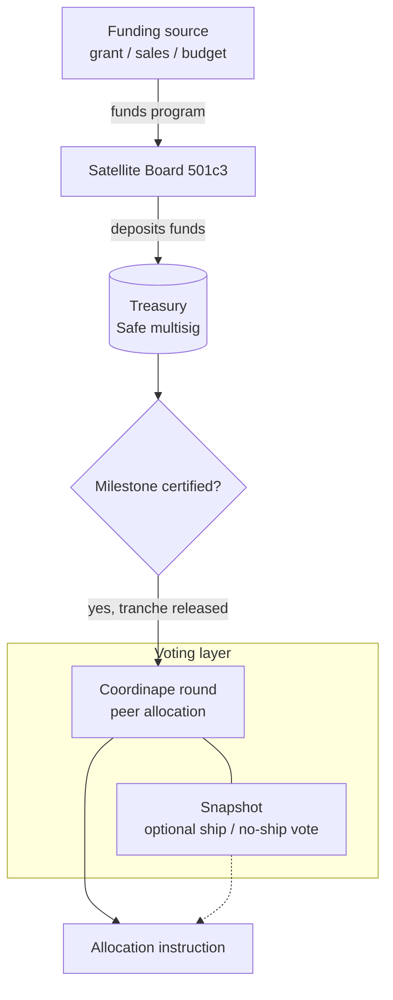
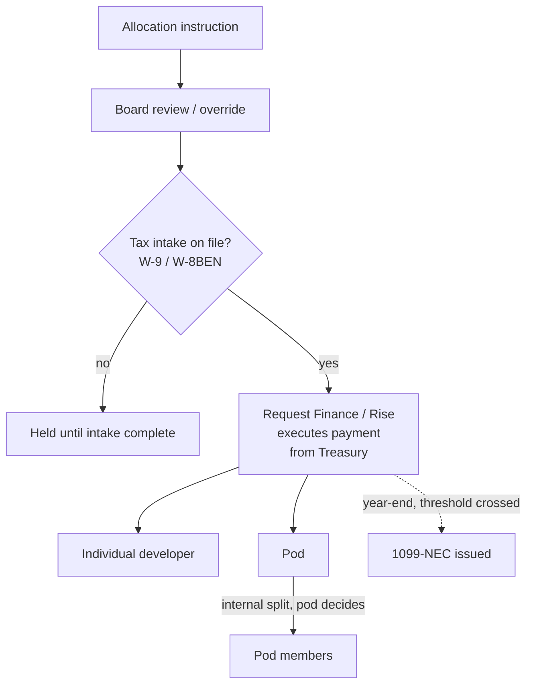

# Contributor Guide: Trust, Standing, and Getting Paid

*For actual committers and contributors — how funded work turns into a payment, and
(once drafted) how standing and trust are earned and lost.*

**Status:** Stub. Created by moving the Worked Example section out of
[`commons-hub-pattern.md`](commons-hub-pattern.md#3-worked-example-funded-program-allocation-mechanic);
the rest of this guide is not yet drafted. Not reviewed by counsel — nothing here
should be treated as a legal or tax conclusion.

This is one of four companion documents split out of a single original draft (see
[`DOC-SPLIT-PLAN.md`](DOC-SPLIT-PLAN.md) for the rationale). See
[`commons-hub-pattern.md`](commons-hub-pattern.md) for the reference architecture this
guide assumes throughout — particularly
[§2, Governance Layer](commons-hub-pattern.md#2-governance-layer--two-separate-mechanisms),
which draws the board-vs-DAO distinction the mechanic below implements.

## Not yet drafted

- Community Trust and Contributor Standing
- Tactical Governance — Committer Voting Weight

## Getting Paid: the Funded Program Allocation Mechanic

This is the concrete mechanic the allocation DAO implements. Note that every step here
happens *after* the board has already decided to pursue and has secured the funding —
the DAO has no role in that decision.

**Part 1 — funding award through the vote:**

**Part 2 — the vote's output through payment:**

Coordinape and Snapshot touch this pipeline only at the voting layer, and
only lightly — both use a connected crypto wallet as a *signature/identity*
mechanism, not as an on-chain computation. Snapshot votes are signed
messages tallied off-chain (gasless); Coordinape's peer-allocation round is
an ordinary web app. The genuine on-chain activity in this diagram is the
treasury and payment layer (Safe multisig → Request Finance/Rise → developer
wallet) — that was always going to be blockchain-based once the org chose to
pay contributors in crypto, independent of the voting-tool choice.

1. A Satellite's board pursues and secures a funded program — e.g., a $100,000 grant,
   an earned-revenue-funded initiative, or a board-allocated budget — on terms the
   board negotiated and remains accountable for.
2. Community members who want to contribute work toward the funded program **opt in**
   as contributors (no fixed roster; participation is self-selected by interest).
3. Each participating contributor completes standard tax intake (e.g., a
   [W-9](https://www.irs.gov/forms-pubs/about-form-w-9) for US persons,
   [W-8BEN](https://www.irs.gov/forms-pubs/about-form-w-8-ben) for foreign
   contributors) and registers a wallet address for
   receiving funds (chain TBD — Bitcoin or Ethereum are the current candidates).
   Intake must be complete *before* a contributor is eligible to receive any
   disbursement — this is a gate, not a follow-up step.
4. As the program hits its funded milestones, **active contributors vote** on how the
   released tranche is apportioned among those who did the work.
5. Votes can allocate a tranche either to an **individual contributor** or to a
   **pod** (a development sub-group working a piece of the program).
6. If a tranche is voted to a pod, the pod's own members then decide internally how to
   divide that chunk — the DAO-level vote only decides the pod's allocation, not the
   individual split within it.
7. The vote's output is an **allocation instruction**, not a payment. It feeds a
   disbursement pipeline that: confirms tax intake is on file for every recipient,
   executes payment only after that check passes, records each payment as compensation
   for services rendered on the specific funded program (not as a profit share or gift), tracks
   cumulative payments per contributor per calendar year, and issues
   [1099-NEC](https://www.irs.gov/forms-pubs/about-form-1099-nec) (or the
   applicable equivalent) at year end for contributors who cross reporting thresholds.
   The DAO machinery is meant to be built integrated with this disbursement/tax
   pipeline from the start, not layered on top of it later.

Outstanding legal/tax questions about this mechanic (DAO scope vs. fiduciary duty,
compensation-vs-profit-sharing characterization, intake-as-gate, crypto valuation
and withholding) are tracked in the [Legal Risk Register](legal-risk-register.md),
not duplicated here.
