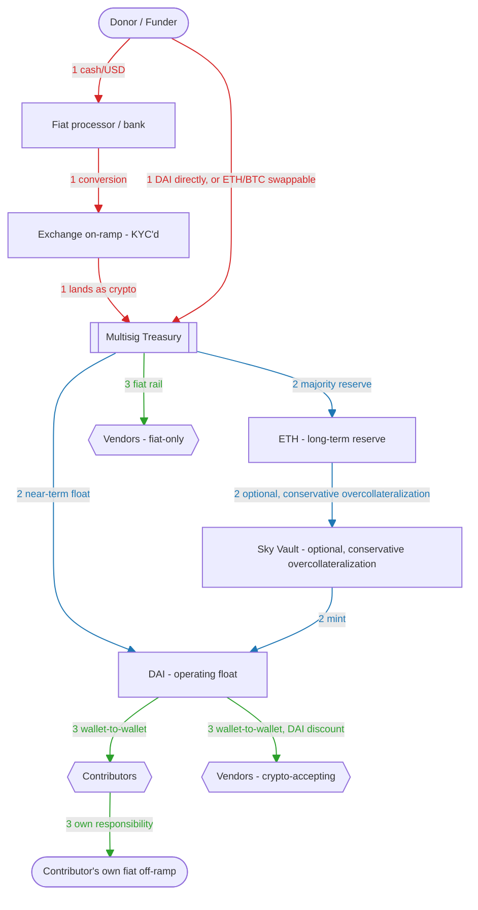

# Financial Layer — rewrite outline

Working outline for the rewrite of the *Financial Layer* section in
[`commons-hub-pattern.md`](commons-hub-pattern.md). Picks up right after the
existing intro (OFAC/IEEPA mechanics, correspondent banking, Banca Etica —
currently lines 863-876), replacing the old "Our structure holds reserves..."
paragraph through the section's end.

## Flow diagram

Donor/funder inflow (cash vs. crypto path), treasury allocation (DAI float
vs. ETH reserve, optional Vault minting), and payout (contributors, vendors).

## I. The stablecoin instinct, corrected

- A. Why "hold value in a USD-pegged asset" seemed like the easy answer
  1. The real goal was accounting simplicity — avoiding capital-gain/cost-basis
     tracking a volatile asset requires
- B. Why the obvious choice (USDC/USDT) doesn't survive scrutiny
  1. GENIUS Act (2025) makes freeze/sanctions-screening a legal requirement for
     regulated issuers, not just Circle's own caution
  2. Circle's 2022 Tornado Cash freeze — precedent, not hypothetical
  3. USDT: offshore jurisdiction doesn't buy real insulation — $4.4B+
     voluntarily frozen, more freeze-happy than USDC in practice
- C. DAI as the actual fit
  1. Decentralized, overcollateralized via Sky vaults — no company, no admin key
  2. Keeps the accounting benefit without the freeze exposure
  3. Overcollateralization is a minting-side mechanic only — Doikayt
     acquires/holds/spends, never mints

## II. DAI vs. USDS — a distinction that has to survive into practice

- A. Same protocol, two different tokens
  1. DAI unchanged since the 2024 rebrand — still no freeze function
  2. USDS — new token, built *with* a freeze function for compliance
- B. The ecosystem is pulling toward USDS, not DAI
  1. Migration incentives, April 2026 mass-migration event
  2. Hold/transact DAI specifically, monitor its liquidity over time
- C. Operational gotcha: verify the actual token contract/ticker on any
  incoming "Sky stablecoin," don't assume

## III. Being honest about what DAI doesn't solve

- A. Framing: cost/friction increase for an attacker, not immunity — state
  explicitly
  1. Callback to A/I's 48-hour single-choke-point collapse
- B. Protocol-level risk
  1. Emergency Shutdown Module — legitimate circuit breaker, can still freeze
     liquidity on short notice
  2. Roman Storm precedent — the humans/governance behind a protocol stay
     legally reachable
- C. Collateral composition risk
  1. ~35-40% of Sky's collateral is USDC via the PSM — directly freezable by
     Circle, no court needed
  2. RWA vaults — SPV/trust legal structures, enforcement runs through
     ordinary courts, not code
- D. Quantified worst case
  1. 2023 depeg precedent — ~$0.85-0.90, recovered in 48 hours
  2. $80M surplus buffer, thin against ~$13B system size
  3. Illustrative-only haircut range if buffer/backstop exceeded — no
     historical precedent, say so plainly
- E. Remaining risk surface in one line each — on-ramp risk,
  infra-dependency, on-chain surveillance, non-financial state levers —
  cross-reference rather than re-explain

## IV. Payout: dual rails, by design

- A. Contributors
  1. Wallet-to-wallet from the multisig, no processor in the loop
  2. Fiat conversion is their own responsibility — a filter for fit, stated
     matter-of-factly
- B. Vendors
  1. Any crypto-accepting vendor gets paid in crypto
  2. A 3-5% discount for DAI payment — grounded in avoided card fees, framed
     as a standard cash discount, flagged for counsel review
- C. The fiat rail that remains — kept for those who need it, chosen for
  reliability not immunity (PayPal vs. Stripe track record)

## V. Extending the ask upstream: funders

- A. Request, not requirement — "fund us in DAI, however you get there"
- B. Tone distinction: contributor policy is a filter, funder ask is polite
  and expectation-free
- C. What it buys: closes the on-ramp gap onto the funder instead of Doikayt
  running its own exchange account

## VI. Treasury composition: why ETH, not BTC

- A. BTC's real advantage — lower historical drawdowns (-83%/-77% vs.
  -94%/-81%), gap compressing
- B. Why the gap isn't worth the cost here
  1. Not native to any mechanic in this doc — needs wrapping/bridging to
     touch DAI or a Vault
  2. Extra conversion step = extra taxable event, extra cost-basis tracking
  3. WBTC's custodial risk validated by Sky's own 2026 vote to offboard it
     (Justin Sun ties)
  4. Gas is ETH-only regardless — a pure-BTC treasury still can't transact
- C. The call: gap too small, cost too real — ETH stays primary

## VII. Vendor working capital: minting vs. simply holding

- A. The tempting move — mint DAI against ETH instead of selling, avoids a
  taxable event
- B. The cost — reintroduces liquidation risk, a margin-call exposure at the
  worst possible time
- C. If pursued: conservative over-collateralization (300%+) is the real
  hedge, no derivatives needed
- D. Active hedging (options/perps) — not worth it at this scale; flagged as
  future reconsideration, not current policy

## VIII. Shared fate: contributors paid in ETH

- A. Simultaneous exposure, not sequential transfer — org's treasury and a
  contributor's unconverted pay move together
- B. Degree of sharing is the contributor's own choice — convert fast vs. hold
- C. Cross-reference: same alignment logic as the ESOP section (§3), informal
  and per-paycheck instead of formal equity

## IX. Closing: cost increase, not immunity

- A. Restate plainly — none of this removes the possibility of a targeting
  action
- B. What it does: one 48-hour choke point becomes several independent,
  harder-to-coordinate pressure points
- C. Land explicitly what the doc's existing closing line already gestures
  toward
